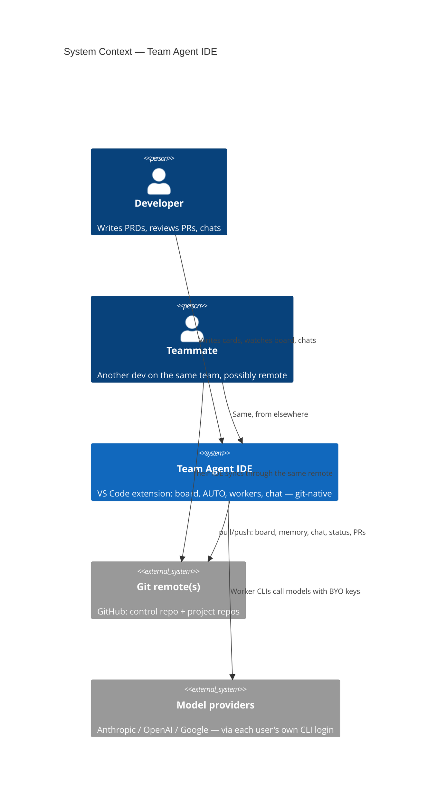
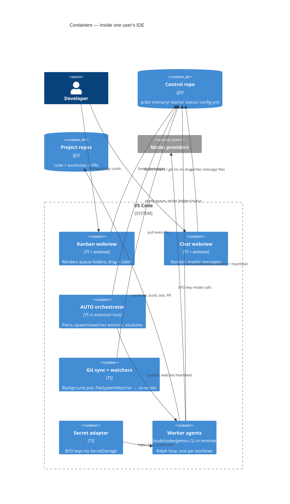

# 10 — System Architecture

> **Status:** ✅ done · **Date:** 2026-06-06 · **Owner:** Gerard
> **Purpose:** The layered stack, the components we own vs. inherit, and how data flows through the system. The architectural contract every subsystem doc refines.

---

## 1. Architectural principles (restated as constraints)

These are not aspirations; they are constraints that bound every design decision downstream:

1. **No server, no DB.** All durable state is files in git. If a component needs a process running between sessions, it's wrong or deferred.
2. **VS Code is the host; we are a guest.** We use VS Code's APIs, never replace its primitives.
3. **Each layer talks down, not across.** The UI reads the coordination layer; the coordination layer is git; agents read/write git. No back-channels.
4. **Every writer owns its file.** Concurrency safety comes from not sharing files, not from locks.
5. **Eventual consistency is acceptable.** `git pull` latency (seconds) is the system's clock. Nothing requires real-time.

## 2. The four layers

```
┌─ VS CODE (host) ──────────────────────────────────────────────┐
│  multi-root workspace · Monaco · file tree · terminal · SCM   │  ← inherited, $0
├─ EXTENSION (our code, runs in the extension host) ────────────┤
│  • Kanban webview      • Chat webview      • Onboarding UI     │  ← presentation
│  • AUTO orchestrator (stateful brain)                         │  ← orchestration
│  • Git ops + FileSystemWatcher (board/chat liveness)          │  ← sync
│  • SecretStorage adapter (BYO keys)                           │
├─ COORDINATION (the control repo, in git) ─────────────────────┤
│  prds/{inbox,in-progress,review,done}/                        │  ← the queue/board
│  memory/{project, agents/<id>}/                               │  ← shared + per-agent
│  teams/<team>/{members.md, chat/}                             │  ← identity + comms
│  status/<id>.json   config.yml                                │  ← heartbeat + config
├─ AGENT RUNTIME (worker processes) ────────────────────────────┤
│  worktree-per-agent · claude|codex|gemini CLI in a terminal   │  ← execution
│  · Ralph loop · writes heartbeat + memory + PRs               │
└────────────────────────────────────────────────────────────────┘
                         │
                ┌────────▼────────┐
                │  GIT REMOTE(s)  │  ← the only shared infrastructure
                │  control + N proj repos (GitHub)  │
                └─────────────────┘
```

**Layer responsibilities:**

| Layer | Owns | Does NOT own |
|---|---|---|
| **VS Code host** | Editor, file tree, terminals, multi-root, SCM gutter | Anything product-specific |
| **Extension** | Board/chat rendering, AUTO, git sync, watchers, secrets | Durable state (that's git), code execution (that's workers) |
| **Coordination (control repo)** | All shared truth: queue, memory, chat, status, config | Logic — it's just files |
| **Agent runtime** | Building, testing, committing, PRing in project repos | Deciding *what* to build (AUTO does) |

## 3. C4 — Context (Level 1)



The only thing connecting two teammates is the **git remote**. There is no product server in this diagram — by design.

## 4. C4 — Containers (Level 2)



## 5. Component inventory (what we actually build)

| Component | Layer | Doc | Build effort |
|---|---|---|---|
| Kanban webview | Extension/UI | `23-kanban-board.md` | High (the marquee surface) |
| Chat webview | Extension/UI | `22-team-communication.md` | Medium |
| AUTO orchestrator | Extension/orchestration | `12-agent-runtime.md` | High (the brain) |
| Worker supervisor (spawn/worktree/lifecycle) | Extension/orchestration | `12-agent-runtime.md` | High |
| Git sync + FileSystemWatcher | Extension/sync | `11-coordination-model.md` | Medium |
| Claim CAS logic | Extension + git | `11-coordination-model.md` | Medium (the one true concurrency bug) |
| Memory read/write + consolidation | Coordination | `13-memory-architecture.md` | Medium |
| Secret adapter (SecretStorage + SOPS) | Extension/secrets | `21-secrets-and-keys.md` | Low–Medium |
| Identity/onboarding (GitHub auth) | Extension | `20-identity-and-teams.md` | Low (VS Code provides it) |
| Verification/trust gate | Coordination + workers | `25-verification-trust-gate.md` | Medium |
| Data schemas (card/status/config) | Coordination | `14-data-model.md` | Low (definition) |

## 6. The primary data flow — a PRD's journey

```mermaid
sequenceDiagram
    participant H as Human
    participant B as Board (webview)
    participant C as Control repo (git)
    participant A as AUTO
    participant W as Worker
    participant P as Project repo
    H->>B: Write card, drop in inbox/
    B->>C: git add + commit + push (card in prds/inbox/)
    A->>C: pull; see ready card
    A->>A: decompose PRD → tasks (Task Ledger)
    A->>C: claim: git mv inbox→in-progress, set owner; push (CAS)
    A->>W: spawn worker in fresh worktree
    W->>P: implement on branch, run tests
    W->>C: write heartbeat + per-agent memory
    W->>P: open PR
    W->>C: git mv in-progress→review; push
    Note over C: Independent validator checks contract
    C-->>A: PR merged + CI green
    A->>C: git mv review→done; push
    B->>C: pull; re-render — card now in done/
```

Every arrow to the control repo is a commit; every state transition is therefore in git history for free.

## 7. Trust & isolation boundaries

- **Team isolation = AUTO + repo permissions.** Your AUTO only commands workers you spawned; it reads only repos you can access. Another team's AUTO is a different process with different GitHub credentials and (in v1) a different control repo. There is no shared process to cross.
- **Worker isolation = worktree.** Workers never share a working directory; filesystem collisions are impossible by construction.
- **Secret isolation = SecretStorage + env injection.** Keys live in the OS keychain and are handed to workers as env vars at spawn; they are never written into any repo.
- **The trust gate** (`done ← verified`) is the boundary between "an agent claims it works" and "the team accepts it." Enforced by lifecycle, not by trust. See `25-verification-trust-gate.md`.

## 8. What this architecture deliberately omits (and why)

| Omitted | Why | Revisit when |
|---|---|---|
| Application server / API | Git is the backend | Real-time chat or >1-team RBAC forces it |
| Database | Folders + frontmatter + JSON suffice | Cross-repo semantic search needs an index |
| Vector/embedding store | `grep` over one repo beats it, zero infra | Cross-repo recall at scale |
| Real-time transport (WebSocket) | `git pull` latency is acceptable for minute-scale work | Sub-second chat/cursor presence becomes a requirement |
| Container sandboxing | Worktrees give enough isolation for v1 | Untrusted code / multi-tenant hosting |
| Theia / branded shell | VS Code extension ships faster; same code runs under Theia later | A branded desktop app is wanted |

---

**Related:** `11-coordination-model.md` (how git is the backend) · `12-agent-runtime.md` (AUTO + workers) · `13-memory-architecture.md` · `14-data-model.md` (schemas) · `34-diagram-components.md` (expanded C4).
