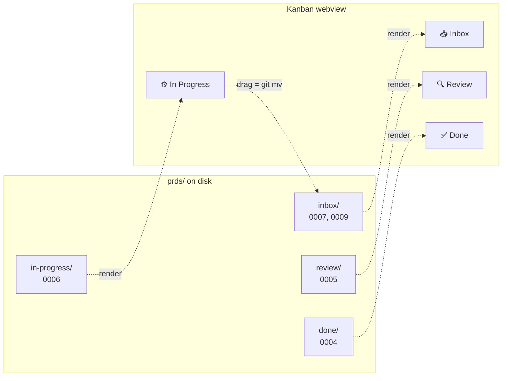
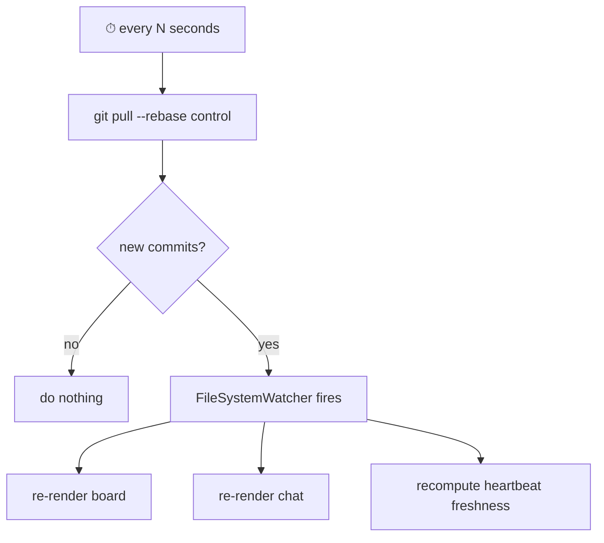

# 11 — Coordination Model

> **Status:** ✅ done · **Date:** 2026-06-06 · **Owner:** Gerard
> **Purpose:** How git alone coordinates a team of humans and agents — the control repo as backend, the queue, the claim compare-and-swap, eventual consistency, and the one concurrency bug that actually matters. This is the load-bearing doc: if git-as-backend doesn't hold here, the whole product collapses to "yet another server app."

---

## 1. The claim being tested

The vision doc makes a bet: **git is a sufficient backend for a remote team.** This doc is where that bet either survives contact with concurrency or it doesn't. Concretely, four coordination problems must be solved with nothing but a git remote:

| Problem | Server-app answer | Our git-native answer |
|---|---|---|
| Where is the shared truth? | A database | The **control repo** — files in folders |
| How do two agents not grab the same work? | A row lock / transaction | **Claim CAS** — `git mv` + push; the remote's atomic ref-update is the lock |
| How does a teammate see a change? | WebSocket push | **`git pull`** every N seconds; FileSystemWatcher re-renders |
| How do we get history/audit? | An event log table | **`git log`** — every change is already a commit |

If all four hold, there is no server to run. The rest of this doc shows they hold — and names the one place (cross-branch divergence) where naïveté bites.

## 2. The control repo is the backend

One git repo per team holds *all* coordination state. It is not the code; code lives in **project repos** (see `27-multi-repo-workspace.md`). The control repo is pure coordination:

```
control/                          # one git repo, one team (v1)
├── prds/                         # THE BOARD — folders are columns
│   ├── inbox/                    #   ready to claim, ranked by priority
│   │   ├── 0007-stripe-webhooks.md
│   │   └── 0009-csv-export.md
│   ├── in-progress/              #   claimed; owner + branch in frontmatter
│   │   └── 0006-oauth-refresh.md
│   ├── review/                   #   PR open, awaiting verification
│   │   └── 0005-rate-limiter.md
│   └── done/                     #   verified + merged
│       └── 0004-health-checks.md
├── memory/
│   ├── project/                  # consolidated shared memory (resourceId)
│   │   ├── architecture.md
│   │   └── decisions.md
│   └── agents/<id>/              # per-agent scratch notes (threadId)
│       └── notes.md
├── teams/
│   └── core/
│       ├── members.md            # GitHub handles → roles (metadata)
│       └── chat/                 # maildir: one file per message
│           └── 2026/06/06/1717-gerard-a3f2.md
├── status/
│   └── <id>.json                 # heartbeat per agent (state, card, ts)
├── config.yml                    # team config: repos, models, policies
└── .sops.yaml + secrets.enc.yml  # team-shared secrets (SOPS+age)
```

**Why a separate repo from the code:** the control repo churns constantly (every claim, heartbeat, chat message is a commit). Keeping that firehose out of project repos keeps code history clean and lets repo permissions differ (everyone writes the board; not everyone writes every project). See `27-multi-repo-workspace.md` for the N-repo topology.

**Schemas** for every file here live in `14-data-model.md`. This doc cares about the *protocol*, not the field list.

## 3. The queue and the board are the same bytes

There is no separate "board state." The board **is** a render of `prds/*/`:

- A **column** is a folder (`inbox`, `in-progress`, `review`, `done`).
- A **card** is a markdown file with YAML frontmatter.
- **Moving** a card across columns is `git mv` + commit + push.
- **Rank** within `inbox/` is the `priority` field, not file order.



The board webview never holds authoritative state — it is a pure function of the folders at the current commit. Drag-and-drop is sugar over `git mv`. This is why the board survives a crash, a fresh clone, or a teammate joining: there's nothing to rebuild. (Render details and liveness in `23-kanban-board.md`.)

## 4. Claim CAS — the one true concurrency primitive

Everything else is folders and renders. **This** is the part that has to be exactly right, because it's the only place two actors race for the same resource.

### 4.1 The protocol

A claim is: take a card from `inbox/`, mark it yours, and push. The claim is **only real if the push succeeds.**

```mermaid
sequenceDiagram
    participant A as Agent A
    participant B as Agent B
    participant R as Git remote (control)
    Note over A,B: both pulled; both see inbox/0007 ready
    A->>A: git mv inbox/0007 → in-progress/0007<br/>set owner=A, branch, updated=now
    B->>B: git mv inbox/0007 → in-progress/0007<br/>set owner=B, branch, updated=now
    A->>R: git push  (fast-forward from known HEAD)
    R-->>A: ✅ accepted — A's commit is now HEAD
    B->>R: git push  (from the SAME old HEAD)
    R-->>B: ❌ rejected (non-fast-forward)
    B->>B: git reset --hard @{u}   (abandon claim)
    B->>B: re-read inbox/ → 0007 gone → try 0009
```

The remote accepts the first push and rejects the second because the second is no longer a fast-forward. **Git's atomic ref update is the lock.** There is no lock service, no `SELECT … FOR UPDATE`, no Redis `SETNX`. The loser doesn't error — it just lost a race, resets, and claims the next card.

### 4.2 Why this is a compare-and-swap

It's the textbook CAS, spelled in git:

| CAS concept | Git mechanism |
|---|---|
| Read expected value | `git pull` → local HEAD = X |
| Compute new value | `git mv` + frontmatter edit + commit → Y (parent = X) |
| Atomic swap if unchanged | `git push` succeeds **iff** remote is still at X |
| Swap failed, retry | non-fast-forward reject → `reset --hard @{u}`, pick next card |

The compare is "is remote HEAD still the parent of my commit?" The swap is the ref update. Both happen atomically inside the remote's receive-pack. We get a distributed CAS for free from a protocol every developer already runs.

### 4.3 The loser's contract (must be exact)

The losing agent **must**:
1. `git reset --hard @{u}` — discard the local claim commit entirely. (Safe: a claim commit touches only the card's path + frontmatter; no work is lost because no work was done yet.)
2. `git pull` — adopt the winner's HEAD.
3. Re-evaluate `inbox/` — the card it wanted is now in `in-progress/` owned by someone else; pick the next-highest `priority`.
4. Never retry the same card in the same pass (avoids two losers ping-ponging).

This is the single most security/correctness-sensitive routine in the system. It gets a dedicated sequence doc (`33-flow-claim-race.md`) and the most aggressive tests (`PRD-v1.md` success criteria: *zero claim collisions*).

### 4.4 Why not a lock file?

A `claims/0007.lock` file committed to git would *also* race — two agents create it, both push, same CAS. So the lock file buys nothing the `git mv` doesn't already give, and it adds a second source of truth to keep in sync. **The move *is* the lock.** One operation, one truth.

## 5. Eventual consistency — git pull is the clock

Nothing in this system is real-time, and it doesn't need to be. The unit of work is a PRD that takes **minutes**, so a **seconds**-latency sync is invisible.

- Each IDE runs a background `git pull` on the control repo every **N seconds** (default 5–10; configurable in `config.yml`).
- On pull, a `FileSystemWatcher` fires; the board and chat re-render from the new bytes.
- "Liveness" of agents is not a socket — it's the freshness of `status/<id>.json` heartbeats (see `12-agent-runtime.md`).



**The consistency window** is bounded by 2N (your push, their pull). For minute-scale work that's a rounding error. If a feature ever needs sub-second consistency (live cursors, typing presence), that feature — not the whole system — earns a real-time transport. See the "deliberately omitted" table in `10-system-architecture.md`.

**`--rebase` matters:** background pulls rebase local commits (your un-pushed heartbeat/claim) onto the remote, keeping history linear and avoiding spurious merge commits in the coordination firehose.

## 6. The landmine — cross-branch state divergence

This is the failure mode that kills naïve "folders-as-status" designs (observed in Backlog.md and similar tools). **It is the most important paragraph in this doc.**

### 6.1 The bug

If status is encoded **only** in the folder path, and the board is allowed to live on **multiple branches**, then status diverges and there is no truth:

```
branch feature-x:   prds/in-progress/0006.md   ← Alice moved it here
branch feature-y:   prds/review/0006.md         ← Bob moved it here
                    └─ same card, two columns, two branches. Who's right?
```

A path is a single fact with no timestamp. When two branches disagree on a card's path, a merge either conflicts (best case, annoying) or silently picks one (worst case, a card teleports columns and work is lost or duplicated).

### 6.2 The mitigation (three rules, all required)

1. **Frontmatter is the source of truth; the folder is a cache.** Every card carries `status:` and `updated:` in its YAML frontmatter. The folder path is a *denormalised render hint* for fast `ls`-based board drawing — but if folder and frontmatter ever disagree, **frontmatter wins.** A reconciler can always re-file a card by reading its frontmatter and `git mv`-ing it to the matching folder.

   ```yaml
   ---
   id: "0006"
   title: OAuth refresh
   status: in-progress      # ← authoritative
   owner: alice
   branch: feat/0006-oauth
   priority: 1
   updated: 2026-06-06T17:14:22Z   # ← tiebreaker
   ---
   ```

2. **The board lives on exactly one branch** (`main` of the control repo). Claims, moves, chat, and heartbeats commit straight to `main` and push. Agents do their *code* work on feature branches **in project repos**, never by branching the control repo. The control repo's `main` is the one place the board exists, so there's nothing to diverge.

3. **LWW reconciliation as the fallback.** If divergence happens anyway (offline edits, a force-push accident, a clock-mostly-monotonic edge), resolve by **last-write-wins on the `updated` timestamp** in frontmatter, not by folder path and not by git's merge-base guess. Newest `updated` is the card's true status; re-file the folder to match. This is the explicit, documented tiebreaker — never leave it to chance.

### 6.3 Why this specific design

- **Frontmatter-as-truth** gives every status fact a timestamp, which a bare path can never have. Timestamps make LWW possible.
- **Single-branch board** removes the *opportunity* for divergence in the common path — rule 3 is only for the rare path.
- **Folder-as-cache** keeps rendering O(`ls`) fast without making the path load-bearing.

The combination means: fast to render, impossible to silently corrupt, and deterministic to repair. (Field-level schema in `14-data-model.md`; the reconciler lives with the board in `23-kanban-board.md`.)

## 7. Everything-is-many-writers (no shared file, ever)

The claim race is the *only* place two actors touch the same file, and CAS handles it. **Every other coordination channel is designed so two writers never share a file at all:**

| Channel | Sharing avoided by | Doc |
|---|---|---|
| Board moves | One writer per card (the claimant); CAS for the contested moment | this doc §4 |
| Chat | **Maildir** — one file per message, unique name; readers merge by listing | `22-team-communication.md` |
| Memory | **Per-agent files** under `memory/agents/<id>/`; consolidation is a separate PR'd job | `13-memory-architecture.md` |
| Status | **One heartbeat file per agent** `status/<id>.json`; nobody else writes it | `12-agent-runtime.md` |
| Secrets | One encrypted file, edited via `sops` (re-encrypts wholesale, no line merges) | `21-secrets-and-keys.md` |

This is principle #5 from the vision doc ("many writers, never one file") made operational. Merge conflicts are *structurally* impossible for chat, memory, and status because no two processes are appending to the same bytes. The only contended write — the claim — is exactly the one we wrapped in CAS. **We didn't avoid concurrency; we localized it to one well-tested primitive.**

## 8. Failure modes & how git absorbs them

| Failure | What happens | Recovery |
|---|---|---|
| Two agents claim the same card | Push-race; one wins, one gets non-ff reject | Loser resets + claims next card (§4.3). No corruption. |
| Network drops mid-claim | Push never lands; local claim commit is orphaned | Next pull rebases it away or it pushes when back; card stays in `inbox/` for others. Idempotent. |
| Agent crashes holding a card | Card sits in `in-progress/`, heartbeat goes stale | AUTO sees stale `status/<id>.json` (> timeout), re-queues the card (`git mv` back to `inbox/`). See `12`. |
| Stale local board | You see an old column for a few seconds | Next N-second pull reconciles. Bounded by 2N. |
| Force-push to control repo | Could rewrite board history | Branch protection on control `main` (no force-push); divergence (if any) repaired by LWW (§6.2). |
| Card status diverges across branches | The §6 landmine | Shouldn't occur (rule 2); if it does, LWW on `updated` (rule 3). |

Notice the pattern: every failure degrades to "the card stays claimable" or "the next pull fixes it." Nothing requires a human to repair a database, because there is no database — only commits, which are either there or not.

## 9. What the coordination layer explicitly is NOT

- **Not a message bus.** No pub/sub, no queue server. Polling git is the transport.
- **Not transactional across files.** Each commit is atomic, but there's no multi-file ACID transaction. Designed around this: every operation touches exactly the files one writer owns.
- **Not strongly consistent.** It's eventually consistent with a bounded (2N) window. Accepted by design.
- **Not real-time.** Minute-scale work, seconds-scale sync. If that ratio ever inverts for a feature, that feature adds transport — the substrate doesn't.

---

**Related:** `10-system-architecture.md` (where this layer sits) · `12-agent-runtime.md` (who does the claiming) · `13-memory-architecture.md` (the per-agent-files rule) · `14-data-model.md` (card/status/config schemas) · `22-team-communication.md` (maildir, the other many-writers channel) · `23-kanban-board.md` (render + reconciler) · `33-flow-claim-race.md` (the CAS sequence in full).
