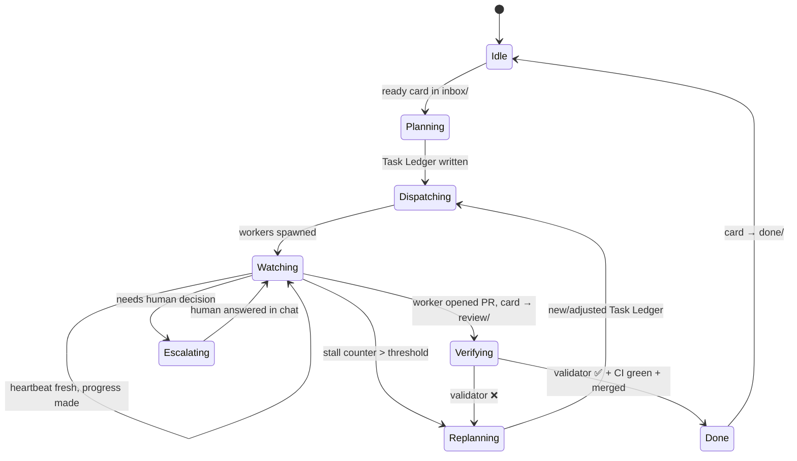
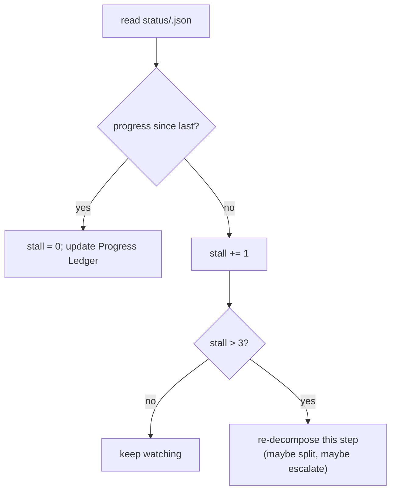
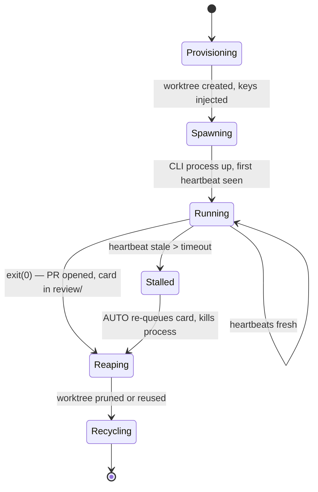

# 12 — Agent Runtime (AUTO + Workers)

> **Status:** ✅ done · **Date:** 2026-06-06 · **Owner:** Gerard
> **Purpose:** The two-tier agent model — the persistent **AUTO** orchestrator and the ephemeral **workers** it spawns. How AUTO plans (the dual-ledger loop), how workers run (the Ralph loop in a worktree), how they signal liveness (heartbeats), and how a stalled worker gets noticed and re-planned. This is the brain and the hands.

---

## 1. Two tiers, one rule each

The whole runtime is two kinds of process with one defining property apiece:

| Tier | What it is | Defining property | Lifetime |
|---|---|---|---|
| **AUTO** | The orchestrator — one per user/team. Chat counterparty, planner, dispatcher, watcher, escalator. | **Stateful.** Carries the plan (ledgers) across the whole PRD and across worker lifetimes. | Long-lived (the session). |
| **Worker** | A CLI coding agent (`claude`/`codex`/`gemini`) in a terminal, one per worktree. | **Stateless per iteration.** Claim → build → test → review → PR → exit. Nothing carried in RAM between runs. | Ephemeral (one card, then gone). |

Everything else follows from this split. AUTO holds the *plan*; workers hold *nothing* — their continuity is git (the worktree, the heartbeat file, the per-agent memory notes). If a worker dies, no state dies with it. If AUTO restarts, it rebuilds from its ledgers in git.

```
        ┌──────────────────────────────────────────────┐
        │  AUTO  (extension host, stateful brain)       │
        │  • reads inbox/ queue                         │
        │  • decompose PRD → Task Ledger                │
        │  • dispatch tasks, watch heartbeats           │
        │  • stall? → re-plan                           │
        └───────────────┬───────────────┬──────────────┘
              spawns     │               │   spawns
        ┌────────────────▼───┐    ┌──────▼─────────────┐
        │ Worker (worktree A)│    │ Worker (worktree B)│   …ephemeral, N of them
        │ Ralph loop, 1 card │    │ Ralph loop, 1 card │
        └─────────┬──────────┘    └─────────┬──────────┘
                  │ heartbeat + memory + PR  │
                  ▼                          ▼
            status/<id>.json           project repo PR
```

## 2. AUTO — the persistent orchestrator

AUTO is the character the human talks to (its voice/persona lives in `AUTO.md`, adapted from the Automatos CTO soul). Operationally it is a **stateful planner-dispatcher** running in the VS Code extension host. It owns four jobs:

1. **Plan** — turn a PRD card into a set of tasks (decomposition).
2. **Dispatch** — claim work and spawn workers into worktrees.
3. **Watch** — read heartbeats; detect stalls; track progress.
4. **Escalate** — when stuck or when a human decision is needed, say so in chat.

AUTO's intelligence is the **dual-ledger loop**, lifted from Magentic-One and expressed as **markdown files in git** (so AUTO's "mind" is auditable and survives a restart).

### 2.1 The two ledgers (Magentic-One, git-native)

```
control/
└── prds/in-progress/0006-oauth-refresh.md     # the card
    ... and alongside AUTO's working state:
└── ledgers/0006/
    ├── task-ledger.md       # OUTER loop: facts, guesses, plan
    └── progress-ledger.md   # INNER loop: per-step who/stalled/next/done
```

**Task Ledger (outer loop)** — written once per (re)plan. AUTO's understanding of the *whole* PRD:

```markdown
# Task Ledger — 0006 OAuth refresh
## Given facts
- Refresh endpoint exists at /auth/refresh (project repo `api`)
- Tokens stored in Postgres `sessions` table
## Educated guesses
- Likely need to rotate refresh tokens on use (security best practice)
## Plan (tasks)
1. [backend] add rotation to /auth/refresh   parallel_group: A
2. [backend] migration: add rotated_at column  parallel_group: A
3. [test]    integration test for rotation     depends_on: [1,2]
```

**Progress Ledger (inner loop)** — updated every time a worker reports. AUTO's per-step tracking:

```markdown
# Progress Ledger — 0006
| step | who | status | stalled? | next instruction | satisfied? |
|------|-----|--------|----------|------------------|-----------|
| 1 | worker-a3f2 | building | no | — | no |
| 2 | worker-b1c4 | PR open  | no | await review | no |
| 3 | (unassigned)| blocked  | — | wait for 1,2 | no |
```

### 2.2 The orchestration loop (state machine)



This is the loop AUTO runs forever. The two transitions that make it *intelligent* rather than a dumb dispatcher:

- **Watching → Replanning** (the stall): caught by the stall counter (§2.3).
- **Verifying → Replanning** (the rejection): the trust gate bounced the work; re-decompose. See `25-verification-trust-gate.md`.

### 2.3 The stall counter — how AUTO notices a spinning worker

A **stall** is a step that isn't progressing. AUTO increments a per-step counter when, between two heartbeats, a worker shows no forward motion (same state, no new commits, no PR). When the counter crosses a threshold (default 3 cycles), AUTO **re-plans** that branch of the Task Ledger rather than waiting forever.



"Progress" is defined concretely from git + heartbeat: a new commit on the worker's branch, a state transition in its heartbeat, or a PR opened. No progress across the threshold = the worker is stuck (bad task, missing context, infinite loop) and AUTO intervenes instead of trusting it. This is the Magentic-One insight: **the orchestrator's job is to detect non-progress, not to micromanage steps.**

### 2.4 Playbook vs Mission (when to plan at all)

From Automatos: not every PRD needs LLM planning.

- **Playbook** — a *fixed, deterministic DAG* of tasks. No LLM decomposition. Run when the steps are known ("add a CRUD endpoint" → always the same 4 tasks). Cheaper, faster, reproducible.
- **Mission** — an *adaptive* plan. AUTO decomposes and re-plans as it learns. Run when the path is unknown.

AUTO picks based on the card: a `playbook:` field in frontmatter pins a known recipe; its absence means "Mission — figure it out." (Authoring detail in `24-prd-authoring-and-decomposition.md`.)

## 3. Workers — the ephemeral hands

A worker is a model CLI running in a VS Code integrated terminal, bound to **one git worktree**, living **one card's worth of life**. It is a **Ralph loop** (after snarktank/ralph): do exactly one unit of work per invocation, then exit; the supervisor re-invokes to do the next.

### 3.1 The Ralph loop (one worker's life)

```mermaid
sequenceDiagram
    participant S as AUTO/Supervisor
    participant W as Worker (CLI)
    participant C as Control repo
    participant P as Project repo (worktree)
    S->>W: spawn in fresh worktree, inject keys, point at card
    W->>C: claim card (git mv inbox→in-progress, CAS push)
    Note over W: lost the race? reset, ask supervisor for next card
    W->>P: implement on feature branch
    W->>P: run tests / build
    W->>W: self-review against validation_criteria[]
    W->>C: write per-agent memory notes
    W->>C: write heartbeat (every N s, throughout)
    W->>P: open PR
    W->>C: git mv in-progress→review; push
    W->>S: exit (0 = clean, nonzero = needs attention)
    S->>S: worktree torn down or recycled
```

**Stateless per iteration** is the key discipline: a worker holds nothing in RAM that matters between runs. Its continuity is entirely in git — the worktree (code-in-progress), the heartbeat (liveness), the memory notes (what it learned), the card frontmatter (what it claimed). Kill it any time; the next invocation reconstructs context from those files. This is what makes workers safely disposable and trivially parallel.

### 3.2 Worktree-per-worker (isolation by construction)

Every worker gets its own `git worktree` — a separate working directory on its own branch off a project repo:

```
project-api/                       # the repo
├── .git/
├── (main checkout)
└── ../worktrees/
    ├── 0006-oauth-a3f2/           # worker A's worktree, branch feat/0006
    └── 0011-export-b1c4/          # worker B's worktree, branch feat/0011
```

**Filesystem collisions are impossible** because no two workers share a directory. No locks, no "who's editing this file" — they're literally different directories on different branches. This is principle #5 ("many writers, never one file") applied to *code*: workers never share a working tree, so they never conflict until PR merge time, where git's normal merge handles it. (Topology in `35-diagram-repo-topology.md`.)

### 3.3 BYO-CLI — which engine runs

Workers are model-agnostic. The `engine` is chosen per task/card (`engine: claude|codex|gemini` in frontmatter, default from `config.yml`). The supervisor spawns the right CLI and injects that user's own credentials (BYO-CLI/BYOK). We never proxy or meter tokens — the worker logs into the user's own model account. (Key injection in `21-secrets-and-keys.md`.)

## 4. Spawning & lifecycle (what the supervisor does)

The **worker supervisor** is part of the extension (extension host), distinct from AUTO's planning brain but driven by it. Its job is process + worktree lifecycle:



Lifecycle responsibilities:

- **Provision:** `git worktree add` a fresh dir + branch; inject model keys as env vars (from SecretStorage, never written to disk in the repo).
- **Spawn:** launch the chosen CLI in a VS Code terminal, pointed at the card and worktree; confirm a first heartbeat appears.
- **Supervise:** treat heartbeat freshness as liveness (§5). No tmux pane-scraping (that was Canopy's approach; we replaced it with heartbeat files).
- **Reap:** on clean exit, prune/recycle the worktree. On stall, kill + let AUTO re-queue the card.

**Concurrency cap:** `config.yml` sets `max_workers` (v1 default ≤4). The supervisor never exceeds it; extra ready cards wait in `inbox/`.

## 5. Heartbeats — liveness without a socket

Every agent (AUTO and each worker) writes `status/<id>.json` every **N seconds**. This file *is* the liveness signal — there is no socket, no ping, no process-table inspection across machines.

```json
{
  "id": "worker-a3f2",
  "kind": "worker",
  "engine": "claude",
  "state": "building",
  "card": "0006",
  "branch": "feat/0006-oauth",
  "repo": "project-api",
  "last_seen": "2026-06-06T17:18:04Z",
  "note": "running integration tests"
}
```

- **The board** reads heartbeats to show running/waiting/stalled badges.
- **AUTO** reads heartbeats to drive the stall counter (§2.3) and to decide reaping.
- **Staleness** = `now − last_seen > timeout` (default 3N). Stale ⇒ assume dead ⇒ re-queue its card.

This replaces Canopy's tmux pane-scraping with a plain file that syncs over git like everything else. A teammate on another machine sees your agents' liveness because their IDE pulled your heartbeat commits. (Schema in `14-data-model.md`.)

> **Heartbeat write volume:** heartbeats commit frequently and would spam history. Mitigations (detailed in `14`): heartbeats may live on a dedicated `status` branch or use squashed/amended commits, kept out of the board's `main` history. The point is liveness, not audit — so this is the one channel where we trade history for low noise.

## 6. How AUTO and workers talk (only through git)

They do **not** have an RPC channel. AUTO influences workers only by writing files they read, and learns from workers only by reading files they wrote:

| Direction | Channel (a file/path) |
|---|---|
| AUTO → worker: "build this" | the **card** in `in-progress/` + the **Task Ledger** step |
| AUTO → worker: "stop" | kill the process (supervisor); worker's next heartbeat never comes |
| worker → AUTO: "I'm alive / where I am" | `status/<id>.json` heartbeat |
| worker → AUTO: "what I learned" | `memory/agents/<id>/notes.md` |
| worker → AUTO: "I'm done" | card moved to `review/` + PR URL in frontmatter + exit code |

This is the layered-talk-down rule from `10-system-architecture.md`: no back-channels. Every coordination fact is a file, which means it's also a commit, which means it's auditable and survives any process dying. The runtime has **no shared memory between processes** — only the control repo.

## 7. Team isolation lives here

Team isolation is **not** a network ACL — it's a process + credential boundary at the AUTO tier:

- Your AUTO is a different OS process from another team's AUTO, with **different GitHub credentials** and (in v1) a **different control repo**.
- Your AUTO only spawns and commands workers *it* created; it has no handle to anyone else's workers.
- There is no shared orchestrator process to cross, so "another team's agent talking to my agents" is impossible by construction — there's no channel for it.

(Full isolation model + the chat-routing taxonomy in `22-team-communication.md`; identity in `20-identity-and-teams.md`.)

## 8. Failure modes

| Failure | Detection | Response |
|---|---|---|
| Worker hangs (infinite loop) | stall counter > 3 (no commits/PR) | AUTO re-plans step; supervisor kills + re-queues card |
| Worker crashes | heartbeat stale > 3N | supervisor reaps; card returns to `inbox/` (idempotent) |
| Worker claims then dies pre-PR | card stuck in `in-progress/`, stale heartbeat | re-queue card; worktree pruned; no work lost (none done) |
| AUTO restarts | ledgers are in git | rebuild Task/Progress Ledgers from `ledgers/<id>/`; resume Watching |
| Bad decomposition (tasks never converge) | repeated stalls across steps | escalate to human in chat (Escalating state) |
| Worker opens a bad PR | validator rejects | card bounces review→in-progress; AUTO re-plans (`25`) |

The invariant: **no failure loses durable state, because durable state is git, not RAM.** Processes are cattle; the control repo is the herd record.

---

**Related:** `10-system-architecture.md` (where AUTO/workers sit) · `11-coordination-model.md` (the claim CAS workers use) · `13-memory-architecture.md` (per-agent notes + consolidation) · `14-data-model.md` (heartbeat, ledger, card schemas) · `24-prd-authoring-and-decomposition.md` (Playbook vs Mission, decomposition prompt) · `25-verification-trust-gate.md` (the validator that gates `done`) · `31-flow-auto-loop.md` (this loop as a full diagram) · `AUTO.md` (AUTO's voice/persona).
