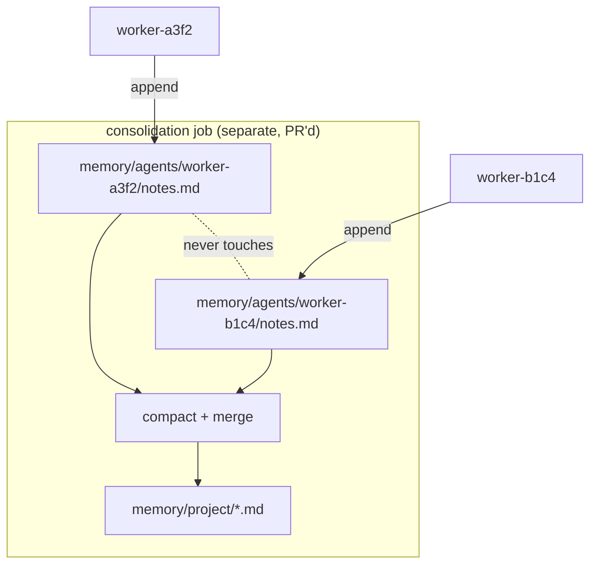
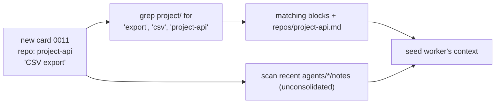
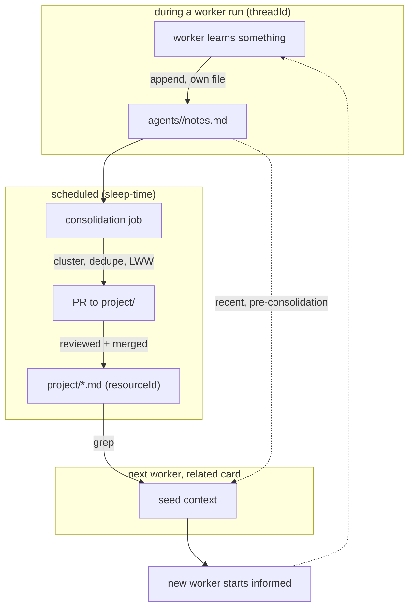

# 13 — Memory Architecture

> **Status:** ✅ done · **Date:** 2026-06-06 · **Owner:** Gerard
> **Purpose:** How agents remember — across iterations, across workers, across teammates — using nothing but files in git. The scoping model (per-agent vs shared), the write discipline that makes concurrent memory conflict-free, and the consolidation job that turns scratch notes into durable team knowledge. Derived from Letta, Mastra, and Mem0 — but their *patterns*, not their servers.

---

## 1. The problem memory solves

From the vision doc's lived problem: *8 agents, no shared memory between them.* Each hand-spawned agent re-learns the codebase from scratch; nothing one agent discovers helps the next; a teammate's agents know nothing about yours. **Memory is the difference between 8 amnesiac agents and one learning team.**

What we need:
1. A worker mid-task remembers what *it* just figured out (within-run scratch).
2. A *new* worker on a related card benefits from what *past* workers learned (cross-run recall).
3. A *teammate's* agents benefit from your agents' learnings (cross-human recall).
4. None of it requires a vector database, an embedding service, or a server.

The bet (from `01-competitive-landscape.md`): **`grep` over one team's repo beats a vector store** for a team-scale corpus, at zero infra. We adopt the *memory patterns* from Letta/Mastra/Mem0 and express them as git files.

## 2. Two scopes — resourceId and threadId (Mastra)

Mastra's scoping convention maps cleanly onto deterministic file paths:

| Scope | Mastra term | What it is | Path | Lifetime |
|---|---|---|---|---|
| **Shared/durable** | `resourceId` | Team/user-persistent knowledge — architecture, decisions, conventions | `memory/project/` | Permanent (PR'd, reviewed) |
| **Ephemeral/scratch** | `threadId` | One worktree-run's working notes | `memory/agents/<id>/` | Disposable (lives with the worker) |

```
control/memory/
├── project/                    # resourceId — shared team brain
│   ├── architecture.md         #   how the system is built
│   ├── decisions.md            #   ADR-style: what we chose & why
│   ├── conventions.md          #   code/style/process norms
│   └── repos/<repo>.md         #   per-project-repo knowledge
└── agents/                     # threadId — per-worker scratch
    ├── worker-a3f2/
    │   └── notes.md            #   what THIS run learned
    └── worker-b1c4/
        └── notes.md
```

The discipline: **workers write only to their own `agents/<id>/` dir; nobody else writes there.** Shared `project/` memory is never edited live by a worker mid-run — it changes only through the **consolidation** job (§5), which is reviewed. This keeps the fast path (worker scribbling notes) conflict-free and the slow path (durable knowledge) high-quality.

## 3. Per-agent files — why concurrency is a non-issue

This is principle #5 ("many writers, never one file") applied to memory. Each worker owns exactly one notes file under its own id-named directory. Two workers writing memory *simultaneously* touch **different files in different directories** — so:

- No locks. No merge conflicts. No coordination.
- A worker appends freely to `memory/agents/<id>/notes.md` as often as it likes.
- Commits to these paths never collide because the paths are disjoint by `<id>`.



Contrast with a single shared `memory.md` that every agent appends to: that's the exact line-merge hell §6 of `11-coordination-model.md` warns about. We never have it, because no two agents share a memory file.

## 4. The memory block format (Letta-derived)

Letta's insight: a memory entry needs a **`description`** — metadata about *what this block is for* — not just raw content, so an agent (or a human) can decide relevance without reading the whole thing. We adopt that as lightweight frontmatter per note, append-only:

```markdown
<!-- memory/agents/worker-a3f2/notes.md -->
---
agent: worker-a3f2
card: "0006"
repo: project-api
updated: 2026-06-06T17:18:04Z
---

## [2026-06-06T17:09Z] auth/refresh location
**desc:** where refresh logic lives
The refresh endpoint is in `api/auth/refresh.py`, not the `routes/` dir as
the README implies. Tokens come from the `sessions` table.

## [2026-06-06T17:15Z] gotcha: rotation breaks existing sessions
**desc:** migration ordering constraint
Adding `rotated_at` NOT NULL fails on existing rows — needs a default or a
two-step migration. Cost me 20 min.
```

Each block has a timestamp, a one-line `desc:` (Letta-style), and the body. **Append-only** — never rewrite a past block. This means the file's git history is a true log of what the agent learned, and concurrent appends from the *same* agent (serialized by that one process) never race.

## 5. Consolidation — scratch becomes knowledge (Mem0-derived)

Raw per-agent notes are noisy, redundant, and scoped to one run. **Consolidation** is the scheduled job that distills them into the shared `project/` brain. This is "sleep-time reflection," git-native.

```mermaid
sequenceDiagram
    participant Cron as Consolidation job
    participant A as memory/agents/*/
    participant B as branch: consolidate/2026-06-06
    participant P as memory/project/
    participant R as Reviewer (human or agent)
    Cron->>A: read all per-agent notes since last run
    Cron->>Cron: cluster by topic; drop dupes; resolve conflicts (Mem0 additive)
    Cron->>B: write compacted updates to project/*.md on a branch
    B->>R: open PR "memory consolidation 2026-06-06"
    R->>P: review + merge → durable team knowledge
    Cron->>A: optionally prune consolidated agent notes
```

### 5.1 Why a PR, not a live write

Shared memory is *team knowledge* — wrong entries mislead every future agent. So consolidation **opens a PR** rather than committing straight to `project/`. The same trust gate that guards code (`25-verification-trust-gate.md`) guards the team's memory: a human (or a reviewer agent) approves what enters the shared brain. Memory edits are *just more git*, reviewable in a PR like any change.

### 5.2 Mem0's additive rule (resolve-on-read, not destructive-on-write)

From Mem0 V3: don't destructively overwrite memory on write — **append, and resolve conflicts when reading.** When two notes disagree ("tokens are in Postgres" vs "tokens moved to Redis"), consolidation keeps both with timestamps and lets the **newer `updated` win at read time** (the same LWW tiebreaker as the board, §6 of `11`). This avoids the classic memory bug where a hasty overwrite erases a fact that was actually still true in some context.

### 5.3 When it runs

- On a schedule (`config.yml`: e.g. nightly, or every M completed cards).
- After a milestone (AUTO can trigger it when a PRD reaches `done`).
- Manually (a human runs "consolidate now" from the command palette).

It's a normal worker-like job — branches, writes, PRs, exits. No daemon.

## 6. Retrieval — how an agent recalls

When a worker spins up on a new card, it needs relevant prior knowledge. Retrieval is deliberately dumb and dependency-free:

1. **`grep`/ripgrep over `memory/project/`** for terms from the card (title, repo, key nouns). One repo, fast, no index.
2. **Read the matching `project/repos/<repo>.md`** for the project repo it's about to touch.
3. **Optionally scan recent `agents/*/notes.md`** for very-recent learnings not yet consolidated.



**Why grep beats embeddings here** (from the research): a single team's memory is small (thousands of lines, not millions of docs); lexical search over it is instant, explainable, and needs zero infrastructure. An embedding store earns its place only at **cross-repo, cross-team scale** — explicitly deferred (see the omit table in `10-system-architecture.md`). We start with `grep` and add an index *only if* recall quality demands it, never preemptively.

## 7. The memory lifecycle (end to end)



The cycle: **scratch → consolidate → durable → recall → better scratch.** Each turn of the loop makes the team's agents a little less amnesiac. That's the whole point — and it runs on commits, branches, and `grep`.

## 8. What we deliberately do NOT build

| Tempting | Why we skip it (v1) | Revisit when |
|---|---|---|
| Vector/embedding store | `grep` over one team's repo is faster to ship and explain, zero infra | Cross-repo/cross-team recall at scale |
| Dedicated memory DB (Zep, Cognee) | Zep needs Postgres+Neo4j; that's a server — violates principle #1 | Never, unless we abandon git-native |
| Live shared-memory writes | Creates the single-file merge problem; quality risk to team brain | Never — PR'd consolidation is the design |
| Per-token memory "importance" scoring | Premature; timestamps + `desc:` + grep suffice | Recall quality measurably bad |
| Cross-agent RPC to share memory | No back-channels (layered-talk-down rule) | Never — files are the channel |

The through-line: memory is **files an agent reads and writes**, consolidated by a **reviewed job**, recalled by **grep**. Every fancier option adds a server or a single-writer bottleneck we designed specifically to avoid.

---

**Related:** `11-coordination-model.md` (the many-writers principle this applies) · `12-agent-runtime.md` (workers that write notes; consolidation as a job) · `14-data-model.md` (note + memory file schemas) · `25-verification-trust-gate.md` (the PR review that guards shared memory) · `01-competitive-landscape.md` (why grep beats a vector store at this scale; Letta/Mastra/Mem0 sources) · `PRD-07-memory-consolidation.md` (the buildable increment).
