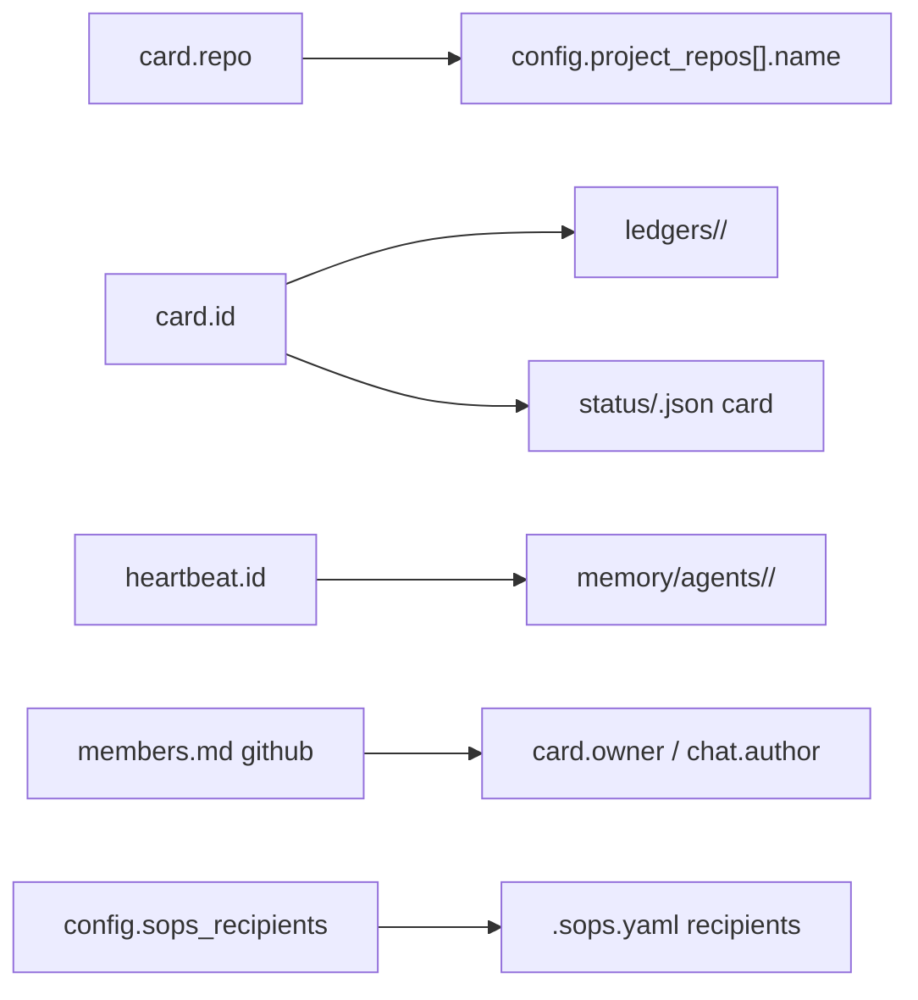

# 14 — Data Model

> **Status:** ✅ done · **Date:** 2026-06-06 · **Owner:** Gerard
> **Purpose:** The authoritative schema for **every file** in the control repo. Other docs describe *protocols*; this doc pins the *bytes*. If two docs disagree on a field, this one wins. Each schema lists fields, types, required/optional, and the invariant that keeps it correct.

---

## 1. Conventions

- **Format:** markdown files carry **YAML frontmatter** + a markdown body; pure-data files are **JSON**; config is **YAML**.
- **IDs:** zero-padded strings (`"0006"`), stable for a card's life, used in filenames and cross-references. Strings, not ints (preserves padding, avoids YAML coercion).
- **Timestamps:** **ISO-8601 UTC with `Z`** (`2026-06-06T17:18:04Z`) — always. They are the LWW tiebreaker (`11` §6), so format consistency is load-bearing.
- **Enums:** lowercase-hyphen (`in-progress`), matching folder names exactly.
- **Source of truth:** for a card, **frontmatter wins over folder path** (`11` §6). For everything else, the file is the truth.

## 2. Card / PRD — `prds/<column>/<id>-<slug>.md`

The central object. A card *is* a PRD file; the folder it sits in is the column.

```yaml
---
id: "0006"                        # string, required, stable, unique
title: OAuth refresh              # string, required
status: in-progress               # enum, required, AUTHORITATIVE (see §2.1)
priority: 1                       # int, required; lower = higher priority
owner: alice                      # string|null; GitHub handle of claimant
branch: feat/0006-oauth           # string|null; set at claim, in project repo
repo: project-api                 # string, required; which project repo
engine: claude                    # enum claude|codex|gemini; default from config
playbook: null                    # string|null; named recipe → Playbook, else Mission
created: 2026-06-06T16:40:00Z      # ISO-8601 UTC, required
updated: 2026-06-06T17:18:04Z      # ISO-8601 UTC, required; LWW tiebreaker
pr: null                          # string|null; PR URL, set when worker opens it
labels: [backend, security]       # string[]; optional, free-form
validation_criteria:              # string[]; testable assertions = "done" (§2.2)
  - "POST /auth/refresh rotates the refresh token"
  - "old refresh token is rejected after rotation"
  - "existing sessions survive the migration"
dependencies: []                  # string[] of card ids that must reach done first
---

## Context
Why this work exists, links to discussion.

## Requirements
What must be true when done (prose; the testable form is validation_criteria).

## Notes
Anything a worker should know before starting.
```

### 2.1 The status invariant (the most important rule in this doc)

```
status (frontmatter)  ==  <column> (folder)      ← must hold
on disagreement:      status WINS; reconciler re-files the folder
```

`status ∈ {inbox, in-progress, review, done}` and **must** match the parent folder. The folder is a denormalised render cache; the frontmatter is truth. The reconciler (in `23-kanban-board.md`) reads `status` and `git mv`s the file to the matching folder if they drift. This is the cross-branch-divergence mitigation from `11` §6 — encoded here as a field-level invariant.

### 2.2 validation_criteria — the trust-gate contract

A finite list of **testable behavioural assertions** (Factory Droids' "validation contract"). Written when the card is authored, checked by an **independent validator**, never by the implementer (`25-verification-trust-gate.md`). A card cannot reach `done` until every criterion passes. Empty list = invalid card (AUTO refuses to plan it).

### 2.3 Lifecycle of the mutable fields

| Field | Set at | Mutated by | Cleared/finalized at |
|---|---|---|---|
| `status` | author (inbox) | claim, review-move, done-move | terminal at `done` |
| `owner` | claim | re-queue (→ null) | stays at done |
| `branch` | claim | — | stays (audit) |
| `pr` | worker opens PR | — | stays (audit) |
| `updated` | author | **every** mutation | — (always fresh) |

**Invariant:** any write that changes a card **must** bump `updated`. LWW depends on it.

## 3. Heartbeat — `status/<id>.json`

One file per agent; **only that agent writes it**. Liveness signal (`12` §5).

```json
{
  "id": "worker-a3f2",
  "kind": "worker",
  "engine": "claude",
  "state": "building",
  "card": "0006",
  "branch": "feat/0006-oauth",
  "repo": "project-api",
  "last_seen": "2026-06-06T17:18:04Z",
  "note": "running integration tests"
}
```

| Field | Type | Required | Notes |
|---|---|---|---|
| `id` | string | ✓ | unique agent id; matches `memory/agents/<id>/` and filename |
| `kind` | enum `auto`\|`worker` | ✓ | AUTO writes one too |
| `engine` | enum | worker only | which CLI |
| `state` | enum | ✓ | `idle`\|`claiming`\|`building`\|`testing`\|`reviewing`\|`pr-open`\|`stalled`\|`exiting` |
| `card` | string\|null | ✓ | current card id |
| `branch` | string\|null | ✓ | current worktree branch |
| `repo` | string\|null | ✓ | current project repo |
| `last_seen` | ISO-8601 | ✓ | bumped every N s; **staleness = now − last_seen > 3N** |
| `note` | string | — | human-readable current action |

**Liveness rule:** `stale ⇔ now − last_seen > timeout` (default `timeout = 3 × heartbeat_interval`). Stale ⇒ agent presumed dead ⇒ AUTO re-queues its card.

**Write-volume note:** heartbeats commit often. To keep them out of the board's `main` history, they live on a dedicated **`status` branch** (or use amended/squashed commits). This is the one channel where we trade audit history for low noise — liveness is ephemeral by nature.

## 4. Ledgers — `ledgers/<card-id>/{task-ledger.md, progress-ledger.md}`

AUTO's working memory for a PRD (`12` §2.1). Markdown, AUTO-owned, rebuilt on restart.

**`task-ledger.md`** (outer loop — facts/guesses/plan):

```markdown
---
card: "0006"
mode: mission                     # mission | playbook
updated: 2026-06-06T17:10:00Z
---
## Given facts
- ...
## Educated guesses
- ...
## Plan
1. [role] task   parallel_group: A   depends_on: []
```

**`progress-ledger.md`** (inner loop — per-step tracking):

```markdown
---
card: "0006"
updated: 2026-06-06T17:18:00Z
stall_threshold: 3
---
| step | who | status | stall | next | satisfied |
|------|-----|--------|-------|------|-----------|
| 1 | worker-a3f2 | building | 0 | — | no |
```

**Task object fields** (one row of the plan): `role` (agent role), `parallel_group` (tasks in same group may run concurrently), `depends_on` (string[] of step numbers), `verification_criteria` (string[], inherited into the worker's self-review).

## 5. Memory files

**`memory/agents/<id>/notes.md`** — per-worker scratch, append-only (`13` §4):

```markdown
---
agent: worker-a3f2
card: "0006"
repo: project-api
updated: 2026-06-06T17:18:04Z
---
## [ISO-TS] short title
**desc:** one-line what-this-is (Letta-style)
body…
```

**`memory/project/*.md`** — consolidated shared knowledge (`13` §5). Same block format, but curated via PR. Conventional files: `architecture.md`, `decisions.md`, `conventions.md`, `repos/<repo>.md`. No rigid schema beyond the per-block `desc:` + timestamp; these are human-readable docs the team owns.

## 6. Chat — `teams/<team>/chat/<YYYY>/<MM>/<DD>/<HHMM>-<author>-<rand>.md`

**Maildir**: one file per message, globally unique name, **never edited after write** (`22-team-communication.md`). Concurrency-free because no two messages share a file.

```yaml
---
id: 1717-gerard-a3f2              # unique; encodes time+author+nonce
author: gerard                    # GitHub handle
to: "@team"                       # @team | @alice | @auto | thread:<id>
thread: null                      # string|null; reply-to message id
ts: 2026-06-06T17:17:00Z          # ISO-8601 UTC; render order
kind: human                       # human | auto | system
---
Message body in markdown.
```

| Field | Type | Required | Notes |
|---|---|---|---|
| `id` | string | ✓ | unique; `<HHMM>-<author>-<rand>` matches filename |
| `author` | string | ✓ | GitHub handle, or `auto` |
| `to` | string | ✓ | routing target (`22` taxonomy) |
| `thread` | string\|null | ✓ | message id this replies to |
| `ts` | ISO-8601 | ✓ | sort key for render |
| `kind` | enum | ✓ | `human`\|`auto`\|`system` |

Readers build the conversation by **listing the directory and sorting by `ts`** — no shared log file to append to. Immutability + unique names = zero merge conflicts.

## 7. Team manifest — `teams/<team>/members.md`

Human-readable mapping of members → handles → roles. **Metadata, not enforcement** — GitHub repo permissions + CODEOWNERS are the real gate (`20-identity-and-teams.md`).

```markdown
---
team: core
updated: 2026-06-06T12:00:00Z
---
| member | github | role | engines |
|--------|--------|------|---------|
| Gerard | gerard161 | lead | claude, codex |
| Alice  | alice-h   | dev  | claude |
```

`role ∈ {lead, dev, reviewer}` is advisory (used for chat routing / default reviewer); actual write access is GitHub's.

## 8. Config — `config.yml`

One file, the team's tunables. Read by AUTO, the supervisor, and the sync loop.

```yaml
team: core
control_repo: github.com/acme/control
project_repos:                    # the N repos in the workspace
  - name: project-api
    url: github.com/acme/api
  - name: project-web
    url: github.com/acme/web

sync:
  pull_interval_s: 8              # background git pull cadence (N)
  heartbeat_interval_s: 10        # agent heartbeat cadence
  heartbeat_timeout_mult: 3       # stale = mult × heartbeat_interval

runtime:
  max_workers: 4                  # concurrency cap (v1 ≤ 4)
  default_engine: claude          # claude | codex | gemini
  stall_threshold: 3              # cycles of no-progress → replan

verification:
  require_ci_green: true          # trust gate: CI must pass
  require_independent_review: true# validator ≠ implementer
  reviewer_engine: claude         # which CLI plays validator

memory:
  consolidate: nightly            # nightly | per-N-cards | manual
  consolidate_after_cards: 5      # if per-N-cards

secrets:
  sops_recipients:                # age public keys (NOT private!)
    - age1q...gerard
    - age1z...alice
```

**Invariants:** `pull_interval_s`, `heartbeat_interval_s` > 0; `max_workers ≥ 1`; `sops_recipients` are **public** age keys only (private keys never touch git — `21-secrets-and-keys.md`); every `project_repos[].name` is unique (cards reference it via `repo:`).

## 9. Secrets — `.sops.yaml` + `secrets.enc.yml`

Team-shared secrets, **encrypted in git** via SOPS+age (`21-secrets-and-keys.md`). The plaintext schema (what's inside, once decrypted) is intentionally minimal — **model API keys are NOT here** (those are per-user, in OS keychain). Team secrets are things like shared service tokens:

```yaml
# secrets.enc.yml — every VALUE is SOPS-encrypted; keys/structure stay diffable
shared:
  some_team_service_token: ENC[AES256_GCM,data:...,type:str]
```

**Hard rules (enforced by gitleaks pre-commit + CI + GitHub push protection):**
- **Never** commit plaintext model API keys, OAuth/access tokens, age **private** keys, or `.env` with real values.
- `.sops.yaml` lists **public** recipients only.
- Onboarding/offboarding a member = `sops updatekeys` + commit (re-encrypts to the new recipient set).

## 10. Cross-reference integrity (the graph that must stay consistent)

These references tie the model together; a reconciler/validator checks them:



| Reference | Must point to | Checked by |
|---|---|---|
| `card.repo` | a `config.project_repos[].name` | author-time + reconciler |
| `card.status` | its parent folder | reconciler (`23`) |
| `status/<id>.json` `id` | `memory/agents/<id>/` + ledger refs | supervisor |
| `card.owner`, `chat.author` | a `members.md` github handle | advisory |
| `config.sops_recipients` | `.sops.yaml` recipients | `sops updatekeys` |

**Invariant:** every `id` is one identity across the model — the card id threads through `prds/`, `ledgers/`, and (via the worker) `status/` + `memory/agents/`. Keep them aligned and the whole system is greppable by id.

---

**Related:** `11-coordination-model.md` (status-in-frontmatter rule this formalizes) · `12-agent-runtime.md` (heartbeat/ledger producers) · `13-memory-architecture.md` (memory file format) · `20-identity-and-teams.md` (members manifest) · `21-secrets-and-keys.md` (SOPS schema + hard rules) · `22-team-communication.md` (chat maildir) · `23-kanban-board.md` (the reconciler that enforces §2.1).
