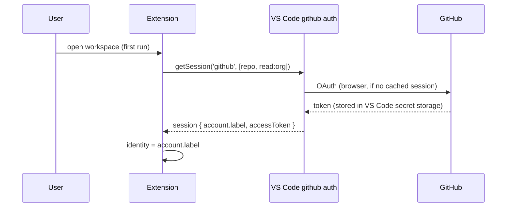
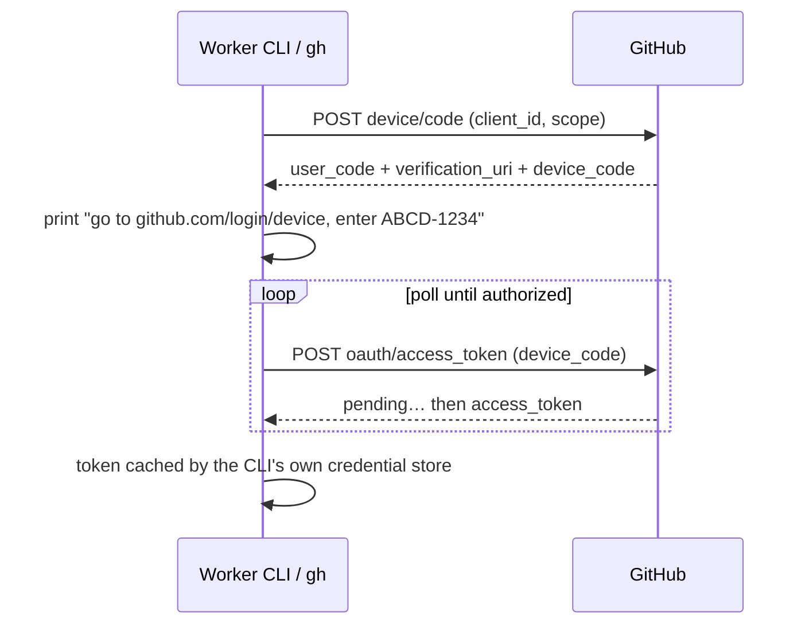
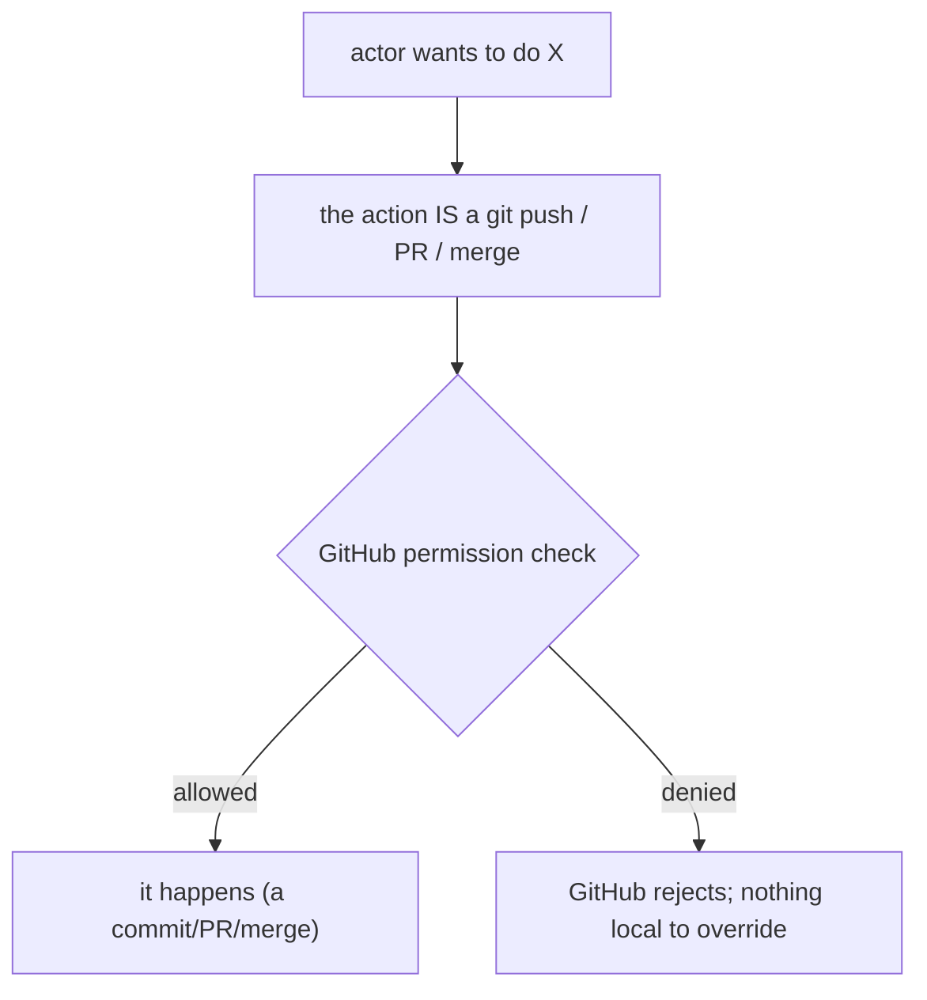
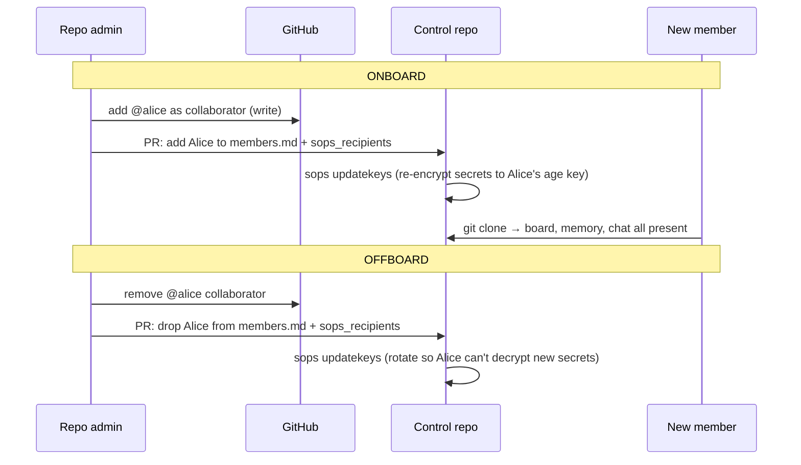

# 20 — Identity & Teams

> **Status:** ✅ done · **Date:** 2026-06-06 · **Owner:** Gerard
> **Purpose:** How a person signs in, how the system knows who they are, and how "a team" is defined — all without running an account system. The answer throughout: **GitHub is the identity provider, git permissions are the authorization layer, and a team is a repo's collaborator set.** We build almost nothing here, on purpose.

---

## 1. The principle — no account system

We do not run auth. We do not store passwords, issue sessions, or maintain a user table. **Who you are in git is who you are in the product.** This is principle #1 (git is the only backend) applied to identity: an account system is a server with a database, so we don't have one.

```
identity      = your GitHub account        (VS Code's built-in github auth)
authentication= VS Code github auth provider + GitHub OAuth device flow (CLIs)
authorization = GitHub repo permissions + CODEOWNERS
a "team"      = the collaborator set of a control repo
team metadata = teams/<team>/members.md   (human-readable, NOT enforcement)
```

Everything else in this doc is consequences of that table.

## 2. Sign-in — VS Code does it

The extension never shows a login form. It calls VS Code's built-in authentication API:

```ts
const session = await vscode.authentication.getSession(
  'github', ['repo', 'read:org'], { createIfNone: true }
);
// session.account.label  → the GitHub handle = the user's identity
// session.accessToken     → used for git ops the extension performs
```



- **First run:** VS Code opens the standard GitHub OAuth consent in the browser; the token is cached by VS Code (we never see or store the password).
- **Subsequent runs:** `getSession` returns the cached session silently.
- **The handle** (`session.account.label`) is the user's identity everywhere — it's what we write into `card.owner`, `chat.author`, and `members.md`.

No form, no user record, no session table. VS Code + GitHub own the whole flow.

## 3. Worker CLI auth — device flow

Workers are separate CLI processes (`claude`/`codex`/`gemini`, plus `gh` for git ops). They can't ride the extension's in-memory session, and they're headless, so they use **GitHub's OAuth device flow** (the "enter this code at github.com/login/device" pattern):



In practice this is mostly handled *for* us: `gh auth login` and each model CLI already implement device flow and cache their own credentials. The extension's job is only to ensure the CLIs are logged in (detect, prompt once), not to manage their tokens. **Model API keys are a separate concern** (BYO key injection — `21-secrets-and-keys.md`); this section is about *git/GitHub* identity for the CLI.

## 4. Authorization — GitHub permissions, not our code

We write **zero** authorization logic. The question "can Alice move this card / push to this repo / merge this PR?" is answered entirely by GitHub:

| Action | Gated by |
|---|---|
| Read the board (control repo) | GitHub **read** on the control repo |
| Claim/move a card (push to control) | GitHub **write** on the control repo |
| Open a PR on a project repo | GitHub **write** (or fork) on that project repo |
| Merge a PR (reach `done`) | GitHub branch protection + **CODEOWNERS** review |
| Join/leave a team | added/removed as a **collaborator** on the control repo |



Because every action in the system *is* a git operation, **GitHub's existing permission check is our authorization layer** — for free, battle-tested, and auditable. There is no in-app role check to bypass, because there is no in-app role.

## 5. What a "team" actually is

A team is **the collaborator set of a control repo.** That's the whole definition:

- **One control repo per team (v1).** Being on the team = having access to that repo.
- **Adding a member** = adding a GitHub collaborator (or org-team) to the control repo (and the relevant project repos). Their next clone/pull just works.
- **Removing a member** = revoking that access. Their local clone goes stale; they can push nothing.
- **Team isolation** = they're literally different repos with different collaborator sets. Another team's AUTO has different GitHub credentials and a different control repo — no shared surface to cross (`12` §7, `22` isolation).

```
Team "core"   → control repo  github.com/acme/control-core   (collaborators: gerard161, alice-h)
Team "growth" → control repo  github.com/acme/control-growth (collaborators: bob-q, carol-z)
                └─ different repos, different ACLs, zero shared state → isolated by construction
```

## 6. The teams manifest — metadata, not a gate

`teams/<team>/members.md` (schema in `14` §7) is a **committed, human-readable** roster — names, handles, roles, preferred engines. It exists so the *product* can be friendly (show display names in chat, pick a default reviewer by role), **not** to enforce anything.

> **Critical distinction:** `members.md` is *descriptive*. If it says Alice is a "reviewer" but GitHub hasn't granted her write access, GitHub wins — she can't merge. **Never** treat the manifest as an authorization source. The enforcement layer is always GitHub permissions + CODEOWNERS. The manifest is a convenience cache of social metadata.

Keeping it in git means onboarding is a PR ("add Alice to the roster") that a human reviews — same trust gate as everything else — but the *real* access change is the GitHub collaborator add, which a repo admin does in GitHub.

## 7. Onboarding & offboarding (a commit + a permission change)



- **Onboard** = (1) GitHub collaborator add [the real gate], (2) manifest PR [metadata], (3) `sops updatekeys` so shared secrets encrypt to their age key [`21`].
- **Offboard** = reverse all three; crucially `sops updatekeys` re-encrypts so the removed member can't read *future* secret changes (rotate anything truly sensitive — git history still holds old ciphertext).

Both are **just git + GitHub settings** — no admin console to build.

## 8. AUTO's identity

AUTO acts on the user's behalf and commits as a recognizable author (e.g. `auto[bot]` or the user's handle with an `auto` marker in `chat.kind`). It uses the **user's** GitHub credentials (it's their orchestrator, their access) — it is not a separate GitHub account in v1. This keeps the permission model trivial: AUTO can do exactly what the user can do, nothing more. (If a future version wants AUTO as a distinct GitHub App identity for finer audit, that's a post-kernel addition — see `51-risks-open-questions.md`.)

## 9. Privacy & multi-tenancy boundary (v1 honesty)

- **Two teammates** share a control repo → they see each other's board, chat, memory. That's the point.
- **Two teams** use different control repos → they see *nothing* of each other. Isolation is repo-level.
- **What v1 does NOT provide:** SSO/SAML, org-wide RBAC beyond GitHub's, per-field redaction, or hosted multi-tenant separation. Those are explicitly out of scope (vision doc §4 "not for"). A regulated enterprise wanting more than GitHub permissions is a post-kernel conversation.

The honest one-liner: **our security model is exactly GitHub's security model.** That's a feature (proven, auditable, zero new attack surface) and a boundary (we inherit GitHub's limits). For the target user — a small team already living in GitHub — it's precisely right.

---

**Related:** `12-agent-runtime.md` (AUTO/worker processes that carry identity) · `21-secrets-and-keys.md` (BYO model keys + SOPS onboarding) · `22-team-communication.md` (team isolation, chat author = handle) · `14-data-model.md` (members manifest schema) · `26-extension-surface.md` (the `vscode.authentication` API call) · `PRD-02-identity-teams.md` (buildable increment).
