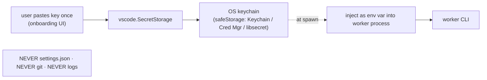
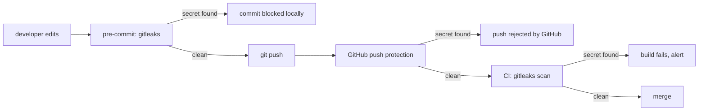

# 21 — Secrets & Keys

> **Status:** ✅ done · **Date:** 2026-06-06 · **Owner:** Gerard
> **Purpose:** Where every secret lives, how it gets to a worker, and the hard rules that keep secrets out of git. Two distinct kinds of secret with two distinct homes: **personal model keys → OS keychain (never git)**; **team-shared secrets → SOPS+age (encrypted in git)**. Plus the guardrails (gitleaks, push protection) that make a leak hard to commit by accident.

---

## 1. Two kinds of secret, two homes (the whole model)

Conflating these is the classic mistake. They have opposite requirements:

| | **Personal model keys** (BYO) | **Team-shared secrets** |
|---|---|---|
| Examples | Your Anthropic/OpenAI/Google login, personal API keys | A shared service token the whole team needs |
| Who has it | One person | Everyone on the team |
| Home | **OS keychain** via `vscode.SecretStorage` | **Encrypted in git** via SOPS+age |
| In git? | **NEVER** | Yes — but only as ciphertext |
| Sync | Doesn't sync; each user has their own | Syncs like any file (it's in the repo) |
| Onboarding | Each user enters their own once | `sops updatekeys` re-encrypts to new member |

The rule of thumb: **if it's yours, it never leaves your machine; if it's the team's, it's in git but encrypted.** Model API keys are *always* the first kind — BYO-CLI means each user runs on their own model account, so there is no shared model key to manage.

## 2. Personal keys — `vscode.SecretStorage` (the OS keychain)

VS Code's `SecretStorage` API stores secrets in the OS keychain through Electron's `safeStorage` (macOS Keychain, Windows Credential Manager, libsecret on Linux). This is the *only* place personal model keys live.

```ts
// store (once, during onboarding)
await context.secrets.store('automatos.anthropicApiKey', key);
// retrieve (at worker spawn)
const key = await context.secrets.get('automatos.anthropicApiKey');
```



**Hard rules for personal keys:**
- **NEVER** `settings.json` (it's plaintext, often synced/committed).
- **NEVER** git, **NEVER** a file in any repo, **NEVER** a log line.
- They exist in two places only: the **OS keychain** (at rest) and a **worker's process env** (in use).

## 3. Key injection — keychain → worker env at spawn

Workers receive keys as **environment variables injected at spawn**, never written to disk in the worktree:

```mermaid
sequenceDiagram
    participant Sup as Worker supervisor
    participant SS as SecretStorage (keychain)
    participant Term as VS Code terminal
    participant W as Worker CLI
    Sup->>SS: get('automatos.anthropicApiKey')
    SS-->>Sup: key (in memory only)
    Sup->>Term: create terminal with env { ANTHROPIC_API_KEY: key }
    Term->>W: spawn CLI; env carries the key
    W->>W: model calls use env key (BYO)
    Note over W: key lives in process env, never in the worktree files
```

- The supervisor reads the key from the keychain **in memory**, sets it in the spawned terminal's `env`, and launches the CLI. The key is in the process environment, not on disk.
- When the worker exits, the process (and its env) is gone. Nothing to clean up in the repo.
- **The worktree never contains the key** — so even an accidental `git add -A` in a worktree can't commit it.

This is the BYO-CLI economics made concrete: the worker authenticates to the model with the *user's own* key, we never proxy or meter (`00-vision` §5).

## 4. Team-shared secrets — SOPS + age (encrypted in git)

Some secrets genuinely must be shared (a team service token). These go in git — but **only as ciphertext** — using **SOPS** (encrypts *values*, keeps the file structure/keys diffable) with **age** (modern, simple, multi-recipient public-key encryption).

```yaml
# secrets.enc.yml — committed to git; only VALUES are encrypted
shared:
  team_service_token: ENC[AES256_GCM,data:9f3a...,type:str]   # ciphertext
  webhook_signing_key: ENC[AES256_GCM,data:b2c1...,type:str]
```

```yaml
# .sops.yaml — committed; lists PUBLIC recipients (age public keys only)
creation_rules:
  - path_regex: secrets\.enc\.ya?ml$
    age: >-
      age1q...gerard,
      age1z...alice
```

Why this specific stack:

| Property | Why it matters |
|---|---|
| **Encrypts values, not the file** | The YAML keys stay readable → diffs are meaningful, reviews work |
| **Multi-recipient (age)** | Each member decrypts with their own age private key; no shared passphrase |
| **Onboarding = a commit** | `sops updatekeys` re-encrypts to the new recipient set; offboarding rotates them out |
| **No server** | It's just files + local keys → satisfies principle #1 (git is the only backend) |

```mermaid
flowchart TD
  Plain["secret value"] -->|sops encrypt to recipients| Cipher["secrets.enc.yml (ciphertext)"]
  Cipher -->|committed| Git["control repo (git)"]
  Git -->|clone/pull| Member["teammate"]
  Member -->|age private key (in keychain)| Decrypt["sops decrypt → plaintext in memory"]
  Decrypt -.injected like §3.-> W["worker, if needed"]
  AgePriv["age PRIVATE key"] -.NEVER in git.- Git
```

**age private keys** live in the user's keychain/`~/.config/sops/age` — **never** in git. Only **public** keys appear in `.sops.yaml`.

## 5. Onboarding / offboarding a team secret recipient

```bash
# onboard Alice: add her age PUBLIC key as a recipient, re-encrypt
sops updatekeys secrets.enc.yml   # after adding age1z...alice to .sops.yaml
git commit -am "secrets: add alice as recipient"

# offboard: remove her from .sops.yaml, re-encrypt so she can't read NEW secrets
sops updatekeys secrets.enc.yml
git commit -am "secrets: remove alice; rotate"
```

**Offboarding caveat (be honest about it):** removing a recipient stops them decrypting *future* ciphertext, but **git history still holds old ciphertext they could already decrypt.** So offboarding a sensitive secret means **rotating the underlying secret** (issue a new token, re-encrypt), not just dropping the recipient. Document which secrets are rotation-on-offboard in `members.md` notes.

## 6. The guardrails — making a leak hard to commit

Defense in depth so a secret can't slip into git by accident:



| Layer | Tool | Catches |
|---|---|---|
| **Local pre-commit** | `gitleaks protect --staged` | secrets before they're even committed |
| **Remote push** | GitHub **push protection** | known-pattern secrets at push time |
| **CI** | `gitleaks detect` in the pipeline | anything the first two missed, on every PR |

Three independent layers means a single bypass (e.g. `--no-verify` locally) doesn't expose a secret — push protection or CI still catches it. **Never** instruct an agent or human to `--no-verify` past a gitleaks block (CLAUDE.md security rule); investigate the finding instead.

## 7. The hard rules (the checklist that must always hold)

These are non-negotiable and enforced by §6's layers:

- [ ] **No plaintext model API keys** anywhere in git — they live in the OS keychain only (§2).
- [ ] **No OAuth/access tokens** committed — CLIs cache their own (`20` §3).
- [ ] **No age PRIVATE keys** in git — only public keys in `.sops.yaml` (§4).
- [ ] **No `.env` with real values** committed — `.env.example` with placeholders is fine.
- [ ] **`.sops.yaml` lists public recipients only.**
- [ ] **Keys reach workers only as injected env vars**, never as files in a worktree (§3).
- [ ] **Sensitive team secrets are rotated on offboarding**, not just un-recipiented (§5).
- [ ] **gitleaks runs at pre-commit + push + CI**; never bypass it.

## 8. What we deliberately do NOT build

| Tempting | Why we skip it (v1) | Revisit when |
|---|---|---|
| A secrets server / Vault | It's a server — violates principle #1; SOPS+age covers team sharing | Enterprise demands centralized rotation/audit |
| Proxying model calls through us | Kills BYO-CLI economics; makes us a metered relay | Never (it's the anti-thesis) |
| Per-worker ephemeral key minting | Overkill; BYO key in env is sufficient isolation for v1 | Untrusted multi-tenant hosting |
| Custom encryption | Don't roll crypto; SOPS+age is audited and standard | Never |

The shape: **personal = keychain, team = SOPS-in-git, model calls = BYO, leaks = gitleaks×3.** No server, no proxy, no custom crypto — secrets ride the same git-native, principle-#1 rails as everything else.

---

**Related:** `20-identity-and-teams.md` (GitHub identity, onboarding flow that pairs with `sops updatekeys`) · `12-agent-runtime.md` (worker spawn = where injection happens) · `14-data-model.md` (`config.sops_recipients`, secrets schema) · `26-extension-surface.md` (`vscode.SecretStorage` API) · `00-vision-positioning.md` (BYO-CLI economics) · `PRD-03-secrets-keys.md` (buildable increment).
