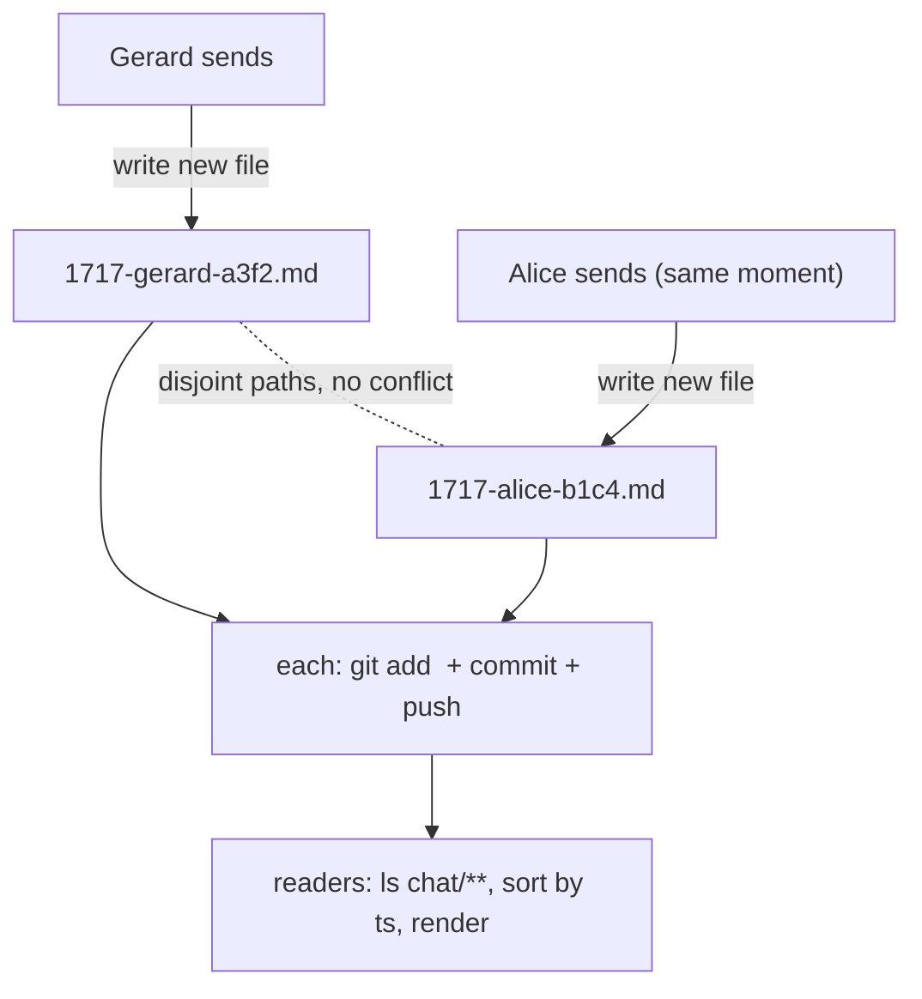
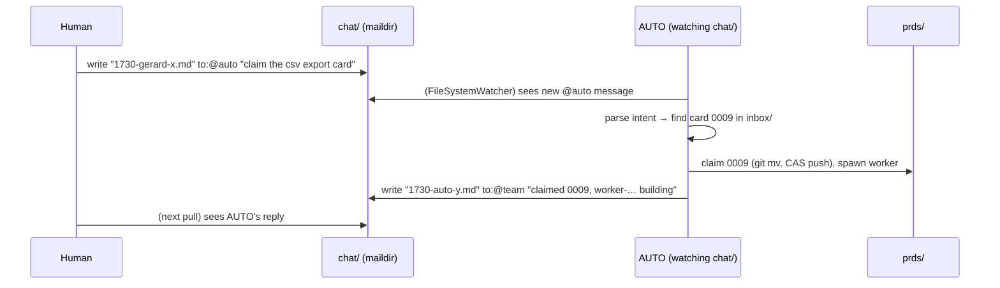

# 22 — Team Communication

> **Status:** ✅ done · **Date:** 2026-06-06 · **Owner:** Gerard
> **Purpose:** How humans talk to humans, humans talk to AUTO, and AUTO talks back — all over git, with zero merge conflicts. The transport is **maildir** (one file per message), the routing is a small **`to:` taxonomy**, and team isolation falls out of the control-repo boundary. This is one of the two marquee surfaces (the other is the board).

---

## 1. What chat must do (and must not)

Chat is a **primary goal** of the product (`00-vision` §1): a side panel where teammates coordinate while agents work. Requirements:

1. **Human ↔ human** — the main use: two teammates discussing work, reviewing PRs, steering.
2. **Human ↔ AUTO** — ask your orchestrator "what's running?", "claim the export card", "why is 0006 stalled?".
3. **AUTO ↔ human** — AUTO escalates ("0006 stalled 3 cycles, need a decision"), reports ("0005 merged").
4. **Conflict-free over git** — two people typing at once must never produce a merge conflict.
5. **Team-isolated** — another team's chat is invisible and unreachable.

What it is **not** (v1): real-time presence, typing indicators, sub-second delivery, or a WebSocket anything. It's minute-scale coordination over `git pull`, like the rest of the system.

## 2. Maildir — one file per message (the key idea)

The conflict-free requirement (#4) is the whole design constraint, and it's solved exactly like memory and the board: **never let two writers share a file.** Each message is its **own immutable file** with a globally unique name:

```
teams/core/chat/
└── 2026/06/06/
    ├── 1717-gerard-a3f2.md      # Gerard's message at 17:17
    ├── 1717-alice-b1c4.md       # Alice's message, SAME minute — different file
    ├── 1718-auto-c2d5.md        # AUTO's reply
    └── 1719-gerard-e3f6.md
```



- **Unique name** = `<HHMM>-<author>-<nonce>` (date dirs above it). Two messages can't collide even in the same minute because of the nonce + author (schema in `14` §6).
- **Immutable** — a message file is never edited after write. (Edits/deletes, if ever needed, are new tombstone messages, not in-place changes.)
- **Reading** = list the directory tree, sort by `ts`, render. No shared log file to append to → **structurally impossible to merge-conflict.**

This is "maildir" because it's the same trick the maildir email format uses: one file per message, unique names, so concurrent delivery never corrupts a shared mbox.

## 3. The routing taxonomy — the `to:` field

Every message has a `to:` that says who it's for. Small, fixed vocabulary:

| `to:` value | Meaning | Rendered where |
|---|---|---|
| `@team` | everyone on the team (the default channel) | main chat |
| `@<handle>` | a direct message to one person (e.g. `@alice`) | DM view / highlighted |
| `@auto` | a request/command to the user's AUTO | AUTO picks it up |
| `thread:<id>` | a reply within a thread (replies to message `<id>`) | nested under the thread |
| `system` | system notices (card moved, PR merged) — written by `kind: system` | inline, muted |

```mermaid
flowchart LR
  Msg["message.to"] --> Route{value?}
  Route -->|@team| Team["broadcast to team channel"]
  Route -->|@handle| DM["direct to that member"]
  Route -->|@auto| AUTO["AUTO consumes as a command"]
  Route -->|thread:id| Thr["attach under thread id"]
  Route -->|system| Sys["muted system line"]
```

Routing is **render-time**, not transport-time: every message file is in the same maildir; the `to:` field tells the *reader* how to display/filter it. There's no separate channel storage — `@team` vs `@alice` is a view filter over the same folder. (Threads are just messages whose `thread:` points at a parent id; `14` §6.)

## 4. Human ↔ AUTO — chat as the command surface

AUTO is the chat counterparty (`02-glossary`: "the chat counterparty"). A human steers the whole system by messaging `@auto`:



- AUTO **watches `chat/`** (FileSystemWatcher + pull) for `to:@auto` messages and treats them as natural-language commands: claim a card, report status, explain a stall, re-plan, pause a worker.
- AUTO **replies by writing its own message file** (`kind: auto`) — same maildir, same transport. Its escalations (stall, needs-decision from `12` §2.2) arrive here too.
- This means **the chat log is also the command log** — every instruction to AUTO and every AUTO action-report is a committed message, auditable in git history. No separate command channel.

## 5. Team isolation — it's the repo boundary, again

Requirement #5 (another team's chat is invisible/unreachable) needs **no special code** — it's the same isolation as everywhere:

- Chat lives in `teams/<team>/chat/` **inside a team's control repo**.
- A team = the collaborator set of that repo (`20` §5).
- Another team has a **different control repo** with a **different collaborator set** → you can't read or write their `chat/` because you can't read or write their repo.
- Your AUTO only watches *your* control repo's `chat/`, using *your* GitHub credentials → it can't see, route to, or be commanded by another team's chat.

```
Team core   → control-core repo   → teams/core/chat/    (only core can read/write)
Team growth → control-growth repo → teams/growth/chat/  (only growth can read/write)
            └─ no shared repo → no shared chat → isolation by construction, not by ACL code
```

"Another team's agents can't talk to my team's agents" (an original requirement) is true because there is **no channel** between them: different repos, different credentials, different AUTO processes (`12` §7). Isolation is a property of the topology, not a firewall we maintain.

## 6. Delivery & liveness (the same git clock)

Chat syncs on the same cadence as everything else (`11` §5):

- **Send** = write file + commit + push (sub-second locally; visible to others after their next pull).
- **Receive** = background `git pull` every N seconds → FileSystemWatcher → re-render the panel.
- **Latency** = bounded by 2N (your push, their pull). For coordination chat about minute-scale work, invisible.
- **Ordering** = by `ts` field (ISO-8601 UTC). Clock skew between machines is possible but bounded and tolerable for human chat; threads pin causality where it matters (`thread:` references a specific parent, not a timestamp).

> **If real-time ever matters** (live typing, sub-second DMs), *that feature* adds a transport (e.g. an optional relay) — the substrate stays git. This is the same "omit until a requirement forces it" stance as `10` §8. v1 deliberately does not pay for real-time.

## 7. Why not Slack / a chat server / WebSockets?

| Alternative | Why not (v1) |
|---|---|
| **Slack/Discord integration** | External dependency + another account system; chat-about-the-work belongs *with* the work, in the same repo, auditable in git |
| **A chat server (WS)** | A server — violates principle #1; real-time isn't needed for minute-scale work |
| **One shared `chat.md` log** | The exact single-file merge-conflict trap maildir exists to avoid (`11` §7) |
| **GitHub Discussions/Issues** | Heavier, API-rate-limited, not renderable inline in the IDE panel the way local files are |

Maildir-in-git wins because it's **conflict-free, server-free, auditable, offline-tolerant, and co-located with the work** — every property the product is built on.

## 8. The chat panel (surface sketch)

The webview rendering (full UX in `26-extension-surface.md`) is a thin function of the maildir:

```
┌─ TEAM CHAT ──────────────────────────────┐
│ #team                              ⌄      │
│ ───────────────────────────────────────  │
│ alice    17:17  PR for 0005 is up, lgtm?  │
│ gerard   17:17  looking now               │
│ AUTO     17:18  ✅ 0005 merged, CI green   │
│ AUTO     17:18  ⚠ 0006 stalled 3x — split? │
│ gerard   17:19  @auto yes, split it       │
│ ───────────────────────────────────────  │
│ > message @team / @auto…            [send]│
└──────────────────────────────────────────┘
```

- Columns/filters (`#team`, DMs, threads) are render-time views over `to:` (§3).
- Sending writes a new maildir file; the panel re-renders on the next watcher tick.
- AUTO's lines (`kind: auto`) are visually marked; system lines (`kind: system`) are muted.

---

**Related:** `11-coordination-model.md` (maildir as the other many-writers channel) · `12-agent-runtime.md` (AUTO consumes `@auto`, escalates here) · `14-data-model.md` (chat message schema) · `20-identity-and-teams.md` (team = repo collaborators → chat isolation) · `23-kanban-board.md` (the sibling marquee surface) · `26-extension-surface.md` (webview rendering) · `PRD-08-team-chat.md` (buildable increment).
