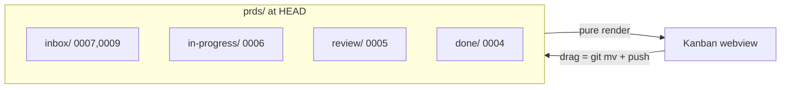
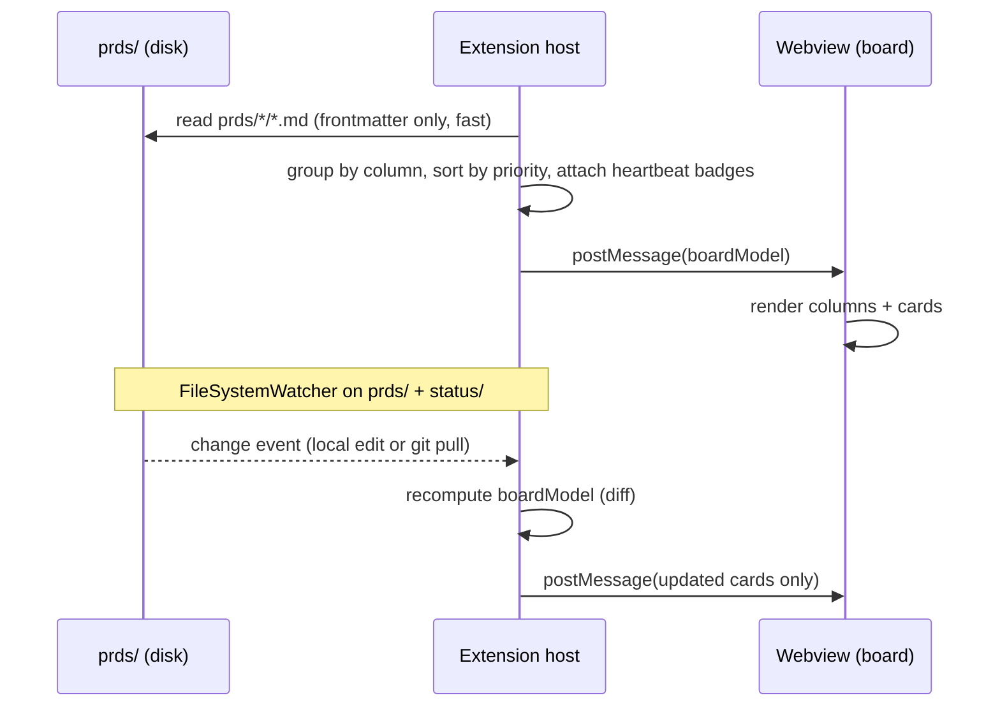
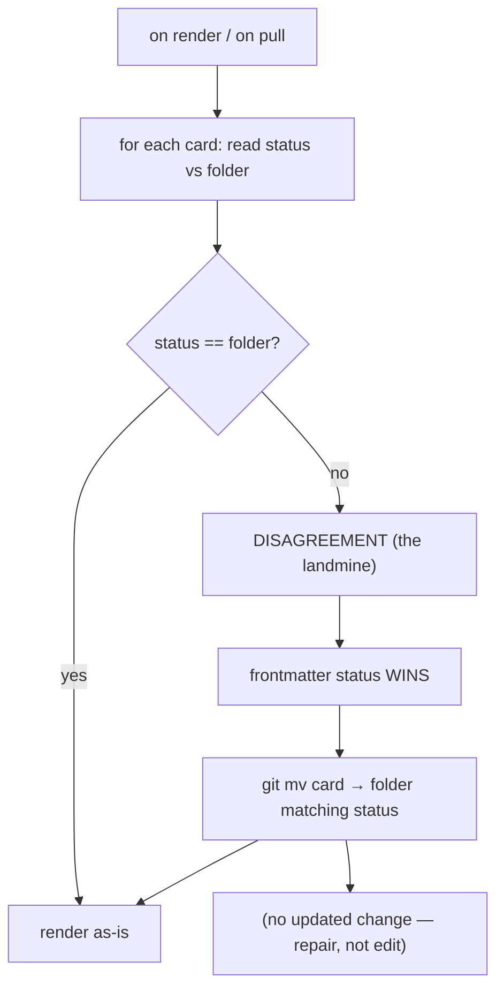

# 23 — Kanban Board

> **Status:** ✅ done · **Date:** 2026-06-06 · **Owner:** Gerard
> **Purpose:** The marquee surface — a Kanban board that is a **live render of the queue folders**, where dragging a card *is* a `git mv`, and where the reconciler keeps folder and frontmatter honest. The board holds no state of its own; it's a pure function of `prds/*/` at the current commit.

---

## 1. The one idea — the board is a render, not a store

There is no board database, no board model, no board state to corrupt. **The board is a pure function of the folders:**

```
render(prds/) → board UI
```

- A **column** is a folder: `inbox/`, `in-progress/`, `review/`, `done/`.
- A **card** is a file: `prds/<column>/<id>-<slug>.md`.
- **Position/rank** within a column is the `priority` frontmatter field.
- **Drag** a card between columns = `git mv` + commit + push.

Everything else in this doc follows from that. Because the board is a render, it survives a crash, a fresh clone, or a teammate joining mid-flight — there's nothing to rebuild; you just `render(prds/)` again. (This is the coordination model of `11` made visible.)



## 2. Rendering pipeline (folders → pixels)



- The extension host **reads frontmatter** (not full bodies — fast) from every card, builds a `boardModel` (columns → sorted cards + liveness badges), and posts it to the webview.
- The webview is **dumb**: it renders `boardModel` and emits user intents (drag, open, claim) back to the host. All git/file logic stays in the host; the webview never touches the filesystem (VS Code webview sandbox).
- **Re-render triggers:** a `FileSystemWatcher` on `prds/` and `status/` fires on any local edit *or* any change pulled from the remote (`11` §5). The board updates within one watcher tick of a `git pull`.

## 3. Drag = `git mv` (the core interaction)

Dragging a card is sugar over the claim/move protocol (`11` §4):

```mermaid
sequenceDiagram
    participant U as User
    participant WV as Webview
    participant Ext as Extension host
    participant C as Control repo
    U->>WV: drag 0006 from in-progress → review
    WV->>Ext: intent { card: 0006, from: in-progress, to: review }
    Ext->>Ext: optimistic UI: show 0006 in review (pending)
    Ext->>C: git mv in-progress/0006 → review/0006
    Ext->>Ext: set frontmatter status=review, updated=now
    Ext->>C: commit + push (CAS)
    alt push accepted
        C-->>Ext: ok → confirm card in review
    else push rejected (someone moved it first)
        C-->>Ext: non-ff → reset, re-render from remote truth
        Ext->>WV: revert optimistic move; show actual state
    end
```

- **Optimistic UI:** the card visually moves immediately; the git push confirms or reverts it. On a lost race (`11` §4.3) the board snaps back to remote truth — the user sees the real state within a tick, never a lie.
- **Both `git mv` *and* a frontmatter `status` write happen together** (one commit), preserving the §4 invariant (folder == frontmatter). The `updated` bump feeds LWW.
- **Human drag and agent claim are the same operation** — a person dragging `inbox → in-progress` *is* claiming the card, identical to a worker claiming it. One protocol, two initiators.

## 4. The reconciler — keeping folder and frontmatter honest

The board's correctness rests on the invariant `status (frontmatter) == column (folder)` (`14` §2.1). The **reconciler** is the small routine that enforces it, because the frontmatter is the source of truth and the folder is a cache (`11` §6).



- **Normal case:** folder and frontmatter agree → render directly.
- **Drift case** (the cross-branch landmine from `11` §6): they disagree → **frontmatter `status` wins**; the reconciler `git mv`s the file to the folder that matches `status`. If *two frontmatters* disagree across a merge, the **newer `updated` wins** (LWW) — that's resolved at merge time, and the reconciler just re-files to match the survivor.
- The reconciler is **idempotent and cheap** (frontmatter read + maybe a move). It runs on every render and after every pull, so the board self-heals continuously rather than accumulating drift.

This is where the abstract mitigation in `11` §6 becomes running code: **single-branch board + frontmatter-as-truth + LWW**, enforced by a reconciler that fires on every tick.

## 5. Liveness — badges from heartbeats

Cards in `in-progress/` show what their worker is doing, read from `status/<id>.json` (`12` §5):

| Badge | Source | Meaning |
|---|---|---|
| 🟢 running | heartbeat fresh, `state: building/testing` | worker actively on it |
| 🟡 waiting | `state: claiming/idle` or queued | claimed, not yet working |
| 🔵 PR open | `state: pr-open` or `card.pr` set | PR is up, heading to review |
| 🔴 stalled | heartbeat stale > timeout, or `state: stalled` | worker stuck/dead; AUTO may re-queue |
| ⚪ unclaimed | no owner (inbox) | available to claim |

```
┌─ ⚙ IN PROGRESS ──────────────┐
│ ┌──────────────────────────┐ │
│ │ 0006 OAuth refresh   🟢   │ │  ← worker-a3f2 "running integration tests"
│ │ alice · feat/0006        │ │
│ └──────────────────────────┘ │
└──────────────────────────────┘
```

Badges update on the same watcher tick as the board (the heartbeat files are in `status/`, also watched). A teammate on another machine sees your workers' liveness because their IDE pulled your heartbeat commits — **liveness syncs over git like everything else**, no socket.

## 6. Board layout (surface sketch)

```
┌─ BOARD · team core ───────────────────────────────────────────────┐
│ 📥 INBOX (2)     ⚙ IN PROGRESS (1)   🔍 REVIEW (1)    ✅ DONE (1)  │
│ ┌────────────┐   ┌────────────┐      ┌────────────┐   ┌──────────┐ │
│ │0007 Stripe │   │0006 OAuth🟢│      │0005 Rate🔵 │   │0004 Health│ │
│ │ webhooks   │   │ alice      │      │ PR #42     │   │ ✓ merged  │ │
│ │ P1  ⚪     │   │ feat/0006  │      │ bob        │   │           │ │
│ ├────────────┤   └────────────┘      └────────────┘   └──────────┘ │
│ │0009 CSV    │                                                     │
│ │ export P2⚪│        [+ New card]                                  │
│ └────────────┘                                                     │
└────────────────────────────────────────────────────────────────────┘
```

- **Columns = folders**, count badges from `ls`.
- **Cards** show id, title, priority, owner/branch, liveness badge.
- **`+ New card`** opens the authoring flow (`24-prd-authoring-and-decomposition.md`) → writes a new file to `inbox/`.
- **Click a card** → opens the PRD markdown in a normal editor tab (it's just a file) and/or a detail panel (validation_criteria, links to PR, heartbeat).

## 7. Interactions inventory

| Interaction | What it does | Underlying op |
|---|---|---|
| Drag card across columns | move/claim | `git mv` + frontmatter `status` + push (CAS) |
| Click card | open PRD | open the `.md` in an editor tab |
| `+ New card` | author a PRD | write new file to `inbox/` (`24`) |
| Edit priority | reorder within column | set `priority` frontmatter + push |
| Hover liveness badge | see worker detail | read `status/<id>.json` `note` |
| "Re-queue" (on stalled) | reclaim a dead card | `git mv` back to `inbox/`, clear `owner` |
| Filter by repo/label | view subset | render-time filter over frontmatter |

All mutations are git operations; all reads are frontmatter/heartbeat. The webview only ever sends *intents* — the host performs the git op and re-renders.

## 8. Performance & scale (v1 honesty)

- **Read cost:** frontmatter-only parse of N cards per render. For v1 scale (tens of cards), trivial. Bodies are read lazily on card-open.
- **Watcher noise:** heartbeats commit often (`14` §3); to avoid re-rendering the whole board on every heartbeat, the host **diffs** `status/` separately and updates only the affected card's badge, not the full `boardModel`.
- **Large boards (post-v1):** if `done/` grows huge, archive old cards to `done/<year>/` (still files, still greppable) so the live render stays small. Not a v1 concern.

## 9. What the board is NOT

- **Not a state store** — it's `render(prds/)`; truth is the folders + frontmatter.
- **Not authoritative on status** — frontmatter is (the reconciler defers to it, §4).
- **Not real-time** — it's watcher-on-pull, bounded by 2N like all sync (`11` §5).
- **Not where claim-races are decided** — that's the CAS in the host (`11` §4); the board just reflects the outcome (optimistic-then-confirm, §3).

The board is the **face** of the coordination model — every pixel traces back to a file in `prds/` or `status/`. Build the render right and the board is automatically correct, because it has no truth of its own to get wrong.

---

**Related:** `11-coordination-model.md` (queue, claim CAS, the divergence mitigation the reconciler enforces) · `12-agent-runtime.md` (heartbeats behind the badges; re-queue) · `14-data-model.md` (card schema, status invariant §2.1) · `22-team-communication.md` (sibling marquee surface) · `24-prd-authoring-and-decomposition.md` (the `+ New card` flow) · `26-extension-surface.md` (webview/host messaging) · `PRD-04-board-webview.md` (buildable increment).
