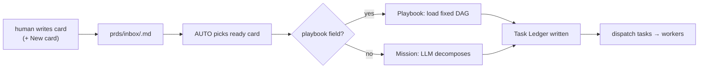
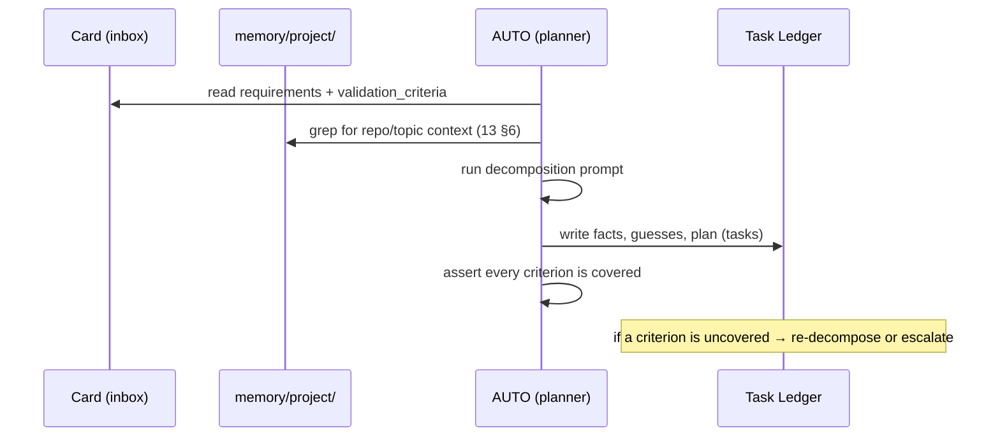
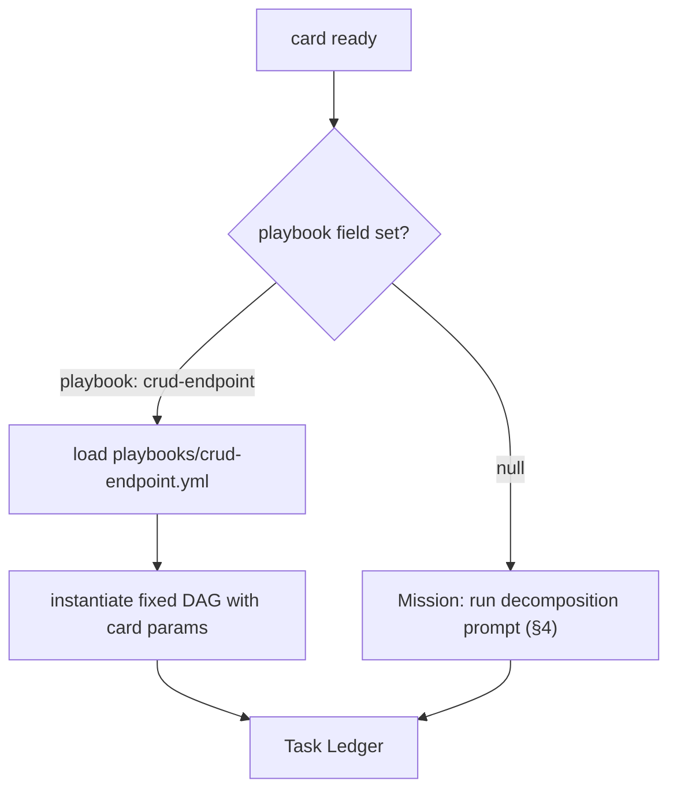
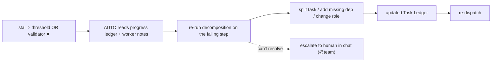

# 24 — PRD Authoring & Decomposition

> **Status:** ✅ done · **Date:** 2026-06-06 · **Owner:** Gerard
> **Purpose:** How a human writes a card and how AUTO turns it into runnable tasks. The PRD format (what a good card contains), the decomposition prompt (PRD → Task Ledger), and the **Playbook vs Mission** decision (deterministic DAG vs adaptive plan). This is where human intent becomes agent work.

---

## 1. The pipeline — intent to tasks



A card enters as human-authored markdown; AUTO converts it into a **Task Ledger** (`12` §2.1) — the set of tasks workers actually run. The conversion is either a **Playbook** (known recipe, no LLM) or a **Mission** (LLM decomposition). The quality of that conversion is bounded by the quality of the card, so authoring matters.

## 2. What a good card contains

A card is a PRD file (schema in `14` §2). Authoring-wise, three parts carry the weight:

```markdown
---
id: "0009"
title: CSV export for reports
status: inbox
priority: 2
repo: project-api
playbook: null                    # null → Mission; or a named recipe
validation_criteria:              # THE most important authoring field
  - "GET /reports/:id/export.csv returns text/csv"
  - "CSV includes header row matching the report columns"
  - "rows match the JSON report exactly (same filter)"
  - "endpoint requires the same auth as GET /reports/:id"
dependencies: []
---

## Context
Users want to pull reports into spreadsheets. Today only JSON is exposed.

## Requirements
Add a CSV export endpoint mirroring the existing JSON report endpoint.

## Notes
The report serializer lives in `api/reports/serialize.py`. Reuse it.
```

| Part | Why it's load-bearing |
|---|---|
| **`validation_criteria[]`** | This *is* the definition of done (`25`). A vague list = an un-checkable card. The single highest-leverage thing an author writes. |
| **Body `## Requirements`** | What AUTO decomposes. Prose intent — the testable form is the criteria. |
| **`repo` + `## Notes`** | Grounds the worker: which repo, what to reuse. Saves a worker re-discovering the codebase (and seeds better memory recall, `13` §6). |

### 2.1 The authoring guardrail

AUTO **refuses to plan a card with empty `validation_criteria`** (`14` §2.2). The `+ New card` flow nudges the author to write at least one testable assertion before the card can leave `inbox/` as "ready." This pushes the "what does done mean?" question to authoring time — where the human has the context — instead of discovering it's undefined after a worker has already built the wrong thing.

## 3. Authoring surface (`+ New card`)

From the board (`23` §6), `+ New card` opens a lightweight authoring panel that writes a file to `prds/inbox/`:

```
┌─ NEW CARD ───────────────────────────────┐
│ Title:    [CSV export for reports      ]  │
│ Repo:     [project-api ▾]  Priority:[2 ▾] │
│ Engine:   [claude ▾]   Playbook:[none ▾]  │
│ ─ Validation criteria (≥1 required) ───   │
│  • GET …/export.csv returns text/csv      │
│  • CSV header matches report columns      │
│  [+ add criterion]                        │
│ ─ Context / Requirements / Notes ─────    │
│  [ markdown editor …                   ]  │
│         [Cancel]   [Create → inbox]       │
└───────────────────────────────────────────┘
```

- It's just a form that emits a `.md` with frontmatter + body — the author can equally hand-write the file; the panel is convenience, not a gate.
- On create: write `prds/inbox/<id>-<slug>.md`, commit, push. The card appears on every teammate's board on their next pull (`11` §5).

## 4. Decomposition — PRD → Task Ledger (Mission)

When there's no `playbook`, AUTO runs a **Mission**: an LLM decomposition that produces the Task Ledger. The prompt (adapted from the Automatos planner) is structured to force good task shape:

```
You are AUTO, decomposing a PRD into a runnable task plan.

INPUT: the card (Context, Requirements, Notes, validation_criteria, repo).
OUTPUT: a Task Ledger with:
  - Given facts:   only what the card + repo memory state (no invention)
  - Educated guesses: assumptions, clearly labelled as guesses
  - Plan: an ordered list of TASKS, each with:
      role             (backend|frontend|test|docs|review)
      parallel_group   (tasks in the same group may run concurrently)
      depends_on[]     (task numbers that must finish first)
      verification_criteria[]  (subset of the card's criteria this task satisfies)

RULES:
  - Every card validation_criterion must be covered by ≥1 task's verification_criteria.
  - Prefer parallelism: independent tasks share a parallel_group.
  - A test task depends on the code task(s) it verifies.
  - Do NOT plan work the card didn't ask for (no scope creep).
  - Ground tasks in repo memory (architecture.md, repos/<repo>.md) before guessing.
```



**The coverage assertion is the key safety check:** after decomposition, AUTO verifies every `validation_criteria` entry maps to at least one task's `verification_criteria`. An uncovered criterion means the plan would build something that can't be verified done — so AUTO re-plans or escalates rather than dispatching a plan that can't pass the trust gate (`25`).

## 5. Playbook vs Mission — when to plan at all

Not every PRD needs an LLM to think. From Automatos:

| | **Playbook** | **Mission** |
|---|---|---|
| What | A **fixed, deterministic DAG** of tasks | An **adaptive** plan AUTO decomposes + re-plans |
| When | The steps are known ("add a CRUD endpoint" → always the same shape) | The path is unknown / novel work |
| Planning cost | Zero LLM (load the recipe) | LLM decomposition (+ possible re-plans) |
| Reproducibility | High (same input → same tasks) | Lower (LLM judgement) |
| Selected by | `playbook: <name>` in card frontmatter | absence of `playbook` |



- **Playbooks** are committed recipes (e.g. `playbooks/crud-endpoint.yml`) — a parameterised, fixed task DAG. Running one is deterministic and cheap; use it for the repetitive 80%.
- **Missions** spend LLM reasoning on the genuinely novel 20%, and can **re-plan** mid-flight when the stall counter trips (`12` §2.3) — Playbooks don't re-plan (if a Playbook stalls, it escalates instead, because its determinism is the point).

The guidance: **prefer a Playbook when you can name the recipe; reach for a Mission only when you can't.** This keeps cost and variance down and reserves LLM planning for where it earns its keep.

## 6. Re-planning (Missions only)

When a Mission stalls (`12` §2.3) or the validator rejects work (`25`), AUTO re-decomposes the affected branch of the plan:



Re-planning is bounded: after K re-plans without progress, AUTO **escalates to the human** (`22` §4) rather than thrashing. The human's answer (in chat) becomes a new fact in the Task Ledger and the Mission resumes. This is the Magentic-One outer-loop in action — re-plan on non-progress, escalate when re-planning doesn't help.

## 7. Decomposition quality rules (what makes a good plan)

The decomposition prompt encodes these; they're worth stating as design intent:

- **Coverage:** every card criterion → ≥1 task. No orphan criteria (§4).
- **No scope creep:** plan only what the card asked. Extra tasks = wasted work and review burden (vision principle: don't out-build the bar).
- **Maximize parallelism:** independent tasks share a `parallel_group` so workers run concurrently (the whole point of worktree-per-worker, `12` §3.2).
- **Honest dependencies:** a test task `depends_on` its code task; a migration before the code that needs it. Wrong deps = stalls.
- **Ground before guessing:** consult `memory/project/` first (`13` §6); label genuine assumptions as "educated guesses" so a reviewer can challenge them.

## 8. Worked example (Mission)

Card `0009 CSV export` (§2) decomposes to:

```markdown
# Task Ledger — 0009 CSV export
## Given facts
- JSON report endpoint exists; serializer in api/reports/serialize.py (from Notes + repos/project-api.md)
## Educated guesses
- CSV can reuse the JSON serializer's column order
## Plan
1. [backend] add GET /reports/:id/export.csv reusing serialize.py
   parallel_group: A · depends_on: [] · verifies: [returns text/csv, header matches, rows match]
2. [backend] enforce same auth as GET /reports/:id
   parallel_group: A · depends_on: [] · verifies: [requires same auth]
3. [test] integration test: csv shape, header, auth
   parallel_group: B · depends_on: [1,2] · verifies: [all four criteria, end-to-end]
```

Coverage check: all four card criteria appear across tasks 1–3 ✓ → AUTO dispatches. Tasks 1 and 2 (group A) run in parallel worktrees; task 3 (group B) waits on both.

---

**Related:** `12-agent-runtime.md` (Task Ledger, stall→re-plan, Playbook/Mission execution) · `14-data-model.md` (card + Task Ledger schema) · `23-kanban-board.md` (`+ New card` surface) · `25-verification-trust-gate.md` (validation_criteria → the gate) · `13-memory-architecture.md` (grounding decomposition in memory) · `AUTO.md` (planner persona) · `PRD-05-auto-orchestrator.md` (buildable increment).
