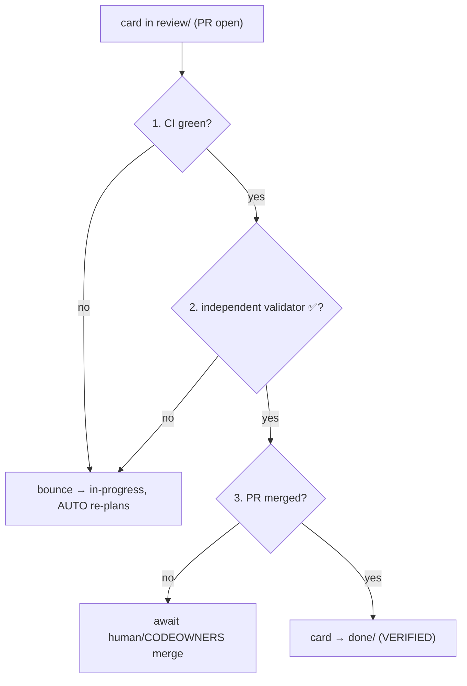
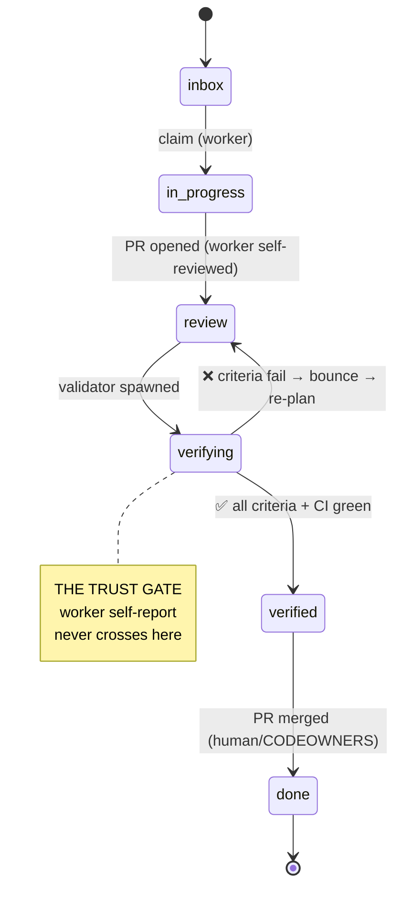

# 25 — Verification & the Trust Gate

> **Status:** ✅ done · **Date:** 2026-06-06 · **Owner:** Gerard
> **Purpose:** The product's core safety mechanism. Board **`done` is reached only from `verified`** — tests green **and** an independent reviewer agent signs off **and** the PR is merged — never from a worker saying "complete." This doc defines the validation contract, the independent validator, and the exact gate a card must pass. **The trust gate is the product, not throughput** (vision principle #4).

---

## 1. Why this is the whole point

An agent that says "done" is making a claim about its own work. Self-grading is the weakest possible signal — the same model that made a mistake is unlikely to catch it. The entire value of a *team* system over hand-spawned agents is that **work is trusted only after independent verification**, exactly like human PRs. So:

> **Board `done` ← `verified`, never `done` ← "the worker exited 0".**

Throughput is not the metric; **trustworthy throughput** is. A system that produces 10 PRs an hour that nobody can trust is worthless; one that produces 3 verified-correct PRs is the product. This doc is the mechanism that makes the difference.

## 2. The three conditions for `verified`

A card moves `review → done` only when **all three** hold:



| Condition | What it proves | Enforced by |
|---|---|---|
| **1. CI green** | the code builds and tests pass | the project repo's CI (GitHub Actions etc.); `config.require_ci_green` |
| **2. Independent validator ✅** | a *different* agent confirms the validation_criteria | reviewer agent (§4); `config.require_independent_review` |
| **3. PR merged** | a human/CODEOWNERS accepted it into the codebase | GitHub branch protection (`20` §4) |

None is sufficient alone. CI proves tests pass but not that the tests check the *right* thing. The validator proves the criteria are met but doesn't merge. The merge proves acceptance but humans rubber-stamp. **Three independent gates, three different failure modes covered.**

## 3. The validation contract (Factory Droids pattern)

The contract is the card's **`validation_criteria[]`** (`14` §2.2, authored in `24` §2): a finite list of **testable behavioural assertions** that define "done" for this card. Written **up front** (at authoring), checked **at the end** (by the validator) — by someone who **didn't write the code**.

```yaml
validation_criteria:
  - "GET /reports/:id/export.csv returns text/csv"
  - "CSV header row matches the report columns"
  - "rows match the JSON report exactly (same filter)"
  - "endpoint requires the same auth as GET /reports/:id"
```

Properties that make it a *contract*:

- **Finite & testable** — each item is a yes/no a reviewer can check by running/reading, not a vibe ("looks good").
- **Authored before the work** — so "done" isn't redefined to match whatever got built (the classic moving-goalpost failure).
- **Checked by the other side** — the implementer proposes, an independent validator disposes. Separated incentives beat self-grading.

If `validation_criteria` is empty, the card is invalid and never gets planned (`24` §2.1) — there's nothing to verify against, so it could never reach `verified`.

## 4. The independent validator — a reviewer agent ≠ the implementer

The second condition is checked by a **reviewer agent that is a different process from the worker that built the code.** This is the heart of the gate.

```mermaid
sequenceDiagram
    participant W as Worker (implementer)
    participant P as Project repo (PR)
    participant V as Validator (reviewer agent)
    participant C as Control repo
    W->>P: open PR, card → review/
    W->>W: self-review (necessary, NOT sufficient)
    C->>V: spawn validator on the PR + card.validation_criteria
    V->>P: read the diff, run/inspect tests, check each criterion
    V->>V: for each criterion → pass / fail + evidence
    alt all criteria pass
        V->>C: ✅ verdict (comment on PR, mark card)
    else any fail
        V->>C: ❌ verdict + which criteria + why
        C->>C: bounce card review→in-progress; AUTO re-plans (24 §6)
    end
```

- **Separation of incentives:** the validator's job is to *find the criterion that fails*, not to bless the work. Because it's a different agent (different process, possibly a different engine via `config.reviewer_engine`), it has no stake in the implementer's mistakes.
- **It checks the contract, not taste:** the validator grades against the explicit `validation_criteria`, producing a per-criterion pass/fail **with evidence** (the test it ran, the line it read). Not "LGTM" — a checklist verdict.
- **Self-review still happens** (the worker reviews itself before opening the PR, `12` §3.1) but is explicitly **not sufficient** — it catches the easy stuff so the validator focuses on the contract.

This is the Factory Droids "independent validator" pattern: the reviewer is structurally separate from the builder, so verification is adversarial-enough to be meaningful.

## 5. The full lifecycle gate (where it sits)



The gate lives between `review` and `done`. A worker can move a card *to* `review` (it opened a PR), but **a worker can never move a card to `done`** — only the verification process can, and only when all three conditions (§2) hold. This is enforced by AUTO/lifecycle, not by trust: the `git mv review→done` is performed by the verification step, not by the worker.

## 6. What happens on rejection

A failed verification is **not** a dead end — it's a re-plan signal:

1. Validator writes a **❌ verdict** naming the failing criteria + evidence (a PR comment + a mark on the card).
2. AUTO **bounces** the card `review → in-progress` (`git mv`, frontmatter `status`).
3. AUTO **re-plans** the failing slice (`24` §6), feeding the validator's specific failures back into decomposition as new facts.
4. A worker re-attempts with the failure context in hand.
5. After K failed cycles, **escalate to the human** (`22` §4) rather than loop forever.

The rejection carries *specifics* (which criterion, what evidence), so the re-plan is targeted, not a blind retry. This closes the Magentic-One loop: non-progress and rejection both route back through re-planning.

## 7. Why all three, and not fewer

A natural question: isn't an independent validator enough? No — each gate covers what the others can't:

| Drop this gate | What slips through |
|---|---|
| Drop **CI** | Validator approves code that doesn't actually build/pass on a clean checkout (works-on-my-worktree) |
| Drop **validator** | CI passes tests the *worker wrote to match its own bug*; nobody checked the criteria independently |
| Drop **merge** | Agents self-merge; humans lose the final say; CODEOWNERS/branch-protection bypassed |

The three are **orthogonal**: machine-checkable correctness (CI), criteria-conformance by an independent agent (validator), and human acceptance (merge). Defense in depth for *trust*, mirroring the defense-in-depth for *secrets* (`21` §6). v1 ships with all three on (`config.verification.*` all `true`); relaxing any is a deliberate, documented per-team choice, not a default.

## 8. Trust-gate honesty (limits)

- **The validator is an agent, not an oracle.** It's a strong check, not a proof. Pairing it with CI (objective) and human merge (judgment) is what makes the *combination* trustworthy — no single agent is trusted alone.
- **Criteria quality bounds the gate.** Garbage `validation_criteria` → a gate that verifies the wrong thing. This pushes rigor to authoring (`24` §2.1), which is correct: the human with context defines "done."
- **The gate guards memory too.** Consolidation PRs (`13` §5.1) pass through the same human-review gate before entering shared memory — wrong team-knowledge is as dangerous as wrong code.

The honest claim: **we don't trust any agent's self-report — we trust the convergence of an objective check, an independent agent, and a human merge.** That convergence is the product's core safety mechanism, and it's why this is a *team* system rather than a faster way to run unreviewed agents.

---

**Related:** `24-prd-authoring-and-decomposition.md` (validation_criteria authored here; re-plan on reject) · `12-agent-runtime.md` (worker self-review; AUTO's verifying state; re-plan loop) · `14-data-model.md` (validation_criteria, `config.verification.*`) · `20-identity-and-teams.md` (CODEOWNERS/branch protection = the merge gate) · `13-memory-architecture.md` (consolidation through the same gate) · `00-vision-positioning.md` (principle #4) · `PRD-06-worker-runtime.md` (validator as a buildable increment).
