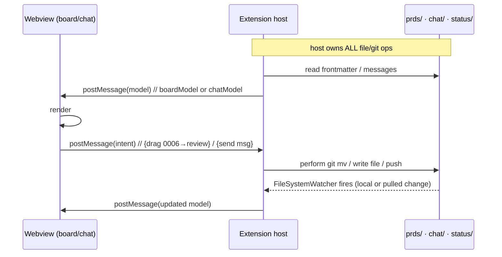
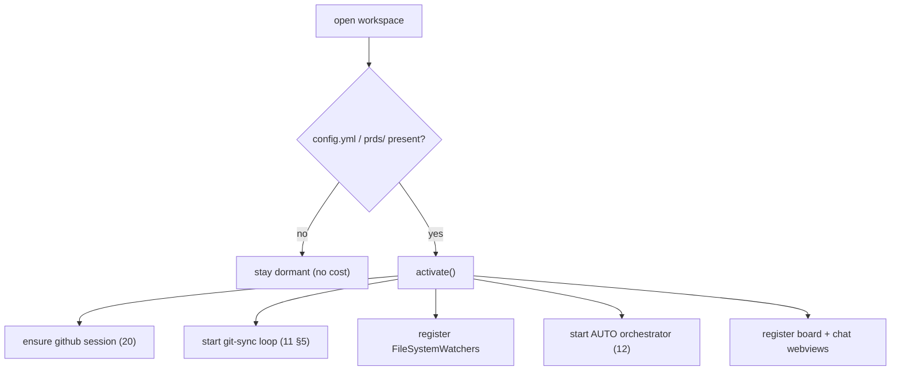

# 26 — Extension Surface (VS Code APIs)

> **Status:** ✅ done · **Date:** 2026-06-06 · **Owner:** Gerard
> **Purpose:** The contract between our code and VS Code — exactly which host APIs we use, how the webviews and extension host talk, what activates the extension, and how it's packaged. The principle throughout: **use VS Code's primitives, never rebuild them** (vision principle #2). This doc is the "what we actually call" reference for everything the UI docs (`22`, `23`) assume.

---

## 1. The guest contract — we are a VS Code extension, not a fork

We ship a **VS Code extension**, not a forked editor (vision §5: "is NOT a new editor"). That means we get Monaco, the file tree, terminals, multi-root workspaces, and SCM **for free** and spend zero effort on them. Our code runs in the **extension host** (a Node.js process VS Code manages) and renders custom UI in **webviews**. Everything we build sits in the small box VS Code gives extensions.

```
┌─ VS Code (host process) ───────────────────────────────┐
│  Monaco · file tree · terminals · multi-root · SCM     │ ← inherited
│  ┌─ Extension Host (Node.js) — OUR code ─────────────┐ │
│  │ activate() · AUTO · supervisor · git sync · watch │ │
│  │  ├─ Webview: Kanban board   (postMessage bridge)  │ │
│  │  └─ Webview: Team chat      (postMessage bridge)  │ │
│  └────────────────────────────────────────────────────┘ │
└──────────────────────────────────────────────────────────┘
```

## 2. The host APIs we use (the whole list)

Deliberately small. Each maps to a subsystem doc:

| VS Code API | What we use it for | Doc |
|---|---|---|
| `vscode.authentication.getSession('github', …)` | sign-in; identity = GitHub handle | `20` §2 |
| `vscode.SecretStorage` (`context.secrets`) | personal BYO model keys in OS keychain | `21` §2 |
| `vscode.window.createWebviewPanel` / `WebviewViewProvider` | the board + chat surfaces | `23`, `22` |
| `vscode.window.createTerminal({ env })` | spawn worker CLIs with injected keys | `12` §4, `21` §3 |
| `vscode.workspace.createFileSystemWatcher` | liveness: re-render on `prds/`, `status/`, `chat/` change | `11` §5 |
| `vscode.workspace.workspaceFolders` (multi-root) | the N-repo workspace (control + project repos) | `27` |
| `vscode.commands.registerCommand` | command-palette actions (claim, new card, consolidate) | §5 |
| `vscode.scm` (gutter/decorations) | inherited SCM for diffs/PRs — we don't rebuild it | `27` |
| `context.globalState` / `workspaceState` | tiny non-secret UI prefs (last filter, panel layout) | — |

We **do not** use: any custom editor framework, any DB client, any network server, any real-time transport. If a feature seems to need one, it's redesigned to files-in-git or deferred (`10` §8).

## 3. Webview ↔ extension host messaging

Webviews are **sandboxed** — they cannot touch the filesystem or git directly. All file/git work happens in the **host**; the webview only renders a model and emits intents. The bridge is `postMessage`:



The discipline (matches `23` §2): **webview = pure render + intent emitter; host = all logic.** This keeps the security boundary clean (webview can't exfiltrate files), keeps git logic testable in Node, and means the same host logic serves both the board and chat webviews.

**Webview security:** strict CSP, `localResourceRoots` limited to our bundle, no remote content, nonce'd scripts. The webview never receives secrets — keys go keychain→terminal env (`21` §3), never into a webview's `postMessage`.

## 4. Activation — when and how we wake up

The extension activates lazily on signals that a control repo is present, not on every VS Code launch:

```jsonc
// package.json (excerpt)
{
  "activationEvents": [
    "workspaceContains:**/config.yml",        // a control repo present
    "workspaceContains:**/prds/inbox/",        // the board exists
    "onCommand:automatos.openBoard",
    "onView:automatos.board"
  ],
  "contributes": {
    "viewsContainers": { "activitybar": [{ "id": "automatos", "title": "Automatos", "icon": "media/icon.svg" }] },
    "views": { "automatos": [
      { "id": "automatos.board", "name": "Board", "type": "webview" },
      { "id": "automatos.chat",  "name": "Team Chat", "type": "webview" }
    ]},
    "commands": [ /* §5 */ ],
    "configuration": { /* settings: pull interval override, etc. */ }
  }
}
```



`activate(context)` wires up: GitHub session, the N-second sync loop, watchers on `prds/`/`status/`/`chat/`, the AUTO orchestrator, the worker supervisor, and the two webviews. `deactivate()` tears down watchers, stops the sync loop, and lets in-flight workers finish/heartbeat-out gracefully.

## 5. Commands (the palette surface)

Every user action is also a command (so it's keyboard/palette accessible, not only drag):

| Command id | Does | Underlying |
|---|---|---|
| `automatos.openBoard` | focus the board webview | §2 |
| `automatos.newCard` | open authoring panel → write `inbox/` | `24` §3 |
| `automatos.claimCard` | claim selected card (CAS) | `11` §4 |
| `automatos.requeueCard` | reclaim a stalled card | `12` §8 |
| `automatos.sendMessage` | post a chat message | `22` |
| `automatos.askAuto` | message `@auto` | `22` §4 |
| `automatos.consolidateMemory` | trigger consolidation job | `13` §5 |
| `automatos.signIn` | force GitHub session | `20` §2 |
| `automatos.setModelKey` | store a BYO key in SecretStorage | `21` §2 |

Commands are thin wrappers over the same host logic the webviews call — one implementation, two entry points (palette + UI).

## 6. Spawning workers via the terminal API

Workers are real CLI processes in VS Code integrated terminals (not child_process hidden away) so the human can *watch* them — a deliberate UX choice inherited from Canopy's "see the agent work" value:

```ts
const term = vscode.window.createTerminal({
  name: `worker-${id} · ${card}`,
  cwd: worktreePath,                       // the git worktree (12 §3.2)
  env: { ANTHROPIC_API_KEY: keyFromKeychain }  // injected, never on disk (21 §3)
});
term.sendText(`claude --prompt-file ${cardPath}`);  // or codex/gemini per engine
```

- One terminal per worker, named by id+card, `cwd` set to its worktree.
- Keys injected via `env` at creation (`21` §3) — the key is in the process environment, never written into the worktree.
- The human sees the worker's output live and can intervene; AUTO sees its progress via the heartbeat file (`12` §5), not by scraping the terminal (that was Canopy's fragile approach we replaced).

## 7. Packaging & distribution

- **Bundling:** TypeScript → bundled with esbuild into `dist/extension.js` (host) + per-webview bundles. Webview assets (HTML/CSS/JS) are local, loaded via `localResourceRoots` (no CDN — works offline, satisfies the offline-tolerant goal).
- **Packaging:** `vsce package` → a `.vsix`. Installable directly or published to the Marketplace / Open VSX.
- **Dependencies:** Node-side only (git invoked via the user's `git`; CLIs via the user's installed `claude`/`codex`/`gemini`/`gh`). We bundle no model runtime and no server — BYO-CLI means the heavy tools are the user's.
- **Theia compatibility:** because we only use standard extension APIs (§2), the same `.vsix` runs under Theia later (vision §5 "same code runs under Theia") — a branded shell is a post-v1 repackage, not a rewrite.

## 8. Multi-root workspace wiring

The workspace is **multi-root**: the control repo + each project repo are roots (full topology in `27`). The extension uses `vscode.workspace.workspaceFolders` to find them and `config.yml`'s `project_repos[]` to know which is which:

```
.code-workspace
├─ control/          ← coordination (board, chat, memory, status)
├─ project-api/      ← code (workers open PRs here)
└─ project-web/      ← code
```

The board/chat read from the **control** root; workers operate in **project** roots' worktrees. The file tree on the left shows all roots (the "see 20 repos on the left" original vision) — inherited from VS Code's multi-root, zero code from us.

## 9. What we deliberately don't touch

| Tempting | Why we don't | Use instead |
|---|---|---|
| Custom editor / Monaco config | It's free and excellent | inherited Monaco |
| Custom diff/SCM view | VS Code's SCM is great | `vscode.scm`, inherited gutter |
| A bundled terminal emulator | VS Code has one | `createTerminal` |
| A settings UI framework | VS Code has `configuration` contributes | `package.json` config |
| A notification system | VS Code has one | `window.showInformationMessage` etc. |

Every line we *don't* write here is the thesis in action: **the editor is commodity; the coordination substrate is the product.** Our entire surface is two webviews, a handful of commands, some watchers, and terminal spawns — everything else is VS Code's.

---

**Related:** `10-system-architecture.md` (the four layers; extension layer) · `22-team-communication.md` + `23-kanban-board.md` (the two webviews this hosts) · `12-agent-runtime.md` (terminal spawn = worker) · `20-identity-and-teams.md` + `21-secrets-and-keys.md` (auth + SecretStorage APIs) · `27-multi-repo-workspace.md` (multi-root topology) · `11-coordination-model.md` (the sync loop + watchers).
