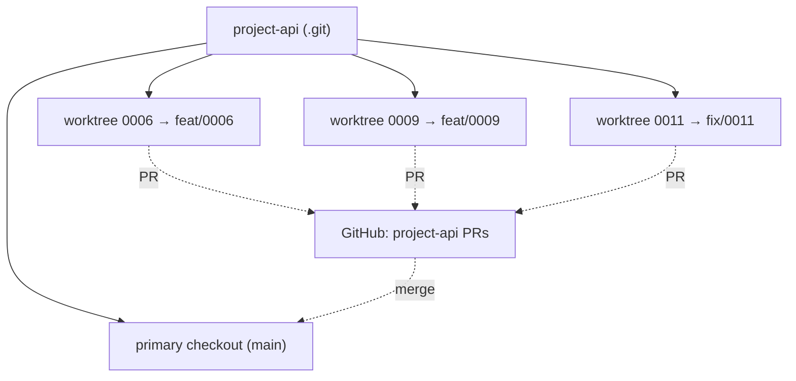
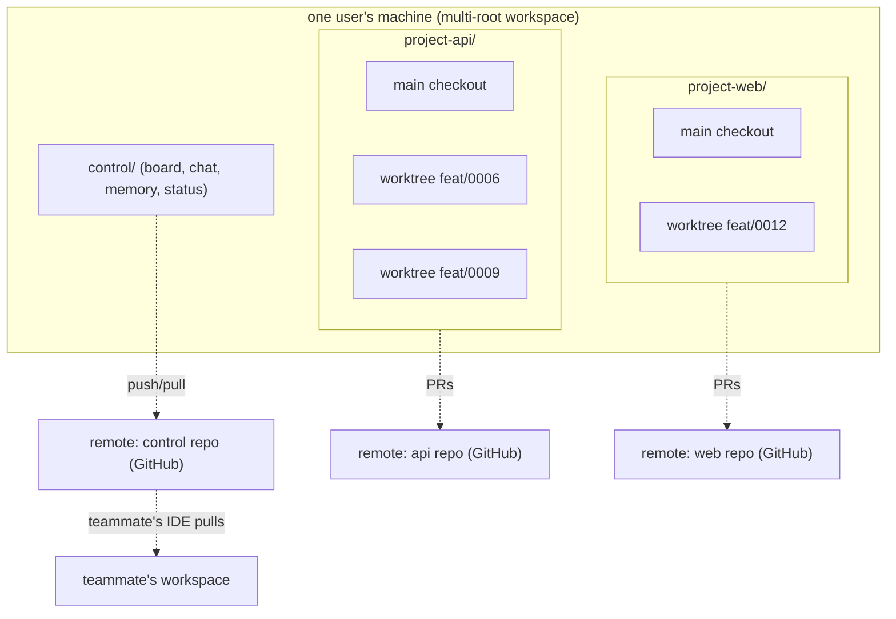
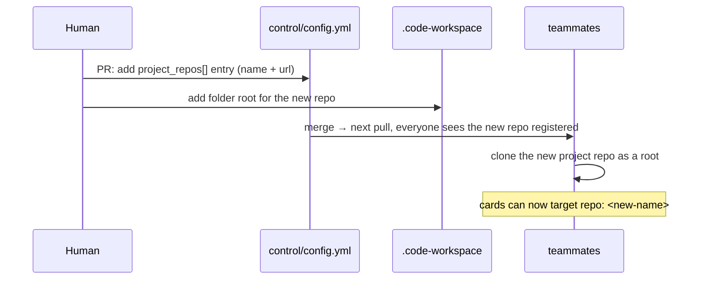

# 27 — Multi-Repo Workspace

> **Status:** ✅ done · **Date:** 2026-06-06 · **Owner:** Gerard
> **Purpose:** The repository topology — one **control repo** (coordination) plus **N project repos** (code), all open as roots in a single VS Code multi-root workspace, with **worktrees** giving each worker its own checkout. This is the "see 20 repos on the left, agents working across all of them" vision made concrete, and the separation that keeps coordination churn out of clean code history.

---

## 1. The shape — one control repo, N project repos

The workspace is **multi-root**: several git repos open side by side. They split into exactly two kinds:

```
my-team.code-workspace
├── control/                ← 1 CONTROL repo: coordination only
│   ├── prds/ memory/ teams/ status/ config.yml
│   └── (the board, chat, memory, heartbeats live here)
├── project-api/            ← PROJECT repo: real code
├── project-web/            ← PROJECT repo: real code
├── project-mobile/         ← PROJECT repo: real code
└── …up to N project repos
```

| | **Control repo** | **Project repo(s)** |
|---|---|---|
| Holds | board, memory, chat, status, config, team secrets | actual application code |
| Churn | constant (every claim/heartbeat/message is a commit) | normal (feature branches, PRs) |
| Count | **1 per team** (v1) | **N** (the repos you build) |
| Who writes | everyone + all agents (coordination) | workers via PRs; gated by repo perms |
| History | a firehose of coordination events | clean code history |

This is the topology behind `10` §2's coordination/project split. Keeping them separate is the key decision this doc justifies (§3).

## 2. The workspace file ties them together

A VS Code `.code-workspace` lists every repo as a folder root; the extension reads `config.yml` to know which root is the control repo and which are projects (`26` §8):

```jsonc
// my-team.code-workspace
{
  "folders": [
    { "path": "control" },          // the coordination repo
    { "path": "project-api" },
    { "path": "project-web" },
    { "path": "project-mobile" }
  ],
  "settings": { "automatos.controlRepo": "control" }
}
```

```yaml
# control/config.yml (the authoritative repo registry)
control_repo: github.com/acme/control
project_repos:
  - { name: project-api,    url: github.com/acme/api }
  - { name: project-web,    url: github.com/acme/web }
  - { name: project-mobile, url: github.com/acme/mobile }
```

A card's `repo:` field (`14` §2) references a `project_repos[].name` — that's how a card knows which project repo its worker builds in. The cross-reference integrity check (`14` §10) ensures every `card.repo` matches a registered project repo.

## 3. Why control is a *separate* repo from code (the load-bearing decision)

It's tempting to put `prds/` in the code repo. We don't, for four reasons:

| Reason | Consequence of mixing | With separation |
|---|---|---|
| **History hygiene** | thousands of heartbeat/claim commits bury the code history | code history stays clean; coordination churn is isolated |
| **Permissions differ** | everyone needs board write, not everyone needs write to every code repo | control-repo write ≠ project-repo write (`20` §4) |
| **One board, many repos** | a card might span repos; whose repo holds it? | the board is repo-agnostic; one queue coordinates N projects |
| **Blast radius** | a bad coordination commit could touch code history | coordination accidents can't corrupt code repos |

The separation makes the board a **cross-repo coordinator**: a single queue dispatches work into *any* of the N project repos, while each project repo stays a normal, clean codebase a non-agent developer could clone and understand with no knowledge of the system.

## 4. Worktrees — per-worker checkouts inside a project repo

Within a project repo, each worker gets its own `git worktree` — a separate working directory on its own branch (`12` §3.2). This is how N workers build in the *same* repo without colliding:

```
project-api/
├── .git/                          # one git db
├── (primary checkout, on main)    # what the human sees in the file tree
└── ../.worktrees/
    ├── 0006-oauth-a3f2/  → branch feat/0006-oauth   (worker A)
    ├── 0009-export-b1c4/ → branch feat/0009-csv      (worker B)
    └── 0011-fix-c2d5/    → branch fix/0011           (worker C)
```



- **Provision:** `git worktree add ../.worktrees/<card>-<id> -b feat/<card>` at worker spawn (`12` §4).
- **Isolation:** different directories, different branches → **filesystem collisions are impossible by construction.** No locks, no "who's editing this file."
- **Convergence:** workers only meet at **PR merge**, where git's normal merge + the trust gate (`25`) handle it — exactly like human developers on branches.
- **Teardown:** `git worktree prune` after the worker exits cleanly (`12` §4). The branch persists until its PR merges.

This is principle #5 ("many writers, never one file") applied to *code*: workers never share a working tree, so concurrent building never conflicts until the controlled moment of merge.

## 5. The complete topology (control + projects + worktrees + remotes)



- **Coordination** flows through the **control remote** (the only shared coordination infrastructure — `10` §3).
- **Code** flows through each **project remote** as PRs.
- A **teammate** opens the *same* `.code-workspace` (same repos) and syncs coordination through the same control remote — that's the entire "remote team" mechanism (`00-vision` §9).

## 6. Adding / removing a repo

The repo set is just `config.yml` + the workspace file — both committed, both reviewable:



- **Add a repo:** register it in `config.yml` (`project_repos[]`) + add a folder to the workspace; teammates clone it on next pull. Cards can then target it via `repo:`.
- **Remove a repo:** drop it from both; existing cards referencing it are completed or re-targeted first (the integrity check, `14` §10, flags dangling `repo:` references).

No infrastructure changes — adding a repo to the "team's purview" is a commit, like everything else.

## 7. Scale boundary (kernel honesty)

v1 is deliberately bounded (vision principle #3: "kernel before cathedral"):

| Dimension | v1 kernel | Why bounded | Scales to |
|---|---|---|---|
| Control repos | **1 per team** | proves the loop without multi-control complexity | multi-team = multi-control later |
| Project repos | **≤5** | the lived problem ("5 projects") | tens, once the loop holds |
| Concurrent workers | **≤4** (`config.max_workers`) | bounded blast radius, easy to watch | more as confidence grows |
| Worktrees per repo | = active workers on that repo | filesystem + git can handle many | many |

The "20 repos on the left" vision is the *destination*; v1 earns it by proving the coordination loop at ≤5 repos / ≤4 agents first (`00-vision` §8 success criteria). The topology in this doc doesn't change at scale — you just register more `project_repos[]` and raise `max_workers`. **Nothing structural blocks 20 repos; we simply prove 5 before claiming 20.**

## 8. Why this topology serves the thesis

- **Multi-root** gives the "see all your repos at once" cockpit — inherited from VS Code, zero build (`26` §8).
- **Control/project split** keeps code clean and lets one queue coordinate many repos (§3).
- **Worktrees** make parallel agents collision-free without containers (§4) — enough isolation for v1 (`10` §8 defers container sandboxing).
- **Everything is a normal git repo** — auditable, forkable, offline-tolerant, governed by GitHub permissions. A developer can clone any project repo and work *without* the extension; the system is additive, never a lock-in.

The topology is the physical embodiment of "git is a sufficient backend for a remote team": N repos you already own, coordinated by one more repo you also own, with no server between them.

---

**Related:** `10-system-architecture.md` (coordination vs project layers) · `11-coordination-model.md` (the control repo as backend) · `12-agent-runtime.md` (worktree-per-worker lifecycle) · `14-data-model.md` (`config.project_repos`, `card.repo`, integrity checks) · `26-extension-surface.md` (multi-root wiring, `.code-workspace`) · `20-identity-and-teams.md` (per-repo permissions) · `35-diagram-repo-topology.md` (this topology as a standalone diagram).
