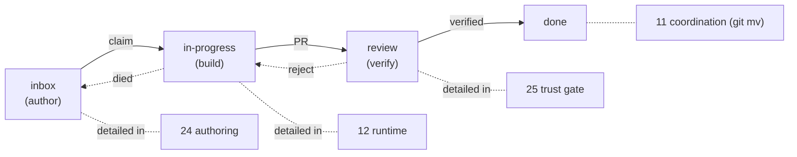

# 30 — Flow: PRD Lifecycle

> **Status:** ✅ done · **Date:** 2026-06-06 · **Owner:** Gerard
> **Purpose:** The end-to-end journey of one card, from a human dropping it in `inbox/` to it landing in `done/` as verified, merged work. This is the spine flow — every other flow doc is a zoom-in on one segment of it. All state lives in git; every transition is a commit.

---

## 1. The full lifecycle (sequence)

```mermaid
sequenceDiagram
    autonumber
    participant H as Human
    participant B as Board (webview)
    participant C as Control repo (git)
    participant A as AUTO
    participant W as Worker
    participant V as Validator
    participant P as Project repo

    H->>B: + New card (validation_criteria authored)
    B->>C: write prds/inbox/0009.md; commit + push
    Note over C: card READY in inbox/

    A->>C: pull; see ready card 0009
    A->>A: decompose → Task Ledger (24 §4) or load Playbook
    A->>C: claim: git mv inbox→in-progress, set owner/branch; push (CAS)
    Note over C: claim is real ONLY if push succeeds (11 §4)

    A->>W: spawn in fresh worktree; inject keys (21 §3)
    W->>P: git worktree add; implement on feat/0009
    W->>C: heartbeat every N s (status/0009-worker.json)
    W->>P: run tests / build
    W->>W: self-review vs validation_criteria (necessary, not sufficient)
    W->>P: open PR
    W->>C: git mv in-progress→review; push
    W->>A: exit(0)

    Note over C,V: THE TRUST GATE (25)
    A->>V: spawn validator on PR + criteria
    V->>P: check each criterion + CI status
    alt all criteria pass AND CI green
        V->>C: ✅ verdict
        Note over P: human/CODEOWNERS merge PR
        A->>C: git mv review→done; push
        Note over C: VERIFIED + merged = done
    else any fail
        V->>C: ❌ verdict + evidence
        A->>C: git mv review→in-progress; push
        A->>A: re-plan failing slice (24 §6)
    end

    B->>C: pull; re-render — 0009 now in done/
    H->>B: sees verified card
```

## 2. The five state transitions (and who performs each)

| # | Transition | Trigger | Performed by | Git op |
|---|---|---|---|---|
| 1 | (none) → `inbox` | human authors a card | Human (via board) | write file to `inbox/` |
| 2 | `inbox` → `in-progress` | AUTO/worker claims | claimant | `git mv` + frontmatter + push (CAS) |
| 3 | `in-progress` → `review` | worker opens PR | Worker | `git mv` + push |
| 4 | `review` → `done` | trust gate passes | **verification (AUTO)** | `git mv` + push |
| 4′ | `review` → `in-progress` | trust gate fails | AUTO (bounce) | `git mv` + push |
| 5 | `in-progress` → `inbox` | worker died (re-queue) | AUTO (supervisor) | `git mv` + push |

**The one rule that defines the product:** transition 4 (`review → done`) is performed **only** by the verification step, **never** by a worker (`25` §5). A worker can reach `review`; it can never reach `done`. That's the trust gate.

## 3. Where each segment is detailed

This spine threads through the subsystem docs — each segment has a home:



| Segment | Detailed in |
|---|---|
| Authoring the card + decomposition | `24-prd-authoring-and-decomposition.md` |
| Claiming (the CAS) | `11-coordination-model.md` §4 · `33-flow-claim-race.md` |
| Building (worker Ralph loop, worktree) | `12-agent-runtime.md` · `27-multi-repo-workspace.md` |
| Verifying (validator + CI + merge) | `25-verification-trust-gate.md` |
| AUTO's orchestration around it all | `31-flow-auto-loop.md` |

## 4. Timeline view (what a teammate sees)

Because every transition is a commit and syncs on the N-second pull (`11` §5), a teammate watching the board sees the card slide across columns in near-real-time:

```mermaid
gantt
    title Card 0009 across the board (teammate's view)
    dateFormat HH:mm
    axisFormat %H:%M
    section inbox
    authored            :done, 17:00, 1min
    section in-progress
    claimed + building  :active, 17:01, 12min
    section review
    PR open + validating :17:13, 5min
    section done
    verified + merged   :crit, 17:18, 1min
```



The card is in `in-progress` for the *work* (minutes), briefly in `review` for the *gate* (the validator run + merge), then `done`. The human's attention is needed only at authoring (defining done) and merge (final acceptance) — the middle runs autonomously.

## 5. Invariants that hold throughout

- **Every state is in git** — kill any process at any point; the card's `status` frontmatter + folder say exactly where it is (`14` §2.1).
- **Every transition is a commit** — the full lifecycle is reconstructable from `git log` of the control repo, for free (`10` §6).
- **No transition skips the gate** — `done` is only ever reached via transition 4, only when verified (`25` §2).
- **Failure re-queues, never loses** — a dead worker's card returns to `inbox` (transition 5); a rejected card returns to `in-progress` (4′). Nothing falls on the floor.

---

**Related:** `11-coordination-model.md` (the git ops behind each move) · `12-agent-runtime.md` (the build segment) · `24-prd-authoring-and-decomposition.md` (the author segment) · `25-verification-trust-gate.md` (the verify segment) · `31-flow-auto-loop.md` (AUTO's loop driving this) · `33-flow-claim-race.md` (the claim segment under contention).
