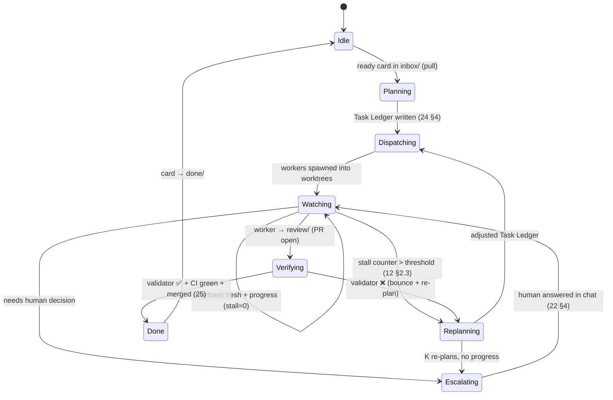
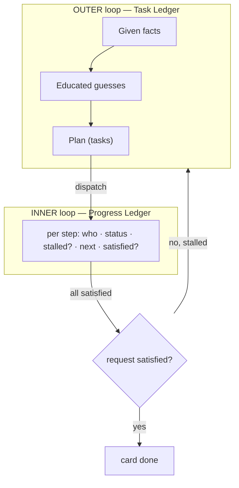
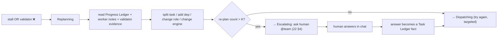
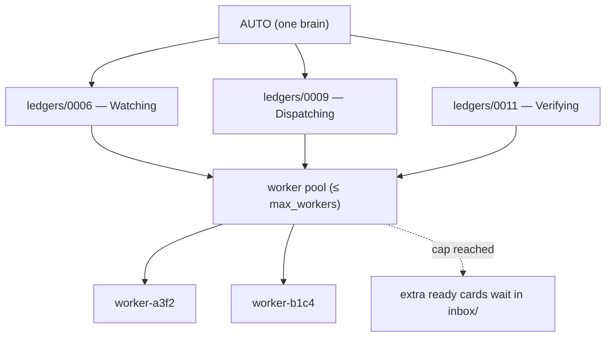
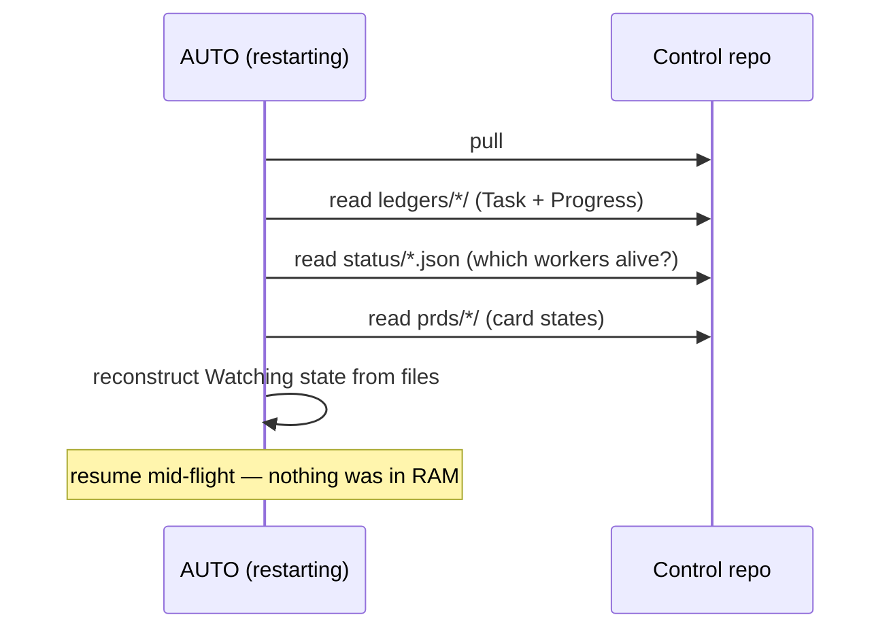
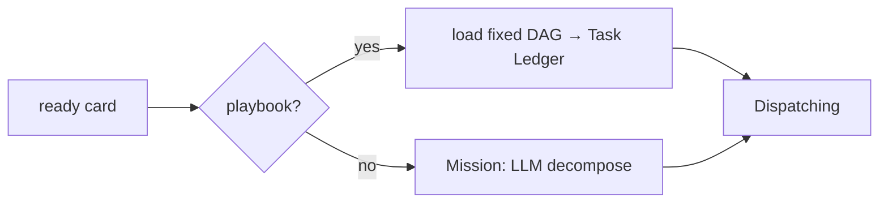

# 31 — Flow: AUTO Orchestration Loop

> **Status:** ✅ done · **Date:** 2026-06-06 · **Owner:** Gerard
> **Purpose:** AUTO's inner life as a running loop — how the persistent orchestrator cycles through planning, dispatching, watching, re-planning, and escalating, driven by the Magentic-One dual-ledger pattern. This is the "brain" flow; `30` is the "card" flow it drives.

---

## 1. The loop (state machine)



AUTO runs this forever. Two transitions make it *intelligent* rather than a dumb dispatcher:
- **Watching → Replanning** — the stall (caught by the stall counter).
- **Verifying → Replanning** — the rejection (the trust gate bounced the work).

Everything else is bookkeeping; these two are where AUTO *thinks*.

## 2. The dual-ledger that backs the loop (Magentic-One)

AUTO's state is not in RAM — it's two markdown files in git, so AUTO survives a restart by re-reading them (`12` §2.1):



- **Outer (Task Ledger):** rewritten on each (re)plan — AUTO's whole-PRD understanding.
- **Inner (Progress Ledger):** updated on each worker report — per-step tracking.
- The loop's job (Magentic-One's insight): **detect non-progress at the inner loop, re-plan at the outer loop.** AUTO doesn't micromanage steps; it watches for stalls and re-decomposes.

## 3. The stall-detection sub-loop (Watching)

The `Watching` state is itself a tight loop over heartbeats:

```mermaid
flowchart TD
  Read["read every worker's status/<id>.json"] --> Each{for each worker}
  Each --> Prog{progress since last?<br/>(new commit / state change / PR)}
  Prog -- yes --> Reset["stall=0; update Progress Ledger"]
  Prog -- no --> Inc["stall += 1"]
  Inc --> T{stall > threshold?}
  T -- no --> Cont["keep watching"]
  T -- yes --> Replan["→ Replanning"]
  Each --> Stale{heartbeat stale > 3N?}
  Stale -- yes --> Requeue["worker dead → re-queue card (12 §8)"]
  Read -.also.-> PRcheck{any worker → review/?}
  PRcheck -- yes --> Verify["→ Verifying"]
```

"Progress" is defined concretely from git + heartbeat (a new commit, a state transition, a PR) — not a guess. No progress across the threshold ⇒ intervene; stale heartbeat ⇒ presume dead ⇒ re-queue. This is how AUTO notices a spinning *or* crashed worker without a socket.

## 4. Re-planning vs escalating (when AUTO stops trying alone)



Re-planning is **bounded**: after K fruitless re-plans, AUTO escalates to the human rather than thrashing. The human's chat answer becomes a *new fact* in the Task Ledger, and the loop resumes informed. AUTO is autonomous until it isn't — then it asks, clearly, with context.

## 5. Concurrency — AUTO runs many cards at once

AUTO isn't single-threaded over cards. It holds a Task/Progress Ledger per active card and a worker pool capped at `config.max_workers` (`14` §8):



One brain, many ledgers, a bounded pool. When the pool is full, ready cards simply wait in `inbox/` — backpressure is automatic (the queue *is* the buffer).

## 6. Restart resilience (why the loop survives a crash)



Because AUTO's entire state is **files in git** (ledgers, heartbeats, card frontmatter), a crash loses nothing. On restart it re-reads and resumes Watching exactly where it was. This is the stateful-orchestrator-without-a-database trick: the state is durable because it's git, not because there's a server holding it.

## 7. Playbook short-circuit

Not every loop entry runs the full Planning state. A card with `playbook:` set skips LLM decomposition:



Playbooks (`24` §5) make the common case deterministic and cheap — the loop spends its LLM budget only on Missions (novel work). A stalled Playbook escalates rather than re-plans (its determinism is the contract).

---

**Related:** `12-agent-runtime.md` (AUTO + the dual ledger, stall counter) · `24-prd-authoring-and-decomposition.md` (Planning state internals; Playbook vs Mission) · `25-verification-trust-gate.md` (Verifying state) · `30-flow-prd-lifecycle.md` (the card flow this loop drives) · `22-team-communication.md` (Escalating → chat) · `AUTO.md` (the persona running this loop).
