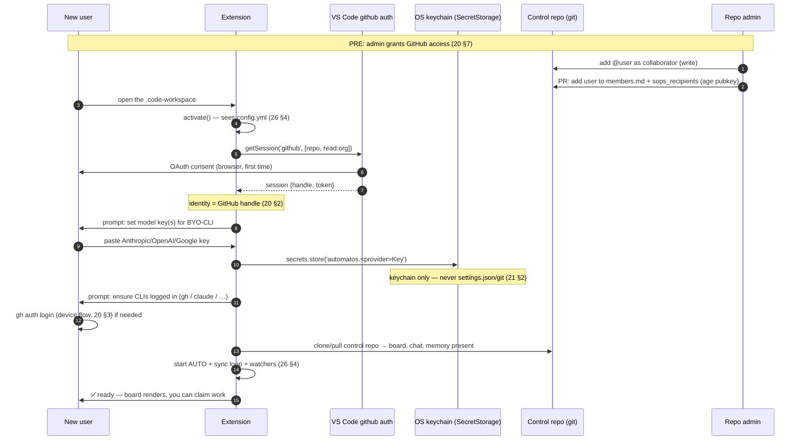
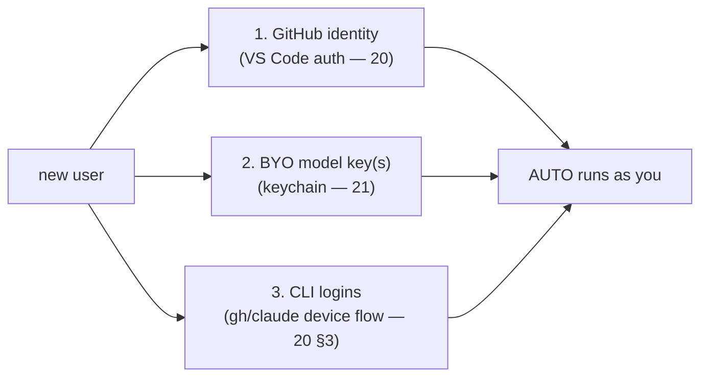
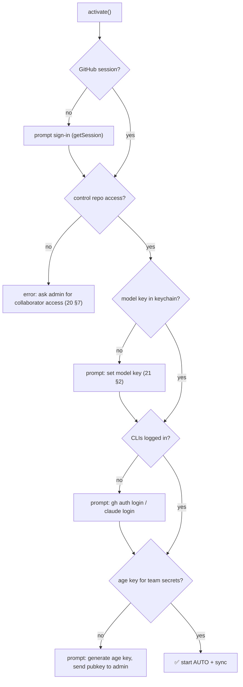
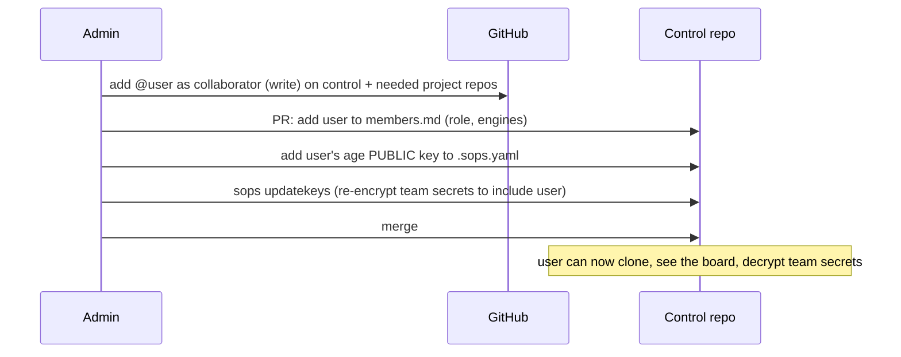
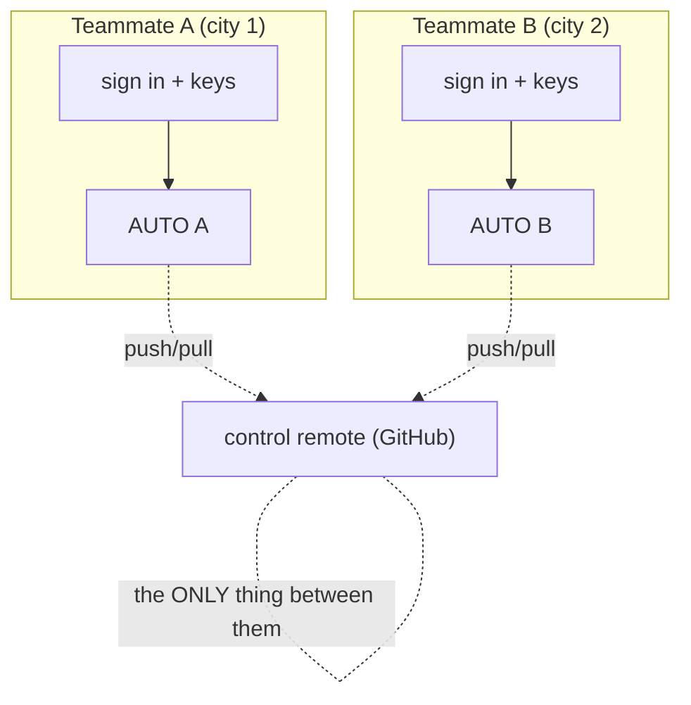
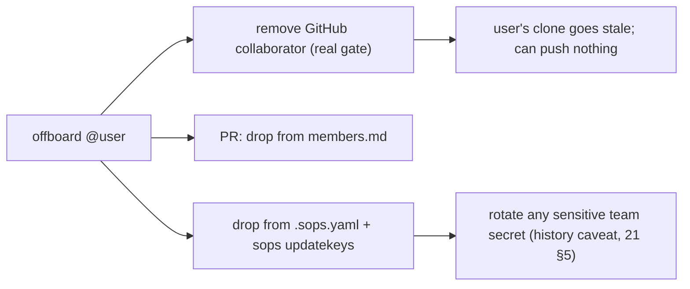

# 32 — Flow: Onboarding

> **Status:** ✅ done · **Date:** 2026-06-06 · **Owner:** Gerard
> **Purpose:** The first-run experience — from "I opened the workspace" to "my AUTO is running and I can claim work." Sign-in (GitHub), key setup (BYO model keys), and joining a team (control-repo access + SOPS recipient). Every step is either a VS Code API call or a git operation; we build almost none of it.

---

## 1. The onboarding sequence (end to end)

The whole flow is: **GitHub sign-in → keychain key → CLI login check → clone → AUTO up.** No account creation, no server registration — joining is getting GitHub access and entering your own keys.

## 2. The three things a new user provides

| # | What | Where it goes | Why |
|---|---|---|---|
| 1 | GitHub sign-in | VS Code's cached session | identity + git auth (`20`) |
| 2 | Model API key(s) | OS keychain via SecretStorage | BYO-CLI worker auth (`21`) |
| 3 | CLI logins (`gh`, model CLIs) | each CLI's own credential store | git ops + model calls from workers |

That's the entire setup burden. Everything else (board, memory, chat, config) arrives by cloning the control repo — it's all just files.

## 3. First-run checklist (what the extension verifies)

On activation the extension runs a readiness check and guides the user through any gap:

Each "no" branch is a specific, actionable prompt — not a wall of setup. The check is idempotent: re-running it after fixing one gap advances to the next. A returning user passes every check silently and lands straight on the board.

## 4. The admin side (granting access)

Onboarding has a counterpart the team admin does once per new member (`20` §7, `21` §5):

- **GitHub collaborator add** is the *real* gate (`20` §4) — without it, nothing else matters.
- The **members.md PR** is metadata/convenience (`20` §6).
- **`sops updatekeys`** lets the new user decrypt team-shared secrets (`21` §4) — only if there *are* team secrets; personal model keys don't involve this.

## 5. The "two teammates, different cities" path (the demo)

The north-star scenario (`00-vision` §9) is just two people each running §1 against the **same control repo**:

Two independent onboardings, two AUTO processes, one shared control remote. Neither installs a server; neither registers with us. The *only* shared infrastructure is the git remote they both already have access to. That's the whole "remote team" mechanism — onboarding is local + GitHub, coordination is git.

## 6. Offboarding (the reverse)

Removing GitHub access is sufficient to stop a user *acting*; the manifest + SOPS cleanup keep metadata and future secrets correct. The honest caveat (`21` §5): old ciphertext in git history was already decryptable by them, so truly sensitive secrets get rotated, not just un-recipiented.

## 7. Why onboarding is this light

Every heavy thing a normal SaaS makes you do, we don't:

| Normal SaaS onboarding | Ours |
|---|---|
| Create an account (email/password) | Use your existing GitHub (`20`) |
| Server provisions your workspace | Clone a git repo |
| Admin console assigns roles | GitHub collaborator + a manifest PR |
| Platform stores your API keys | Keys stay in *your* OS keychain (`21`) |
| Verify email, set up 2FA | GitHub already did |

The result: onboarding is **sign in with GitHub, paste your model key, clone.** It's light because the product runs no account system and no server — joining a team is joining a git repo (vision principle #1).

---

**Related:** `20-identity-and-teams.md` (sign-in, team = repo access, onboarding) · `21-secrets-and-keys.md` (keychain keys, SOPS recipient setup) · `26-extension-surface.md` (activation, the APIs called) · `27-multi-repo-workspace.md` (cloning the workspace) · `00-vision-positioning.md` §9 (the two-teammates demo) · `PRD-02-identity-teams.md` (buildable increment).
