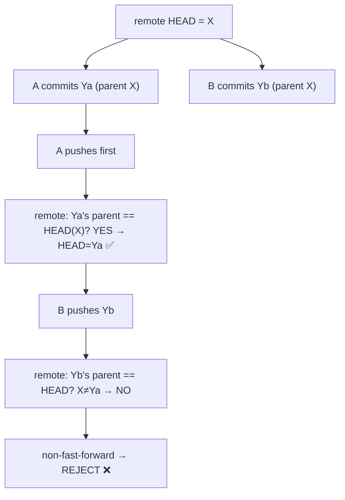
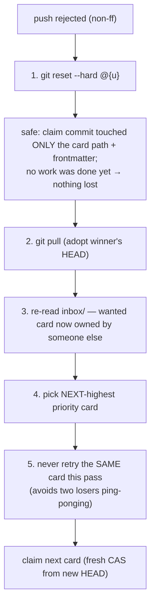
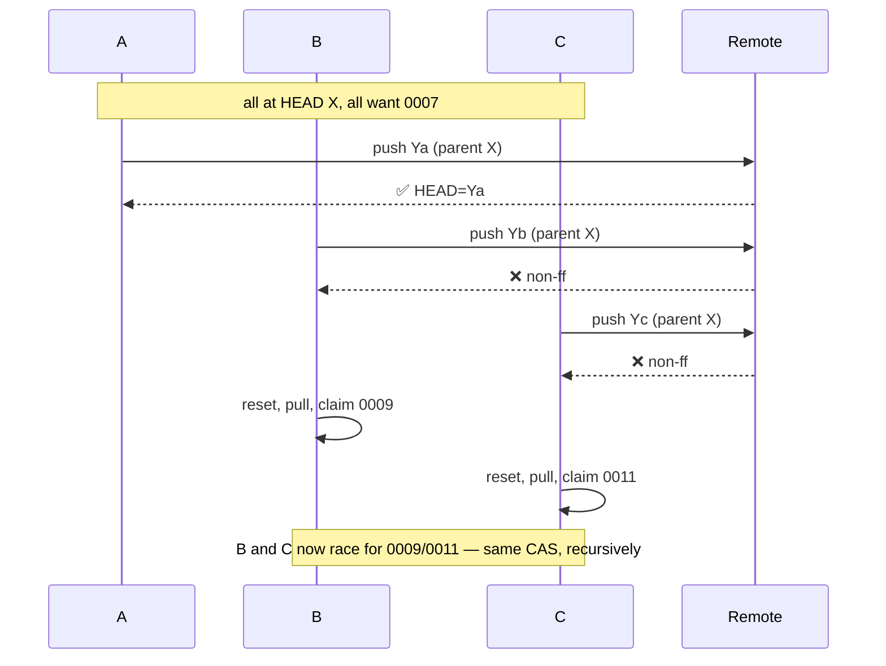
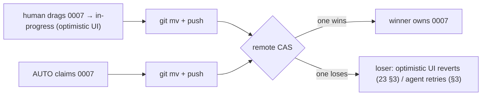
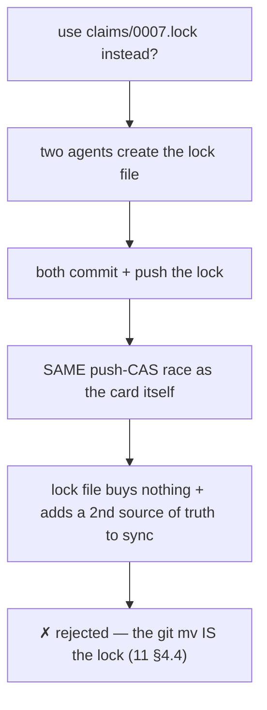

# 33 — Flow: Claim Race (push-CAS)

> **Status:** ✅ done · **Date:** 2026-06-06 · **Owner:** Gerard
> **Purpose:** The single most correctness-sensitive flow in the system, in full detail: two agents claim the same card at the same instant, and git's atomic ref-update decides the winner. This is the compare-and-swap that lets a team coordinate with **no lock service** — the load-bearing concurrency primitive (`11` §4). Get this right and the whole git-as-backend bet holds.

---

## 1. The race (sequence)

```mermaid
sequenceDiagram
    autonumber
    participant A as Agent A
    participant B as Agent B
    participant R as Git remote (control)

    Note over A,B: both at remote HEAD = X; both see inbox/0007 ready
    A->>A: git mv inbox/0007 → in-progress/0007<br/>set owner=A, branch, updated=now → commit Ya (parent X)
    B->>B: git mv inbox/0007 → in-progress/0007<br/>set owner=B, branch, updated=now → commit Yb (parent X)

    par both push from the SAME parent X
        A->>R: git push (Ya, parent X)
    and
        B->>R: git push (Yb, parent X)
    end

    R->>R: receive Ya first — HEAD X→Ya (fast-forward) ✅
    R-->>A: accepted — A WON
    R->>R: receive Yb — parent X ≠ current HEAD Ya → non-fast-forward ❌
    R-->>B: rejected (non-ff) — B LOST

    Note over B: the loser's contract (11 §4.3)
    B->>B: git reset --hard @{u}   (discard Yb entirely)
    B->>R: git pull   (adopt Ya: 0007 now owned by A)
    B->>B: re-read inbox/ → 0007 gone → pick next card (0009)
    B->>B: claim 0009 (fresh CAS)
```

One card, two claimants, **exactly one winner** — decided not by a lock we wrote but by the remote refusing B's non-fast-forward push. No coordination message passed between A and B; git's receive-pack arbitrated.

## 2. Why exactly one wins (the git mechanism)



The remote accepts a push **only if it's a fast-forward** — i.e. the pushed commit's parent is the current HEAD. A's push fast-forwards X→Ya. B's commit Yb *also* has parent X, but HEAD is now Ya, so Yb is **not** a fast-forward → rejected. **This atomic "is HEAD still X?" check inside receive-pack is the compare; the ref update is the swap.** That's a textbook compare-and-swap, for free, over a protocol every developer runs (`11` §4.2).

## 3. The loser's contract (must be exact — this is the bug-prone part)



The five steps, and why each matters:

| Step | Why it's required |
|---|---|
| 1. `reset --hard @{u}` | discards the orphaned claim commit Yb cleanly. **Safe** because a claim commit contains *no work* — just a `git mv` + frontmatter edit. There is nothing to lose. |
| 2. `git pull` | adopts the winner's HEAD so the loser's next attempt starts from current truth (else it races from a stale parent and loses again). |
| 3. re-read `inbox/` | the wanted card is gone (now in `in-progress/` owned by the winner); don't try it again. |
| 4. next-highest `priority` | the loser still wants work — it takes the next claimable card, not nothing. |
| 5. no same-card retry this pass | prevents two losers from both bouncing back to the same just-freed card and re-colliding. |

**This is the routine that gets the most aggressive tests** (`00-vision` §8: *zero claim collisions*). A subtle bug here (e.g. skipping the reset, or retrying the same card) is the one thing that could violate the core safety property.

## 4. The three-way (and N-way) race

CAS composes: with three agents, the same logic applies — one wins, two lose and retry:



N agents → 1 winner per card per round; losers fan out to the next cards and may race again there, resolved by the same primitive each time. The queue drains correctly under any contention level **without a central coordinator** — each card is independently CAS-arbitrated. This is what makes the design scale past one person (the original problem: coordination that *worsens* with more people — here it doesn't).

## 5. Human + agent racing (same primitive)

A human dragging a card and an agent claiming it are the *same* operation (`23` §3), so a human–agent race resolves identically:



If the human loses, the board's optimistic move snaps back to truth on the next tick (`23` §3) — the human briefly saw the card move, then sees reality. If the agent loses, it runs the §3 contract. **No special human-vs-agent logic** — it's one CAS for all claimants.

## 6. Edge cases & how CAS absorbs them

| Edge case | What happens | Resolution |
|---|---|---|
| Network drops between commit and push | claim commit Yb is local-only, orphaned | next pull rebases it away; card stays claimable; idempotent (`11` §8) |
| Loser's pull also races a new push | loser's *next* claim is a fresh CAS from the newest HEAD | retries until it wins a card or queue empties |
| Two pushes arrive truly simultaneously | remote serializes them internally (receive-pack is atomic per ref) | one is "first"; the other sees the updated HEAD → non-ff |
| Winner crashes right after claiming | card sits in `in-progress/`, heartbeat goes stale | AUTO re-queues it (`12` §8) → back to `inbox/`, claimable again |
| Loser keeps losing (busy queue) | every attempt non-ff | eventually claims a card or finds `inbox/` empty and idles |

The invariant across all of them: **a card is either claimed-by-exactly-one or claimable-by-anyone — never claimed-by-two, never lost.** CAS guarantees the first half; the re-queue-on-stale guarantees the second.

## 7. Why no lock file / lock service



A lock file would race exactly like the card does (it's also a file you commit + push), so it adds a second thing to keep consistent and zero safety. **The move is the lock.** One operation, one truth, one CAS. There is no lock service because git's ref update already is one.

---

**Related:** `11-coordination-model.md` §4 (claim CAS definition, loser's contract) · `12-agent-runtime.md` §8 (re-queue on stale, the other half of the invariant) · `23-kanban-board.md` §3 (human drag = same op, optimistic revert) · `30-flow-prd-lifecycle.md` (where claim sits in the lifecycle) · `02-glossary.md` (Claim CAS, push-race) · `PRD-v1.md` (zero-collision success criterion + tests).
