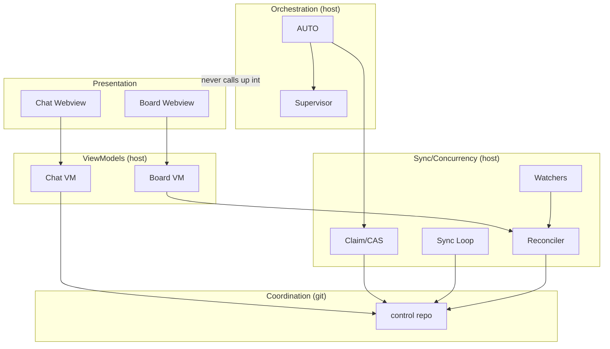
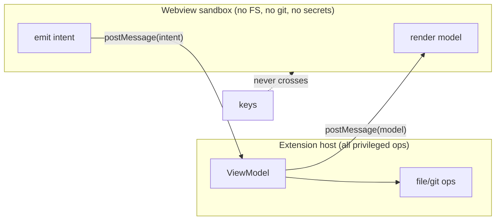
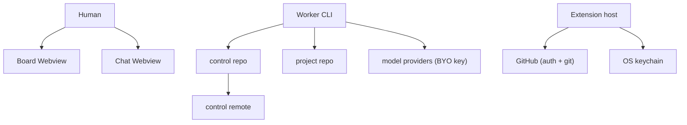

# 34 — Diagram: Components (C4 Level 3)

> **Status:** ✅ done · **Date:** 2026-06-06 · **Owner:** Gerard
> **Purpose:** The C4 **component** view — zooming inside the extension container from `10` §4 to show the actual components we build, their dependencies, and which doc specifies each. This is the "what are the boxes and how do they wire" reference for implementation.

---

## 1. Component diagram (inside the extension host)

```mermaid
C4Component
  title Components — inside the Extension Host
  Container_boundary(ext, "Extension Host (Node.js)") {
    Component(activate, "Activation + Wiring", "TS", "activate(): auth, sync, watchers, AUTO, webviews (26 §4)")
    Component(auto, "AUTO Orchestrator", "TS", "dual-ledger loop: plan/dispatch/watch/replan (12, 31)")
    Component(sup, "Worker Supervisor", "TS", "worktree + terminal lifecycle, heartbeat watch (12 §4)")
    Component(claim, "Claim/CAS Engine", "TS", "git mv + push, loser contract (11 §4, 33)")
    Component(sync, "Git Sync Loop", "TS", "background pull every N s (11 §5)")
    Component(watch, "FileSystemWatchers", "TS", "prds/ status/ chat/ → re-render (11 §5)")
    Component(recon, "Board Reconciler", "TS", "frontmatter==folder; LWW (11 §6, 23 §4)")
    Component(mem, "Memory Service", "TS", "per-agent notes, grep recall, consolidation trigger (13)")
    Component(sec, "Secret Adapter", "TS", "SecretStorage get/store; env injection (21)")
    Component(idy, "Identity Adapter", "TS", "vscode.authentication github (20)")
    Component(boardvm, "Board ViewModel", "TS", "render(prds/)→boardModel; intents (23 §2)")
    Component(chatvm, "Chat ViewModel", "TS", "maildir→chatModel; routing (22)")
  }
  Container(boardwv, "Board Webview", "TS+HTML", "renders boardModel; emits intents")
  Container(chatwv, "Chat Webview", "TS+HTML", "renders chatModel; emits messages")
  ContainerDb(ctrl, "Control repo", "git", "prds/ memory/ teams/ status/ config.yml")
  Container(workers, "Worker CLIs", "claude/codex/gemini", "in terminals, per worktree")
  System_Ext(gh, "GitHub", "remote + auth + permissions")

  Rel(activate, auto, "starts")
  Rel(activate, sync, "starts")
  Rel(activate, watch, "registers")
  Rel(auto, claim, "claims via")
  Rel(auto, sup, "spawns workers via")
  Rel(auto, mem, "reads/triggers")
  Rel(sup, workers, "createTerminal + worktree")
  Rel(sup, sec, "get key → inject env")
  Rel(claim, ctrl, "git mv + push (CAS)")
  Rel(sync, ctrl, "pull")
  Rel(watch, recon, "on change → reconcile")
  Rel(recon, boardvm, "fresh model")
  Rel(boardvm, boardwv, "postMessage(model)")
  Rel(boardwv, boardvm, "postMessage(intent)")
  Rel(chatvm, chatwv, "postMessage(model)")
  Rel(idy, gh, "OAuth session")
  Rel(workers, ctrl, "claim, heartbeat, memory")
```

## 2. Component → doc → build-effort map

The authoritative inventory (mirrors `10` §5, expanded):

| Component | Responsibility | Spec doc | Effort |
|---|---|---|---|
| Activation + Wiring | `activate()`: stand up everything; lazy activation | `26` §4 | Low |
| **AUTO Orchestrator** | the dual-ledger brain (plan/dispatch/watch/replan) | `12`, `31` | **High** |
| **Worker Supervisor** | worktree + terminal lifecycle, reaping | `12` §4 | **High** |
| **Claim/CAS Engine** | `git mv`+push, loser contract — the one true concurrency bug | `11` §4, `33` | **High** |
| Git Sync Loop | background pull every N s | `11` §5 | Low–Med |
| FileSystemWatchers | re-render triggers on `prds/`/`status/`/`chat/` | `11` §5 | Low |
| Board Reconciler | enforce frontmatter==folder; LWW repair | `11` §6, `23` §4 | Medium |
| Memory Service | per-agent notes, grep recall, consolidation trigger | `13` | Medium |
| Secret Adapter | SecretStorage + env injection (+ SOPS for team) | `21` | Low–Med |
| Identity Adapter | `vscode.authentication` github | `20` | Low |
| Board ViewModel | `render(prds/)` → model; handle intents | `23` | **High** (marquee) |
| Chat ViewModel | maildir → model; routing taxonomy | `22` | Medium |

The four **High** items (AUTO, Supervisor, CAS Engine, Board) are the product's heart; everything else is plumbing or inherited.

## 3. Dependency layering (talk down, not across)

The components obey the layered-talk-down rule (`10` §1, principle #3):



Each layer depends only **downward**: presentation → viewmodels → orchestration/sync → git. Webviews never reach past their viewmodel; nothing in orchestration calls back *up* into presentation (it writes files; watchers push changes up). This keeps the dependency graph acyclic and the git layer ignorant of everyone above it (it's "just files," `10` §2).

## 4. The webview boundary (security-relevant)



The webviews are **sandboxed** (`26` §3): they render a model and emit intents, nothing more. All filesystem, git, and secret operations live in the host. **Secrets never enter a webview** — they go keychain→terminal-env only (`21` §3). This boundary is why a compromised webview can't exfiltrate files or keys: it has no capability to.

## 5. What each external actor touches



- **Human** touches only the two webviews (and normal VS Code: editor, terminal, file tree).
- **Worker** touches the control repo (claim/heartbeat/memory), its project-repo worktree (code/PR), and the model provider (BYO key) — never another worker.
- **Host** touches GitHub (auth + git) and the OS keychain (secrets).

No component touches another team's anything — isolation is the repo/credential boundary (`12` §7), not a component-level ACL.

## 6. How to read these C4 levels together

| Level | Doc | Shows |
|---|---|---|
| L1 Context | `10` §3 | the system vs git remote vs model providers vs teammates |
| L2 Container | `10` §4 | board/chat/AUTO/sync/workers + control/project repos |
| **L3 Component** | **this doc** | the boxes inside the extension host + their wiring |
| (L4 Code) | — | not diagrammed; lives in the codebase + per-component docs |

Start at `10` for the big picture; come here for the implementable component breakdown; go to each component's spec doc (column 3 of §2) for the field-level detail.

---

**Related:** `10-system-architecture.md` (C4 L1+L2, component inventory) · `11`/`12`/`13` (the orchestration/sync/memory components) · `22`/`23` (the two viewmodels + webviews) · `21` (secret adapter boundary) · `26-extension-surface.md` (the VS Code APIs each component calls) · `35-diagram-repo-topology.md` (the git side these components talk to).
