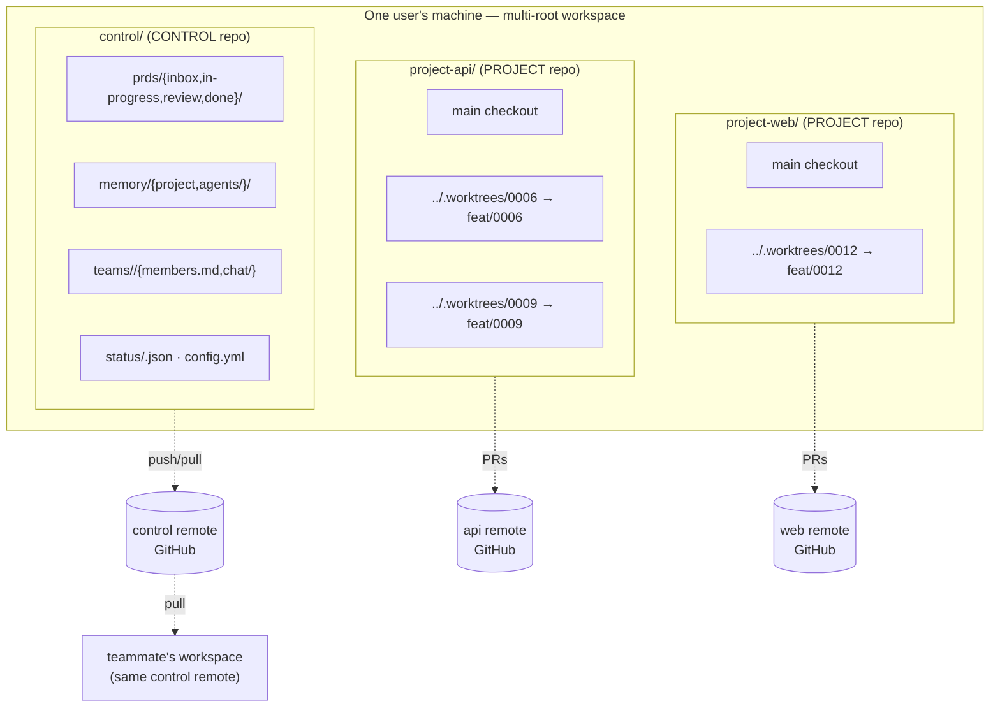
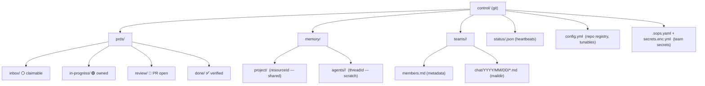
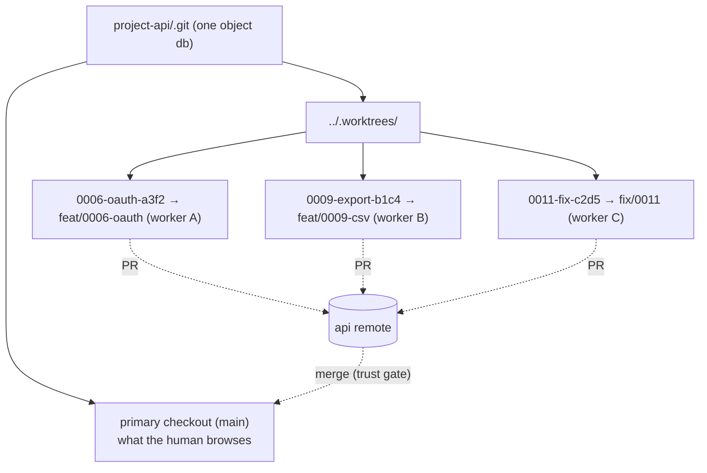
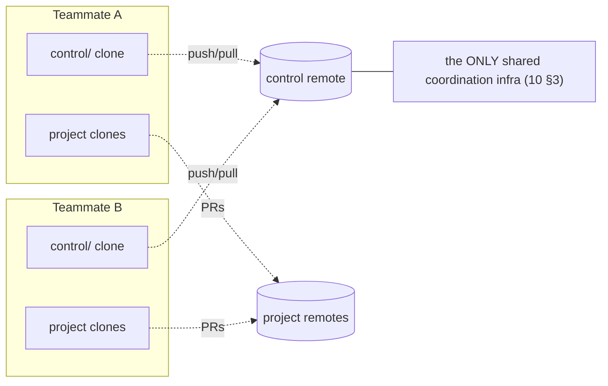
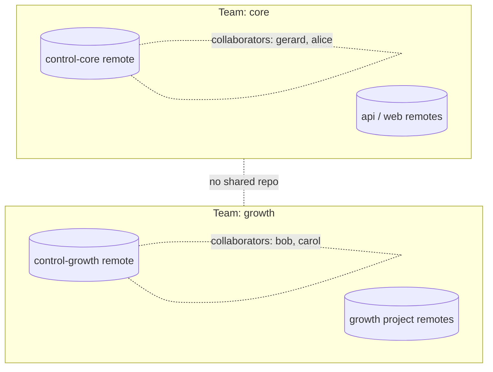
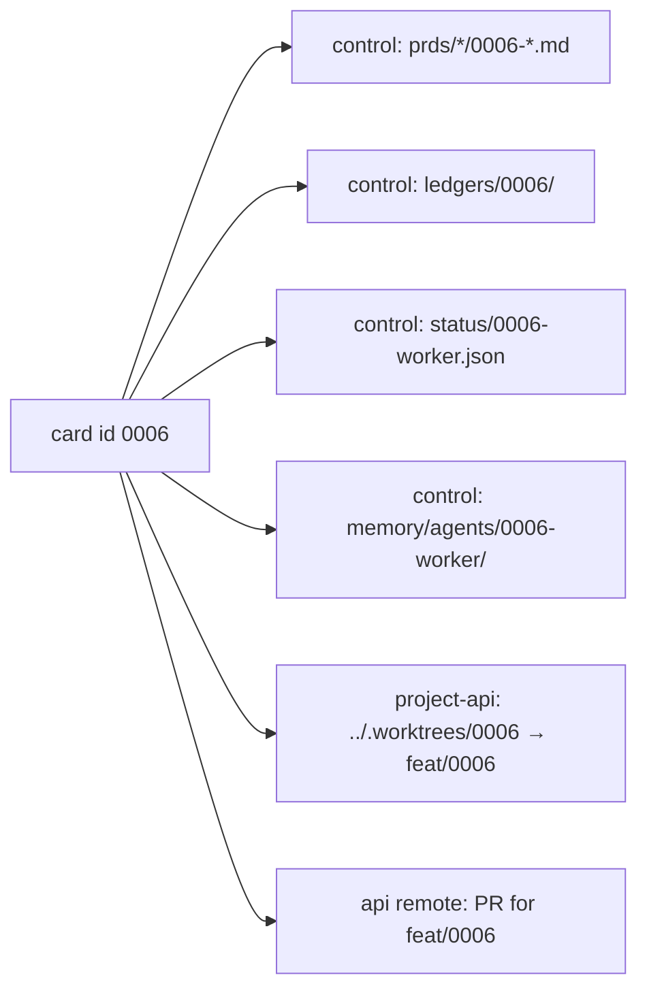
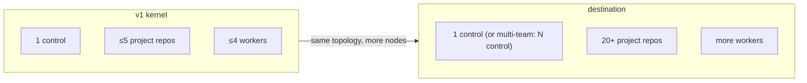

# 35 — Diagram: Repo Topology

> **Status:** ✅ done · **Date:** 2026-06-06 · **Owner:** Gerard
> **Purpose:** The git topology as a standalone reference — one control repo, N project repos, worktrees per worker, and the remotes that tie a remote team together. This is the picture behind `27`; here it's pure diagram + annotation so you can see the whole repository graph at a glance.

---

## 1. The full topology (one user's machine + remotes)

Three kinds of node, one rule each:
- **Control repo** — coordination only; 1 per team; the board *is* its folders.
- **Project repos** — code only; N of them; clean history.
- **Worktrees** — per-worker checkouts inside a project repo; collision-free by construction.

## 2. Control repo internals (the coordination repo)

Every coordination concern is a folder or file here (schemas in `14`). The board, chat, memory, heartbeats, config, and team secrets all live in this one repo — which is why it churns constantly and is kept separate from code (`27` §3).

## 3. Project repo + worktrees (the code repos)

- One `.git`, many working directories — that's what `git worktree` gives.
- **N workers, same repo, zero collisions:** different dirs, different branches (`27` §4).
- Workers converge only at **PR merge**, gated by the trust gate (`25`).
- After a worker exits, `git worktree prune` reclaims its dir; the branch lives until merge.

## 4. The remote graph (how a team shares)

- **Coordination** converges at the **control remote** — the single shared piece of infrastructure (`10` §3). Both teammates' boards, chats, and memory sync through it.
- **Code** converges at each **project remote** as PRs.
- That's the entire "remote team" mechanism: clone the same repos, sync through the same remotes, nothing else between them (`00-vision` §9, `32` §5).

## 5. Team isolation as topology

Isolation isn't a firewall — it's that two teams are **different repo graphs**:

Different control repos, different collaborator sets, different AUTO processes with different GitHub credentials (`12` §7, `20` §5). There's **no edge** between the two graphs — so "another team's agents talking to mine" has no path to traverse. Isolation is a property of the topology, requiring zero isolation code.

## 6. The id thread (one identity across the graph)

A single card id threads through the whole topology, making everything greppable by id (`14` §10):

Follow `0006` and you find its card, AUTO's ledgers, the worker's heartbeat + memory, the worktree, the branch, and the PR — across both repos. The id is the join key of the whole system, no database needed.

## 7. Scale view (kernel → destination)

The topology **doesn't change** at scale — you register more `project_repos[]` in `config.yml` and raise `max_workers` (`27` §7). The "20 repos on the left" vision is this same graph with more project-repo nodes. v1 proves the loop at ≤5 repos / ≤4 workers (`00-vision` §8) before claiming 20 — earn the cathedral (principle #3).

---

**Related:** `27-multi-repo-workspace.md` (the topology in prose) · `10-system-architecture.md` (layers + control remote as sole shared infra) · `11-coordination-model.md` (control repo as backend) · `12-agent-runtime.md` (worktree-per-worker) · `14-data-model.md` (the id thread, integrity checks) · `34-diagram-components.md` (the host components that talk to this git side).
