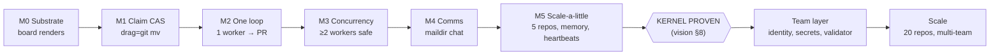
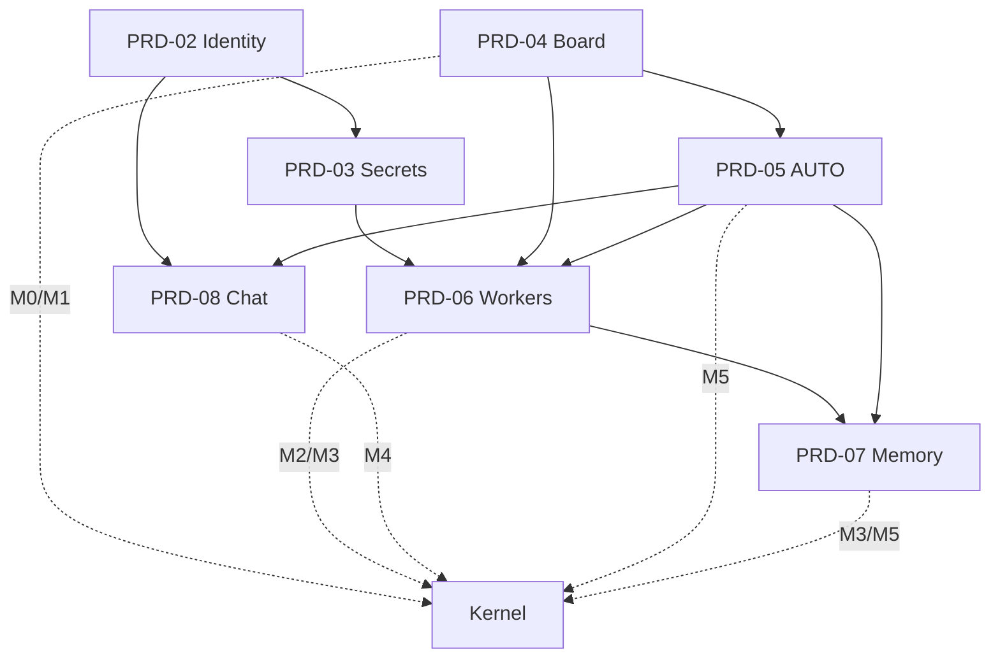

# 50 — Roadmap

> **Status:** ✅ done · **Date:** 2026-06-06 · **Owner:** Gerard
> **Purpose:** The build sequence — milestones from kernel to team to scale, what each proves, which PRDs deliver it, and the dependency order that keeps every step shippable. **Kernel before cathedral** (principle #3): prove the loop at small scale, then grow.

---

## 1. Sequencing principle

Each milestone is **independently demonstrable** and **strictly builds on the last**. We never build two layers of speculation on top of an unproven base. The ordering follows the build order in `00-DOCUMENT-MAP.md` (research → foundation → architecture → subsystems → flows → PRDs → delivery) and now sequences the *implementation* PRDs.

The north-star success criterion gates the whole thing: **≥2 agents across ≥2 repos complete ≥3 PRDs into open PRs, zero claim collisions, zero memory merge conflicts** (`00-vision` §8). Everything before that is getting there; everything after is scale.

## 2. Milestone map (kernel → team → scale)

## 3. The milestones in detail

| # | Proves | Delivered by (PRD) | Demo |
|---|---|---|---|
| **M0** | The board renders the substrate | PRD-04 (read-only board) | Open a control repo → see `prds/*/` as columns |
| **M1** | The claim CAS works | PRD-04 (drag) + the CAS engine | Drag a card → `git mv`+push; lost race reverts (`33`) |
| **M2** | The loop works end-to-end | PRD-06 (supervisor + Ralph) + PRD-05 (minimal dispatch) + PRD-03 (key inject) | 1 worker claims a card → builds → opens a PR, unattended |
| **M3** | Concurrency is safe | PRD-06 (≥2 workers) + PRD-07 (per-agent memory write) | ≥2 workers, conflict-free claims + memory |
| **M4** | Comms works | PRD-08 (maildir chat) | Two humans chat; `@auto` commands AUTO |
| **M5** | It scales a little | PRD-05 (full loop) + PRD-07 (consolidation) + PRD-02 (identity) | 5 repos, heartbeats, consolidation PR |

M0–M5 = the **kernel** (matches `PRD-v1` §7). Clearing M5 satisfies the vision §8 criterion.

## 4. Dependency order of the PRDs

The PRDs don't build in numeric order — they build in dependency order:

**Critical path:** PRD-04 (board + CAS) → PRD-06 (workers, needing PRD-03 keys + PRD-05 dispatch) → PRD-07 (memory) → PRD-08 (chat). Identity (PRD-02) and secrets (PRD-03) are foundational and can land early in parallel with the board.

## 5. Phase view (what to build when)

```mermaid
gantt
    title Build phases (relative, not calendar-committed)
    dateFormat X
    axisFormat %s
    section Foundation
    PRD-02 Identity        :0, 2
    PRD-03 Secrets         :1, 3
    section Kernel surface
    PRD-04 Board + CAS (M0/M1) :2, 5
    section Kernel loop
    PRD-05 AUTO (minimal)   :4, 7
    PRD-06 Workers (M2/M3)  :5, 9
    PRD-07 Memory (M3)      :7, 10
    section Kernel comms
    PRD-08 Chat (M4)        :6, 9
    section Kernel scale
    PRD-05 AUTO (full) + PRD-07 consolidation (M5) :9, 12
```

> The X-axis is **relative ordering**, not a calendar commitment. Sequencing is the deliverable here; dates depend on capacity and are tracked outside this doc.

## 6. Post-kernel: team layer, then scale

Once the kernel holds (M5 / vision §8), growth is **adding nodes, not changing architecture** (`27` §7, `35` §7):

| Stage | Adds | How (no architecture change) |
|---|---|---|
| **Team hardening** | independent validator at full strength, richer chat routing, onboarding polish | PRD-06 validator + PRD-08 + PRD-02 maturity |
| **Scale repos** | 5 → 20 project repos | register more `project_repos[]` in `config.yml` |
| **Scale agents** | raise `max_workers` | a config change; topology unchanged |
| **Multi-team** | >1 control repo | each team = a control repo; isolation is already topological (`12` §7) |
| **Real-time (if forced)** | sub-second chat/presence | *that feature* adds a transport; substrate stays git (`22` §6) |

The roadmap's shape: **a hard kernel push (M0–M5), then linear scale** — because the substrate was designed so scale is registration, not redesign.

## 7. What gates each transition

- **M0→M5 (kernel):** each milestone's demo (§3) passes; M5 meets vision §8 (zero collisions, zero memory conflicts).
- **Kernel→team:** the trust gate is real (independent validator, not self-report — `25`); onboarding is a clean sign-in + key + clone (`32`).
- **Team→scale:** ≥5 repos / ≥4 agents stable; then raise the numbers. The "20 repos" claim is *earned* by proving 5 first (principle #3).

No transition is taken on faith — each is gated by a demonstrable property of the layer below.

---

**Related:** `00-vision-positioning.md` §8 (the kernel success criterion) · `PRD-v1.md` §7 (M0–M5 origin) · the Tier-4 PRDs (`PRD-02`…`PRD-08`, the deliverables) · `27`/`35` (why scale is registration, not redesign) · `51-risks-open-questions.md` (what could derail this).
